```{r setup, include=FALSE}
knitr::opts_chunk$set(echo = TRUE, message = F, warning = F, comment = NA, out.width = "100%")
```

---

# Introduction

This vignette contains the `R` code and analysis done for the paper: [Derek Wright, Sandesh Neupane, Taryn Heidecker, Teketel Haile, Clarice Coyne, Sripada Udupa, Eleonora Barilli, Diego Rubiales, Tania Gioia, Reena Mehra, Ashutosh Sarker, Rajeev Dhakal, Babul Anwar, Debashish Sarker, Albert Vandenberg, and Kirstin E. Bett. (2020) **Understanding photothermal interactions can help expand production range and increase genetic diversity of lentil (*Lens culinaris* Medik.)**. *Plants, People, Planet*. 00:1-11.](https://nph.onlinelibrary.wiley.com/doi/10.1002/ppp3.10158) 

This work done as part of the AGILE project at the University of Saskatchewan.


---

# Data Preparation

Load the nessesary R packages, Prepare the data for analysis.

```{r echo = F}
downloadthis::download_link(
  link = "data/data_ldp.csv",
  button_label = "data_ldp.csv",
  button_type = "success",
  has_icon = TRUE,
  icon = "fa fa-save",
  self_contained = F
)
downloadthis::download_link(
  link = "data/data_countries.csv",
  button_label = "data_countries.csv",
  button_type = "success",
  has_icon = TRUE,
  icon = "fa fa-save",
  self_contained = F
)
downloadthis::download_link(
  link = "data/data_raw.csv",
  button_label = "data_raw.csv",
  button_type = "success",
  has_icon = TRUE,
  icon = "fa fa-save",
  self_contained = F
)
downloadthis::download_link(
  link = "data/data_env.csv",
  button_label = "data_env.csv",
  button_type = "success",
  has_icon = TRUE,
  icon = "fa fa-save",
  self_contained = F
)
downloadthis::download_link(
  link = "data/data_info.csv",
  button_label = "data_info.csv",
  button_type = "success",
  has_icon = TRUE,
  icon = "fa fa-save",
  self_contained = F
)
```

```{r}
#install.packages(c("tidyverse","scales","rworldmap","ggrepel","magick",
#                   "GGally","ggpubr,"ggbeeswarm","FactoMineR","plot3D","stringr",
#                   "plotly","leaflet","leaflet.minicharts","htmlwidgets"))
# Load libraries
library(tidyverse)   # data wrangling
library(scales)      # rescale()
library(rworldmap)   # mapBubbles()
library(ggrepel)     # geom_text_repel() + geom_label_repel()
library(magick)      # image editing
library(GGally)      # ggpairs() + ggmatrix()
library(ggpubr)      # ggarrange()
library(ggbeeswarm)  # geom_quasirandom()
library(FactoMineR)  # PCA() & HCPC()
library(plot3D)      # 3D plots
library(stringr)     # str_pad()
library(plotly)      # plot_ly()
library(leaflet)     # leaflet()
library(leaflet.minicharts) # addMinicharts()
library(htmlwidgets) # saveWidget()
# General color palettes 
colors <- c("darkred",   "darkorange3", "darkgoldenrod2", "deeppink3", 
            "steelblue", "darkorchid4", "cornsilk4",      "darkgreen") 
# Expts color palette
colors_Expt <- c("lightgreen",      "palegreen4",       "darkgreen",   "darkolivegreen3",
                 "darkolivegreen4", "springgreen4",     "orangered2",  "orangered4",
                 "palevioletred",    "mediumvioletred", "orange2",     "orange4", 
                 "slateblue1",       "slateblue4",      "aquamarine3", "aquamarine4", 
                 "deepskyblue3",     "deepskyblue4" )
# Locations
names_Location <- c("Rosthern, Canada", "Sutherland, Canada",  "Central Ferry, USA",
                    "Bhopal, India",    "Jessore, Bangladesh", "Bardiya, Nepal",
                    "Cordoba, Spain",   "Marchouch, Morocco",  "Metaponto, Italy" )
# Experiments
names_Expt <- c("Rosthern, Canada 2016",    "Rosthern, Canada 2017",
                "Sutherland, Canada 2016",  "Sutherland, Canada 2017", 
                "Sutherland, Canada 2018",  "Central Ferry, USA 2018",
                "Bhopal, India 2016",       "Bhopal, India 2017",
                "Jessore, Bangladesh 2016", "Jessore, Bangladesh 2017",
                "Bardiya, Nepal 2016",      "Bardiya, Nepal 2017",
                "Cordoba, Spain 2016",      "Cordoba, Spain 2017",
                "Marchouch, Morocco 2016",  "Marchouch, Morocco 2017",
                "Metaponto, Italy 2016",    "Metaponto, Italy 2017" )
# Experiment short names
names_ExptShort <- c("Ro16", "Ro17", "Su16", "Su17", "Su18", "Us18",
                     "In16", "In17", "Ba16", "Ba17", "Ne16", "Ne17", 
                     "Sp16", "Sp17", "Mo16", "Mo17", "It16", "It17" )
# Macro-Environments
names_MacroEnvs <- c("Temperate", "South Asia", "Mediterranean")
# Lentil Diversity Panel metadata
ldp <- read.csv("data/data_ldp.csv")
# Country info
ct <- read.csv("data/data_countries.csv") %>% filter(Country %in% ldp$Origin)
# ggplot theme
theme_AGL <- theme_bw() + 
  theme(strip.background   = element_rect(colour = "black", fill = NA, size = 0.5),
        panel.background   = element_rect(colour = "black", fill = NA, size = 0.5),
        panel.border       = element_rect(colour = "black", size = 0.5),
        panel.grid         = element_line(color  = alpha("black", 0.1), size = 0.5),
        panel.grid.minor.x = element_blank(), 
        panel.grid.minor.y = element_blank())
# Create scaling function
traitScale <- function(x, trait) {
  xout <- rep(NA, nrow(x))
  for(i in unique(x$Expt)) {
    mn <- x %>% filter(Expt == i) %>% pull(trait) %>% min(na.rm = T)
    mx <- x %>% filter(Expt == i) %>% pull(trait) %>% max(na.rm = T)
    xout <- ifelse(x$Expt == i, rescale(x %>% pull(trait), c(1,5), c(mn,mx)), xout)
  }
  xout
}
# Prep data
# Notes: 
# - DTF2 = non-flowering genotypes <- group_by(Expt) %>% max(DTF)
rr <- read.csv("data/data_raw.csv") %>% 
  mutate(Rep          = factor(Rep), 
         Year         = factor(Year), 
         PlantingDate = as.Date(PlantingDate),
         Location     = factor(Location, levels = names_Location),
         Expt         = factor(Expt,     levels = names_Expt),
         ExptShort    = plyr::mapvalues(Expt, names_Expt, names_ExptShort),
         ExptShort    = factor(ExptShort, levels = names_ExptShort),
         DTF2_scaled  = traitScale(., "DTF2"),
         RDTF         = round(1 / DTF2, 6),
         VEG          = DTF - DTE,
         REP          = DTM - DTF)
# Average raw data
dd <- rr %>% 
  group_by(Entry, Name, Expt, ExptShort, Location, Year) %>%
  summarise_at(vars(DTE, DTF, DTS, DTM, VEG, REP, RDTF, DTF2),
               funs(mean), na.rm = T) %>% 
  ungroup() %>%
  mutate(DTF2_scaled = traitScale(., "DTF2"))
# Prep environmental data
ee <- read.csv("data/data_env.csv") %>%
  mutate(Date      = as.Date(Date),
         ExptShort = plyr::mapvalues(Expt, names_Expt, names_ExptShort),
         ExptShort = factor(ExptShort, levels = names_ExptShort),
         Expt      = factor(Expt,      levels = names_Expt),
         Location  = factor(Location,  levels = names_Location),
         MacroEnv  = factor(MacroEnv,  levels = names_MacroEnvs),
         DayLength_rescaled = rescale(DayLength, to = c(0, 40)) )
# Prep field trial info
xx <- dd %>% group_by(Expt) %>%
  summarise_at(vars(DTE, DTF, DTS, DTM), funs(min, mean, max), na.rm = T) %>% 
  ungroup()
ff <- read.csv("data/data_info.csv") %>% 
  mutate(Start = as.Date(Start) ) %>%
  left_join(xx, by = "Expt")
for(i in unique(ee$Expt)) {
  ee <- ee %>% 
    filter(Expt != i | (Expt == i & DaysAfterPlanting <= ff$DTM_max[ff$Expt == i]))
}
xx <- ee
for(i in unique(ee$Expt)) {
  xx <- xx %>% 
    filter(Expt != i | (Expt == i & DaysAfterPlanting <= ff$DTF_max[ff$Expt == i]))
} 
xx <- xx %>% 
  group_by(Location, Year) %>% 
  summarise(T_mean = mean(Temp_mean, na.rm = T), T_sd = sd(Temp_mean, na.rm = T),
            P_mean = mean(DayLength, na.rm = T), P_sd = sd(DayLength, na.rm = T) ) %>% 
  ungroup() %>%
  mutate(Expt = paste(Location, Year)) %>%
  select(-Location, -Year)
ff <- ff %>% 
  left_join(xx, by = "Expt") %>% 
  mutate(ExptShort = plyr::mapvalues(Expt, names_Expt, names_ExptShort),
         ExptShort = factor(ExptShort, levels = names_ExptShort),
         Expt      = factor(Expt,      levels = names_Expt),
         Location  = factor(Location,  levels = names_Location),
         MacroEnv  = factor(MacroEnv,  levels = names_MacroEnvs),
         T_mean    = round(T_mean, 1),
         P_mean    = round(P_mean, 1))
```

- `ldp` = Lentil Diversity Panel Metadata
- `rr`  = Raw Phenotype Data
- `dd`  = Averaged Phenotype Data
- `ee`  = Environmental Data
- `ff`  = Field Trial Info
- `ct`  = Country Info

---

# Materials & Methods

## Supplemental Table 1: LDP

```{r echo = F}
downloadthis::download_link(
  link = "Supplemental_Table_01.csv",
  button_label = "Supplemental_Table_01.csv",
  button_type = "success",
  has_icon = TRUE,
  icon = "fa fa-save",
  self_contained = F
)
```

```{r}
s1 <- select(ldp, Entry, Name, Origin, Source, Synonyms)
write.csv(s1, "Supplemental_Table_01.csv", row.names = F)
DT::datatable(s1)
```

---

## Supplemental Table 2: Field Trial Info

```{r echo = F}
downloadthis::download_link(
  link = "Supplemental_Table_02.csv",
  button_label = "Supplemental_Table_02.csv",
  button_type = "success",
  has_icon = TRUE,
  icon = "fa fa-save",
  self_contained = F
)
```

```{r}
s2 <- ff %>%
  select(Location, Year, `Short Name`=ExptShort, Latitude=Lat, Longitude=Lon,
         `Planting Date`=Start, `Temperature (mean)`=T_mean, `Photoperiod (mean)`=P_mean, 
         `Number of Seeds Sown`=Number_of_Seeds_Sown, `Plot Type`=Plot_Type)
write.csv(s2, "Supplemental_Table_02.csv", row.names = F)
DT::datatable(s2)
```

```{r}
xx <- ee %>% 
  select(ExptShort, Temp_min, Temp_max, DayLength) %>%
  group_by(ExptShort) %>%
  summarise(Temp_min = min(Temp_min),
            Temp_max = max(Temp_max),
            Photoperiod_min = min(DayLength),
            Photoperiod_max = max(DayLength))
knitr::kable(xx)
```

---

## Figure 1: Field Trial Info


```{r}
# Plot (a) Map
invisible(png("Additional/Temp/Temp_F01_1.png", width = 4200, height = 1575, res = 600))
par(mai = c(0,0,0,0), xaxs = "i", yaxs = "i")
mapBubbles(dF = ff, nameX = "Lon", nameY = "Lat", 
           nameZColour = "MacroEnv", nameZSize = "Year", 
           symbolSize = 0.5, pch = 20, fill = F, addLegend = F,
           colourPalette = c("darkgreen", "darkorange3", "darkblue"), addColourLegend = F, 
           xlim = c(-140,110), ylim = c(10,35),  
           oceanCol = "grey90", landCol = "white", borderCol = "black")
invisible(dev.off())
# Plot (b) mean T and P
mp <- ggplot(ff, aes(x = T_mean, y = P_mean)) + 
  geom_point(aes(color = MacroEnv), size = 3, alpha = 0.8) + 
  geom_text_repel(aes(label = ExptShort)) + 
  scale_x_continuous(breaks = 11:22) + scale_y_continuous(breaks = 11:16) +
  scale_color_manual(name = "Macro-Environment", values = c("darkgreen","darkorange3","darkblue")) +
  theme_AGL + 
  theme(legend.position = "top", legend.margin = unit(c(0,0,0,0), "cm")) +
  labs(x = expression(paste("Mean temperature (", degree, "C)", sep = "")), 
       y = "Mean photoperiod (h)")
ggsave("Additional/Temp/Temp_F01_2.png", mp, width = 7, height = 3.25, dpi = 600)
# Labels were added to "Additional/Temp/Temp_F1_1.png" in image editing software
# Append (a) and (b)
im1 <- image_read("Additional/Temp/Temp_F01_1_1.png") %>% 
  image_annotate("(a)", size = 35)
im2 <- image_read("Additional/Temp/Temp_F01_2.png") %>% image_scale("1200x") %>%
  image_annotate("(b)", size = 35)
im <- image_append(c(im1, im2), stack = T)
image_write(im, "Figure_01.png")
```

---

## Additional Figure 1: LDP Origin Map


```{r}
# Prep data
x1 <- ldp %>% filter(Origin != "Unknown") %>%
  mutate(Origin = recode(Origin, "ICARDA"="Syria", "USDA"="USA")) %>% 
  group_by(Origin) %>% 
  summarise(Count = n()) %>% 
  left_join(select(ct, Origin = Country, Lat, Lon), by = "Origin") %>% 
  ungroup() %>% 
  as.data.frame()
x1[is.na(x1)] <- 0
# Plot
invisible(png("Additional/Additional_Figure_01.png", width = 3600, height = 2055, res = 600))
par(mai = c(0,0,0,0), xaxs = "i",yaxs = "i")
mapBubbles(dF = x1, nameX = "Lon", nameY = "Lat", 
           nameZSize = "Count", nameZColour = "darkred", 
           xlim = c(-140,110), ylim = c(5,20),
           oceanCol = "grey90", landCol = "white", borderCol = "black")
invisible(dev.off())
```

---

## Supplemental Figure 1: DTF Scaling


```{r}
# Prep data
levs <- c("Days from sowing to flower (days)", "Scaled (1-5)")
xx <- dd %>% select(Entry, Expt, ExptShort, DTF, DTF2_scaled) %>%
  left_join(select(ff, Expt, MacroEnv), by = "Expt") %>%
  gather(Trait, Value, DTF, DTF2_scaled) %>% 
  mutate(Trait = plyr::mapvalues(Trait, c("DTF", "DTF2_scaled"), levs),
         Trait = factor(Trait, levels = levs) )
# Plot
mp <- ggplot(xx, aes(x = ExptShort, y = Value)) + 
  geom_violin(fill = "grey", alpha = 0.3, color = NA) + 
  geom_quasirandom(aes(color = MacroEnv), size = 0.1, alpha = 0.5) +
  scale_color_manual(values = c("darkgreen","darkorange3","darkblue")) +
  facet_grid(Trait ~ MacroEnv, scales = "free") + 
  theme_AGL + 
  theme(legend.position = "none",
        panel.grid.major.x = element_blank(),
        axis.text.x = element_text(angle = 90, vjust = 0.5, hjust = 1)) +
  labs(x = NULL, y = NULL)
ggsave("Supplemental_Figure_01.png", mp, width = 8, height = 5, dpi = 600)
```

---

# Phenology

## Figure 2: Data Overview

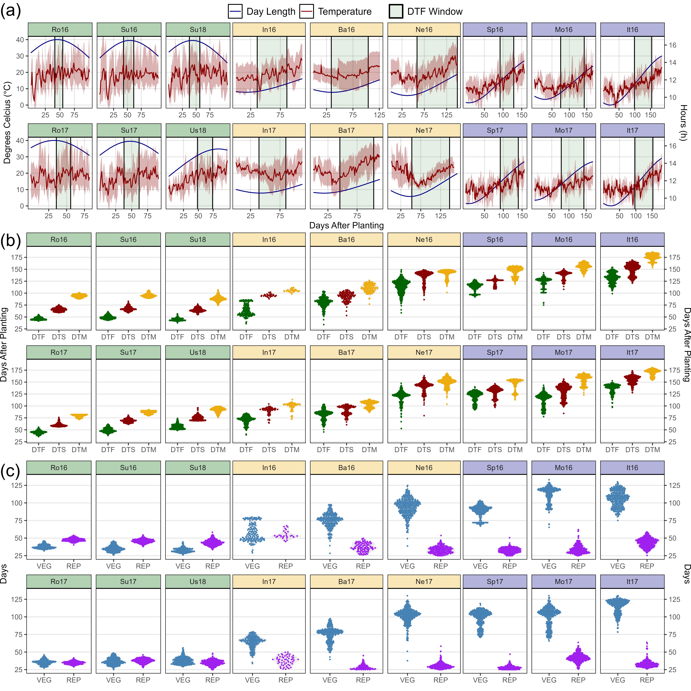

```{r}
# Create plot function
ggEnvPlot <- function(x, mybreaks, nr = 2, nc = 3) {
  yy <- ff %>% 
    filter(Expt %in% unique(x$Expt)) %>% 
    select(ExptShort, Location, Year, min=DTF_min, max=DTF_max) %>%
    mutate(Trait = "DTF Window")
  ggplot(x) +
    geom_rect(data = yy, aes(xmin = min, xmax = max, fill = Trait),   
              ymin = -Inf, ymax = Inf, alpha = 0.1, color = "black") +
    geom_line(aes(x = DaysAfterPlanting, y = DayLength_rescaled, color = "Day Length")) +
    geom_line(aes(x = DaysAfterPlanting, y = Temp_mean, color = "Temperature") ) +
    geom_ribbon(aes(x = DaysAfterPlanting, ymin = Temp_min, ymax = Temp_max),
                fill = "darkred", alpha = 0.3) +
    facet_wrap(ExptShort ~ ., scales = "free_x", dir = "v", nrow = 2, ncol = 3) +
    scale_x_continuous(breaks = mybreaks) +
    scale_color_manual(name = NULL, values = c("darkblue", "darkred")) +
    scale_fill_manual(name = NULL, values = "darkgreen") +
    guides(colour = guide_legend(order = 1, override.aes = list(size = 1.25)), 
           fill = guide_legend(order = 2)) +
    coord_cartesian(ylim=c(0, 40)) +
    theme_AGL + 
    theme(plot.margin = unit(c(0,0,0,0), "cm"), legend.text = element_text(size = 12)) +
    labs(y = NULL, x = NULL)
}
# Plot (a) T and P
mp1.1 <- ggEnvPlot(ee %>% filter(MacroEnv == "Temperate"), c(25, 50, 75)) +
  labs(y = expression(paste("Degrees Celcius (", degree, "C)"))) + 
  theme(strip.background = element_rect(alpha("darkgreen", 0.3)),
        plot.margin = unit(c(0,0,0,0.155), "cm"))
mp1.2 <- ggEnvPlot(ee %>% filter(MacroEnv == "South Asia"), c(25, 75, 125)) +
  labs(x = "Days After Planting") +
  theme(strip.background = element_rect(fill = alpha("darkgoldenrod2", 0.3)),
        axis.text.y = element_blank(), axis.ticks.y = element_blank())
mp1.3 <- ggEnvPlot(ee %>% filter(MacroEnv == "Mediterranean"), c(50, 100, 150)) +
  scale_y_continuous(sec.axis = sec_axis(~ (16.62 - 9.11) * . / (40 - 0) + 9.11,
                     name = "Hours (h)", breaks = c(10, 12, 14, 16))) +
  theme(strip.background = element_rect(fill = alpha("darkblue", 0.3)),
        plot.margin = unit(c(0,0.17,0,0), "cm"),
        axis.text.y.left = element_blank(), axis.ticks.y.left = element_blank())
mp1 <- ggarrange(mp1.1, mp1.2, mp1.3, nrow = 1, ncol = 3, align = "h",
                 legend = "top", common.legend = T)
# Prep data
xx <- dd %>% select(Entry, Year, Expt, ExptShort, Location, DTF, DTS, DTM) %>%
  left_join(select(ff, Expt, MacroEnv), by = "Expt") %>%
  gather(Trait, Value, DTF, DTS, DTM) %>%
  mutate(Trait = factor(Trait, levels = c("DTF", "DTS", "DTM")))
# Create plot function
ggDistroDTF <- function(x) {
  ggplot(x, aes(x = Trait, y = Value) ) +
    geom_violin(color = NA, fill = "grey", alpha = 0.3) + 
    geom_quasirandom(size = 0.3, aes(color = Trait)) +
    facet_wrap(ExptShort ~ ., scales = "free_x", dir = "v", ncol = 3, nrow = 2) + 
    scale_color_manual(values = c("darkgreen", "darkred", "darkgoldenrod2")) +
    scale_y_continuous(limits = c(30,190), breaks = seq(25,175, 25)) +
    theme_AGL + labs(y = NULL, x = NULL) +
    theme(plot.margin = unit(c(0.1,0,0.3,0), "cm"))
}
# Plot (b) DTF, DTS and DTM
mp2.1 <- ggDistroDTF(xx %>% filter(MacroEnv == "Temperate")) + 
  labs(y = "Days After Planting") + 
  theme(strip.background = element_rect(fill = alpha("darkgreen", 0.3)),
        panel.grid.major.x = element_blank())
mp2.2 <- ggDistroDTF(xx %>% filter(MacroEnv == "South Asia")) +
  theme(strip.background = element_rect(fill = alpha("darkgoldenrod2", 0.3)),
        panel.grid.major.x = element_blank(),
        axis.text.y = element_blank(), axis.ticks.y = element_blank())
mp2.3 <- ggDistroDTF(xx %>% filter(MacroEnv == "Mediterranean")) +
  scale_y_continuous(limits = c(30,190), breaks = seq(25,175, 25),
                     sec.axis = sec_axis(~ ., name = "Days After Planting", 
                                         breaks = seq(25,175, 25))) +
  theme(strip.background = element_rect(fill = alpha("darkblue", 0.3)),
        panel.grid.major.x = element_blank(), panel.grid.minor.x = element_line(),
        axis.text.y.left = element_blank(), axis.ticks.y.left = element_blank())
# Append
mp2 <- ggarrange(mp2.1, mp2.2, mp2.3, nrow = 1, ncol = 3, align = "h", legend = "none")
# Prep data
xx <- dd %>% select(Entry, Name, Expt, ExptShort, Location, Year, VEG, REP) %>%
  left_join(select(ff, Expt, MacroEnv), by = "Expt") %>%
  gather(Trait, Value, VEG, REP) %>% 
  mutate(Trait = factor(Trait, levels = c("VEG", "REP")))
# Create plot function
ggDistroREP <- function(x) {
  ggplot(x, aes(x = Trait, y = Value)) + 
    geom_violin(color = NA, fill = "grey", alpha = 0.3) + 
    geom_quasirandom(size = 0.3, aes(color = Trait)) +
    facet_wrap(ExptShort ~ ., scales = "free_x", dir = "v", ncol = 3, nrow = 2) +
    scale_color_manual(values = c("steelblue", "purple")) +
    scale_y_continuous(limits = c(25,135), breaks = seq(25,125, 25)) +
    theme_AGL + labs(x = NULL, y = NULL) + 
    theme(plot.margin = unit(c(0,0,0.3,0), "cm"))
}
# Plot (c) REP and VEG
mp3.1 <- ggDistroREP(xx %>% filter(MacroEnv == "Temperate")) + labs(y = "Days") +
  theme(strip.background = element_rect(fill = alpha("darkgreen", 0.3)),
        panel.grid.major.x = element_blank())
mp3.2 <- ggDistroREP(xx %>% filter(MacroEnv == "South Asia")) + 
  theme(strip.background = element_rect(fill = alpha("darkgoldenrod2", 0.3)),
        axis.text.y = element_blank(), axis.ticks.y = element_blank(),
        panel.grid.major.x = element_blank())
mp3.3 <- ggDistroREP(xx %>% filter(MacroEnv == "Mediterranean")) +
  scale_y_continuous(limits = c(25,135), breaks = seq(25,125, 25),
                     sec.axis = sec_axis(~ ., name = "Days", breaks = seq(25,125, 25))) +
  theme(strip.background = element_rect(fill = alpha("darkblue", 0.3)),
        axis.text.y.left = element_blank(), axis.ticks.y.left = element_blank(),
        panel.grid.major.x = element_blank())
# Append
mp3 <- ggarrange(mp3.1, mp3.2, mp3.3, nrow = 1, ncol = 3, align = "h", legend = "none")
# Save
ggsave("Additional/Temp/Temp_F02_1.png", mp1, width = 12, height = 4, dpi = 500)
ggsave("Additional/Temp/Temp_F02_2.png", mp2, width = 12, height = 4, dpi = 500)
ggsave("Additional/Temp/Temp_F02_3.png", mp3, width = 12, height = 4, dpi = 500)
# Append (a), (b) and (c)
mp1 <- image_read("Additional/Temp/Temp_F02_1.png") %>% image_annotate("(a)", size = 150)
mp2 <- image_read("Additional/Temp/Temp_F02_2.png") %>% image_annotate("(b)", size = 150)
mp3 <- image_read("Additional/Temp/Temp_F02_3.png") %>% image_annotate("(c)", size = 150)
mp <- image_append(c(mp1, mp2, mp3), stack = T)
image_write(mp, "Figure_02.png")
```

---

## Additional Figures: Entry Phenology

https://github.com/derekmichaelwright/AGILE_LDP_Phenology/tree/master/Additional/Entry_Phenology

```{r echo = F}
downloadthis::download_link(
  link = "Additional/pdf_Phenology.pdf",
  button_label = "pdf_Phenology.pdf",
  button_type = "success",
  has_icon = TRUE,
  icon = "fa fa-file-pdf",
  self_contained = FALSE
)
```

```{r eval = F}
# Create plotting function
ggPhenology <- function(x, xE, colnums) {
  mycols <- c("darkgreen", "darkorange3", "darkblue")
  ggplot(xE, aes(x = Trait, y = Value, group = Entry, color = MacroEnv)) +
    geom_line(data = x, color = "grey", alpha = 0.5) +
    geom_line() + 
    geom_point() +
    facet_grid(MacroEnv ~ ExptShort) +
    scale_color_manual(values = mycols[colnums]) +
    theme_AGL + 
    theme(legend.position = "none", panel.grid.major.x = element_blank()) +
    ylim(c(min(x$Value, na.rm = T), max(x$Value, na.rm = T))) +
    labs(x = NULL, y = "Days")
}
# Prep data
xx <- dd %>% select(Entry, Name, ExptShort, DTF, DTS, DTM) %>% 
  left_join(select(ff, ExptShort, MacroEnv), by = "ExptShort") %>%
  gather(Trait, Value, DTF, DTS, DTM) %>%
  mutate(Trait = factor(Trait, levels = c("DTF","DTS","DTM")))
x1 <- xx %>% filter(MacroEnv == "Temperate")
x2 <- xx %>% filter(MacroEnv == "South Asia")
x3 <- xx %>% filter(MacroEnv == "Mediterranean")
# Create PDF
pdf("Additional/pdf_Phenology.pdf", width = 8, height = 6)
for(i in 1:324) {
  xE1 <- xx %>% filter(Entry == i, !is.na(Value), MacroEnv == "Temperate") 
  xE2 <- xx %>% filter(Entry == i, !is.na(Value), MacroEnv == "South Asia")
  xE3 <- xx %>% filter(Entry == i, !is.na(Value), MacroEnv == "Mediterranean")
  mp1 <-  ggPhenology(x1, xE1, 1)
  mp2 <-  ggPhenology(x2, xE2, 2)
  mp3 <-  ggPhenology(x3, xE3, 3)
  figlab <- paste("Entry", str_pad(i, 3, "left", "0"), "|", unique(xE1$Name))
  mp <- ggarrange(mp1, mp2, mp3, nrow = 3, ncol = 1) %>%
    annotate_figure(top = figlab)
  print(mp)
  ggsave(paste0("Additional/Entry_Phenology/Phenology_Entry_", 
                str_pad(i, 3, "left", "0"), ".png"), 
         mp, width = 8, height = 6, dpi = 600)
}
dev.off()
```

---

## Additional Figure 2: DTF DTS DTM


```{r}
# Prep data
xx <- dd %>% select(Entry, Expt, ExptShort, DTF, DTS, DTM) %>%
  left_join(select(ff, Expt, MacroEnv), by = "Expt") %>%
  gather(Trait, Value, DTF, DTS, DTM) %>% 
  mutate(Trait = factor(Trait, levels = c("DTF", "DTS", "DTM")) )
# Plot
mp <- ggplot(xx, aes(x = ExptShort, y = Value)) +
  geom_violin(fill = "grey", alpha = 0.25, color = NA) + 
  geom_quasirandom(size = 0.1, alpha = 0.5, aes(color = MacroEnv)) +
  facet_grid(Trait ~ MacroEnv, scales = "free") + 
  scale_color_manual(values = c("darkgreen", "darkorange3", "darkblue")) +
  theme_AGL +
  theme(legend.position = "none",
        panel.grid.major.x = element_blank(),
        axis.text.x = element_text(angle = 90, vjust = 0.5, hjust = 1)) +
  labs(x = NULL, y = "Days After Planting")
ggsave("Additional/Additional_Figure_02.png", mp, width = 8, height = 6, dpi = 600)
```

---

## Additional Figure 3: MacroEnv Phenology


```{r}
# Prep data
xx <- ee %>% filter(ExptShort %in% c("Su17", "Ba17", "It17")) 
yy <- ff %>% filter(Expt %in% unique(xx$Expt)) %>% 
  mutate(DTF_min = Start + DTF_min, DTF_max = Start + DTF_max,
         DTM_min = Start + DTM_min, DTM_max = Start + DTM_max)
y1 <- select(yy, Expt, Location, Year, MacroEnv, min = DTF_min, max = DTF_max) %>% 
  mutate(Trait = "DTF")
y2 <- select(yy, Expt, Location, Year, MacroEnv, min = DTM_min, max = DTM_max) %>% 
  mutate(Trait = "DTM")
yy <- bind_rows(y1, y2)
# Plot
mp <- ggplot(xx) +
  geom_rect(data = yy, aes(xmin = min, xmax = max, fill = Trait), 
            ymin = 0, ymax = 40, alpha = 0.4) +
  geom_line(aes(x = Date, y = DayLength_rescaled, color = "Blue")) +
  geom_line(aes(x = Date, y = Temp_mean, color = "darkred") ) +
  geom_ribbon(aes(x = Date, ymin = Temp_min, ymax = Temp_max),
              fill = alpha("darkred", 0.25), color = alpha("darkred", 0.25)) +
  facet_grid(Location + MacroEnv  ~ ., scales = "free_x", space = "free_x") +
  scale_color_manual(name = NULL, values = c("Blue", "darkred"), 
                    labels = c("Day length", "Temperature") ) +
  scale_fill_manual(name = NULL, values = c("darkgreen", "darkgoldenrod2")) +
  coord_cartesian(ylim = c(0,40)) +
  theme_AGL +
  theme(legend.position = "bottom", 
        legend.text = element_text(size = 12),
        axis.text.x = element_text(angle = 90, hjust = 1, vjust = 0.5)) +
  scale_x_date(breaks = "1 month", labels = date_format("%b")) +
  scale_y_continuous(sec.axis = sec_axis(~ (16.62 - 9.11) * . / (40 - 0) + 9.11, 
                     breaks = c(10, 12, 14, 16), name = "Hours")) +
  guides(colour = guide_legend(order = 1, override.aes = list(size = 1.25)), 
         fill   = guide_legend(order = 2)) +
  labs(title = "2017 - 2018", y = expression(paste(degree, "Celcius"), x = NULL))
  
ggsave("Additional/Additional_Figure_03.png", mp, width = 8, height = 6, dpi = 600)
```

---

## Additional Figures: Phenology + EnvData


```{r}
# Plotting function
ggPhenologyEnvD <- function(exptshort = "Ro17") {
  # Prep data
  x1 <- dd %>% filter(ExptShort == exptshort) %>%
    select(Entry, Name, ExptShort, Expt, DTF, DTS, DTM) %>%
    gather(Trait, Value, DTF, DTS, DTM) %>%
    mutate(Trait = factor(Trait, levels = c("DTF", "DTS", "DTM")))
  x2 <- ee %>% filter(ExptShort == exptshort)
  myMax <- max(x2$DaysAfterPlanting)
  myColors <- c("steelblue", "darkgreen", "darkgoldenrod2")
  # Plot
  mp1 <- ggplot(x1, aes(x = Value, fill = Trait)) +
    geom_density(alpha = 0.7) +
    facet_grid(. ~ Expt) +
    scale_fill_manual(name = NULL, values = myColors) +
    coord_cartesian(xlim = c(0,myMax)) +
    theme_AGL +
    theme(legend.position = "top",
          axis.text.x  = element_blank(),
          axis.ticks.x = element_blank()) +
    labs(x = NULL, y = NULL)
  mp2 <- ggplot(x2) +
    geom_line(aes(x = DaysAfterPlanting, y = DayLength_rescaled, color = "Blue")) +
    geom_line(aes(x = DaysAfterPlanting, y = Temp_mean, color = "darkred") ) +
    geom_ribbon(aes(x = DaysAfterPlanting, ymin = Temp_min, ymax = Temp_max),
                fill = alpha("darkred", 0.25), color = alpha("darkred", 0.25)) +
    scale_color_manual(name = NULL, values = c("Blue", "darkred"), 
                       labels = c("Day length", "Temperature") ) +
    coord_cartesian(ylim = c(0,40)) +
    theme_AGL +
    theme(legend.position = "bottom", 
          legend.text = element_text(size = 12),
          axis.text.x = element_text(angle = 90, hjust = 1, vjust = 0.5)) +
    scale_x_continuous(limits = c(0, myMax)) +
    scale_y_continuous(sec.axis = sec_axis(~ (16.62 - 9.11) * . / (40 - 0) + 9.11, 
                          breaks = c(10, 12, 14, 16), name = "Hours")) +
    guides(colour = guide_legend(order = 1, override.aes = list(size = 1.25)), 
           fill   = guide_legend(order = 2)) +
    labs(y = expression(paste(degree, "Celcius"), x = NULL))
  ggarrange(mp1, mp2, nrow = 2, align = "v", heights = c(1, 1.2))
}
for(i in names_ExptShort) {
  mp <- ggPhenologyEnvD(i)
  ggsave(paste0("Additional/Expt/1_", i, ".png"), width = 6, height = 6)
}
im <- image_read(paste0("Additional/Expt/1_", names_ExptShort[1:6], ".png"))
im <- image_append(c(image_append(im[1:3]), image_append(im[4:6])), stack = T)
image_write(im, "Additional/Expt/2_Temperate.png")
im <- image_read(paste0("Additional/Expt/1_", names_ExptShort[7:12], ".png"))
im <- image_append(c(image_append(im[1:3]), image_append(im[4:6])), stack = T)
image_write(im, "Additional/Expt/2_SouthAsia.png")
im <- image_read(paste0("Additional/Expt/1_", names_ExptShort[13:18], ".png"))
im <- image_append(c(image_append(im[1:3]), image_append(im[4:6])), stack = T)
image_write(im, "Additional/Expt/2_Mediterranean.png")
```

---

## Additional Figure 4: ggridges


```{r}
# Prep data
xx <- dd %>% select(Expt, DTF, DTS, DTM) %>% 
  gather(Trait, Value, DTF, DTS, DTM) %>%
  mutate(Trait = factor(Trait, levels = c("DTF", "DTS", "DTM")))
# Plot
mp <- ggplot(xx, aes(x = Value, y = Expt, fill = Trait)) + 
  ggridges::geom_density_ridges(alpha = 0.7) +
  scale_fill_manual(name = NULL, values = c("darkgreen", "darkred", "darkgoldenrod2")) +
  theme_AGL + 
  theme(legend.position = "top", legend.margin = unit(c(0,0,0,0), "cm")) +
  labs(y = NULL, x = "Days After Sowing")
ggsave("Additional/Additional_Figure_04.png", mp, width = 6, height = 4, dpi = 600)
```

---

## Supplemental Figure 2: Missing Data


```{r}
# Prep data
xx <- dd %>% 
  filter(Location %in% c("Bhopal, India", "Jessore, Bangladesh", "Bardiya, Nepal")) %>%
  mutate(DTF = ifelse(is.na(DTF), 0, 1),
         DTS = ifelse(is.na(DTS), 0, 1),
         DTM = ifelse(is.na(DTM), 0, 1) ) %>% 
  group_by(Expt, Location, Year) %>% 
  summarise_at(vars(DTF, DTS, DTM), funs(sum), na.rm = T) %>%
  ungroup() %>% 
  gather(Trait, Flowered, DTF, DTS, DTM) %>%
  mutate(Total = ifelse(Expt == "Bardiya, Nepal 2016", 323, 324),
         # One accession was not planted in Bardiya, Nepal 2016
         DidNotFlower = Total - Flowered,
         Percent = round(100 * Flowered / Total),
         Label = paste0(Percent, "%"),
         Trait = factor(Trait, levels = c("DTF", "DTS", "DTM")))
# Plot
mp <- ggplot(xx, aes(x = Trait, y = Percent, fill = Trait)) + 
  geom_bar(stat = "identity", color = "black", alpha = 0.7) + 
  geom_text(aes(label = Label), nudge_y = -3, size = 3.5) + 
  facet_grid(. ~ Location + Year) + 
  scale_fill_manual(values = c("darkgreen", "darkred", "darkgoldenrod2")) + 
  scale_y_continuous(limits = c(0,100), expand = c(0,0)) +
  theme_AGL + 
  theme(legend.position = "none",
        panel.grid.major.x = element_blank() ) + 
  labs(x = NULL, y = "Percent of accessions reaching key phenological time points")
ggsave("Supplemental_Figure_02.png", width = 10, height = 5, dpi = 600)
```

---

## Supplemental Figure 3: Correlation Plots


```{r eval = F}
# Prep data
xx <- dd %>% 
  left_join(select(ff, Expt, MacroEnv), by = "Expt") %>% 
  select(Entry, Expt, MacroEnv, DTF, DTS, DTM)
# Create plotting function
ggCorPlot <- function(x, legend.title, colNums) {
  # Plot (a)
  r2 <- round(cor(x$DTF, x$DTS, use ="complete", method = "pearson")^2, 2)
  tp1 <- ggplot(x) + 
    geom_point(aes(x = DTF, y = DTS, color = Expt, shape = Expt), alpha = 0.8) + 
    geom_label(x = -Inf, y = Inf, hjust = 0, vjust = 1, parse = T,
               label = paste("italic(R)^2 == ", r2) ) +
    scale_color_manual(name = legend.title, values = colors_Expt[colNums]) +
    scale_shape_manual(name = legend.title, values = c(15,16,17,15,16,17)) +
    theme_AGL
  # Plot (b)
  r2 <- round(cor(x$DTF, x$DTM, use ="complete.obs", method = "pearson")^2, 2)
  tp2 <- ggplot(x) + 
    geom_point(aes(x = DTF, y = DTM, color = Expt, shape = Expt), alpha = 0.8) + 
    geom_label(x = -Inf, y = Inf, hjust = 0, vjust = 1, parse = T,
               label = paste("italic(R)^2 == ", r2) ) +
    scale_color_manual(name = legend.title, values = colors_Expt[colNums]) +
    scale_shape_manual(name = legend.title, values = c(15,16,17,15,16,17)) +
    theme_AGL
  # Plot (c)
  r2 <- round(cor(x$DTS, x$DTM, use = "complete", method = "pearson")^2, 2)
  tp3 <- ggplot(x) + 
    geom_point(aes(x = DTS, y = DTM, color = Expt, shape = Expt), alpha = 0.8) + 
    geom_label(x = -Inf, y = Inf, hjust = 0, vjust = 1, parse = T,
               label = paste("italic(R)^2 == ", r2) ) +
    scale_color_manual(name = legend.title, values = colors_Expt[colNums]) +
    scale_shape_manual(name = legend.title, values = c(15,16,17,15,16,17)) +
    theme_AGL
  # Append (a), (b) and (c)
  mp <- ggarrange(tp1, tp2, tp3, nrow = 1, ncol = 3, common.legend = T, legend = "right") 
  mp
}
# Plot
mp1 <- ggCorPlot(xx %>% filter(MacroEnv == "Temperate"),     "Temperate",      1:6 )
mp2 <- ggCorPlot(xx %>% filter(MacroEnv == "South Asia"),    "South Asia",     7:12)
mp3 <- ggCorPlot(xx %>% filter(MacroEnv == "Mediterranean"), "Mediterranean", 13:18)
mp <- ggarrange(mp1, mp2, mp3, nrow = 3, ncol = 1, common.legend = T, legend = "right")
ggsave("Supplemental_Figure_03.png", mp, width = 10, height = 8, dpi = 600)
```

---

## Additional Figures: Correlations


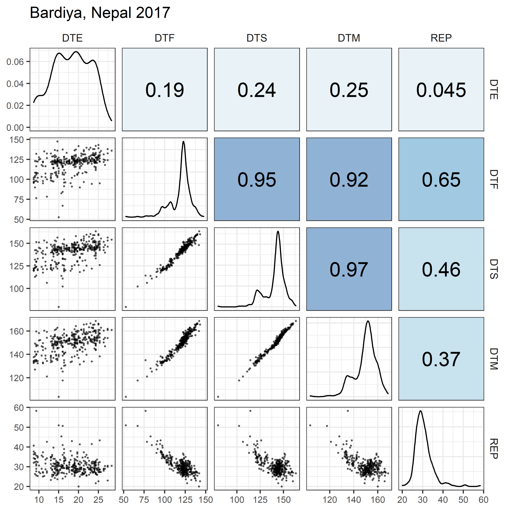


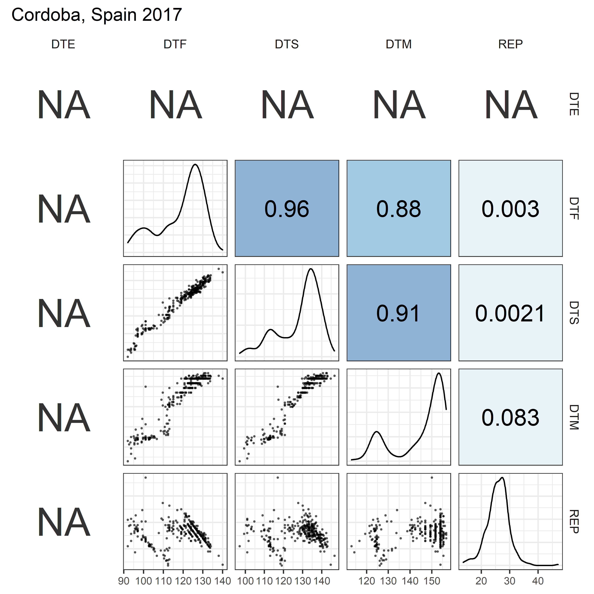


```{r eval = F}
# Prep data
xx <- dd %>% 
  left_join(select(ff, Expt, MacroEnv), by = "Expt") %>%
  mutate(DTE = ifelse(Location == "Cordoba, Spain", NA, DTE))
x1 <- xx %>% filter(MacroEnv == "Temperate")
x2 <- xx %>% filter(MacroEnv == "South Asia")
x3 <- xx %>% filter(MacroEnv == "Mediterranean")
# Create plotting functions
my_lower <- function(data, mapping, cols = colors_Expt, ...) {
  ggplot(data = data, mapping = mapping) +
    geom_point(alpha = 0.5, size = 0.3, aes(color = Expt)) +
    scale_color_manual(values = cols) +
    theme_bw()
}
my_middle <- function(data, mapping, cols = colors_Expt, ...) {
  ggplot(data = data, mapping = mapping) + 
    geom_density(alpha = 0.5) + 
    scale_color_manual(name = NULL, values = cols) +
    scale_fill_manual(name = NULL, values = cols) +
    guides(color = F, fill = guide_legend(nrow = 3, byrow = T)) +
    theme_bw()
}
# See: https://github.com/ggobi/ggally/issues/139
my_upper <- function(data, mapping, color = I("black"), sizeRange = c(1,5), ...) {
  # Prep data
  x <- eval_data_col(data, mapping$x) 
  y <- eval_data_col(data, mapping$y)
  #
  r2 <- cor(x, y, method = "pearson", use = "complete.obs")^2
  rt <- format(r2, digits = 2)[1]
  cex <- max(sizeRange)
  tt <- as.character(rt)
  # plot the cor value
  p <- ggally_text(label = tt, mapping = aes(), color = color, 
                   xP = 0.5, yP = 0.5, size = 6,  ... ) + theme_bw() 
  # Create color palette
  corColors <- RColorBrewer::brewer.pal(n = 10, name = "RdBu")[2:9]
  if        (r2 <= -0.9)              { corCol <- alpha(corColors[1], 0.5) 
  } else if (r2 >= -0.9 & r2 <= -0.6) { corCol <- alpha(corColors[2], 0.5)
  } else if (r2 >= -0.6 & r2 <= -0.3) { corCol <- alpha(corColors[3], 0.5)
  } else if (r2 >= -0.3 & r2 <= 0)    { corCol <- alpha(corColors[4], 0.5)
  } else if (r2 >= 0    & r2 <= 0.3)  { corCol <- alpha(corColors[5], 0.5) 
  } else if (r2 >= 0.3  & r2 <= 0.6)  { corCol <- alpha(corColors[6], 0.5)
  } else if (r2 >= 0.6  & r2 <= 0.9)  { corCol <- alpha(corColors[7], 0.5) 
  } else                              { corCol <- alpha(corColors[8], 0.5) }
  # Plot
  p <- p +
    theme(panel.background = element_rect(fill = corCol),
          panel.grid.major = element_blank(), 
          #panel.grid.minor = element_blank(),
          axis.text = element_text(size = 5))
  p
}
# Plot Correlations for each Expt
for(i in 1:length(names_Expt)) {
  mp <- ggpairs(xx %>% filter(Expt == names_Expt[i]), 
               columns = c("DTE", "DTF", "DTS", "DTM", "REP"), 
        upper  = list(continuous = my_upper), 
        diag   = list(continuous = my_middle),
        lower  = list(continuous = wrap(my_lower, cols = "black")),
        title  = names_Expt[i]) + 
    theme(strip.background = element_rect(fill = "White"))
  ggsave(paste0("Additional/Corr/Corr_", str_pad(i, 2, "left", "0"), 
                "_", names_ExptShort[i], ".png"), 
         mp, width = 6, height = 6, dpi = 600)
}
# Plot (a) Temperate
mp1 <- ggpairs(x1, columns = c("DTE", "DTF", "DTS", "DTM", "REP"), 
               aes(color = Expt, fill = Expt),
        upper=list(continuous = my_upper),
        diag =list(continuous = wrap(my_middle, cols = colors_Expt[1:6])),
        lower=list(continuous = wrap(my_lower,  cols = colors_Expt[1:6])),
        title = "(a) Temperate", 
        legend = c(2,2)) +
  theme(strip.background = element_rect(fill = "White"),
        legend.position = "bottom")
ggsave("Additional/Corr/Corr_Temperate.png", mp1, width = 6, height = 6, dpi = 600)
# Plot (b) South Asia
mp2 <- ggpairs(x2, columns = c("DTE", "DTF", "DTS", "DTM", "REP"), 
               aes(color = Expt, fill = Expt),
        upper  = list(continuous = my_upper),
        diag   = list(continuous = wrap(my_middle, cols = colors_Expt[7:12])),
        lower  = list(continuous = wrap(my_lower,  cols = colors_Expt[7:12])),
        title  = "(b) South Asia", 
        legend = c(2,2)) +
  theme(strip.background = element_rect(fill = "White"),
        legend.position = "bottom")
ggsave("Additional/Corr/Corr_SouthAsia.png", mp2, width = 6, height = 6, dpi = 600)
# Plot (c) Mediterranean
mp3 <- ggpairs(x3, columns = c("DTE", "DTF", "DTS", "DTM", "REP"), 
               aes(color = Expt, fill = Expt),
        upper  = list(continuous = my_upper),
        diag   = list(continuous = wrap(my_middle, cols = colors_Expt[13:18])),
        lower  = list(continuous = wrap(my_lower,  cols = colors_Expt[13:18])),
        title  = "(c) Mediterranean", 
        legend = c(2,2)) +
  theme(strip.background = element_rect(fill = "White"),
        legend.position = "bottom")
ggsave("Additional/Corr/Corr_Mediterranean.png", mp3, width = 6, height = 6, dpi = 600)
# Plot All
mp4 <- ggpairs(xx, columns = c("DTE", "DTF", "DTS", "DTM", "REP"), 
        aes(color = ExptShort, fill = ExptShort),
        upper  = list(continuous = my_upper), 
        diag   = list(continuous = my_middle),
        lower  = list(continuous = my_lower),
        title  = "ALL", 
        legend = c(2,2)) +
  theme(strip.background = element_rect(fill = "White"),
        legend.position = "bottom")
ggsave("Additional/Corr/Corr_All.png", mp4, width = 6, height = 6, dpi = 600)
```

---

# PCA

## Figure 3: PCA Clusters

```{r echo = F}
downloadthis::download_link(
  link = "data/data_pca_results.csv",
  button_label = "data_pca_results.csv",
  button_type = "success",
  has_icon = TRUE,
  icon = "fa fa-save",
  self_contained = F
)
```

```{r echo = F, eval = T}
xx <- read.csv("data/data_pca_results.csv")
DT::datatable(xx)
```


```{r eval = F}
# Prep data
xx <- dd %>% 
  select(Entry, Expt, DTF2_scaled) %>% 
  spread(Expt, DTF2_scaled)
xx <- xx %>% column_to_rownames("Entry") %>% as.matrix()
# PCA
mypca <- PCA(xx, ncp = 10, graph = F)
# Heirarcical clustering
mypcaH <- HCPC(mypca, nb.clust = 8, graph = F)
perc <- round(mypca[[1]][,2], 1)
x1 <- mypcaH[[1]] %>% rownames_to_column("Entry")
x2 <- mypca[[3]]$coord %>% as.data.frame() %>% rownames_to_column("Entry")
pca <- left_join(x1, x2, by = "Entry") %>%
  mutate(Entry = as.numeric(Entry)) %>%
  left_join(select(ldp, Entry, Name, Origin), by = "Entry") %>%
  left_join(select(ct, Origin=Country, Region), by = "Origin") %>%
  select(Entry, Name, Origin, Region, Cluster=clust,
         PC1=Dim.1, PC2=Dim.2, PC3=Dim.3, PC4=Dim.4, PC5=Dim.5,
         PC6=Dim.6, PC7=Dim.7, PC8=Dim.8, PC9=Dim.9, PC10=Dim.10)
# Save data
write.csv(pca, "data/data_pca_results.csv", row.names = F)
# Prep data
x2 <- dd %>% 
  left_join(select(pca, Entry, Cluster), by = "Entry") %>%
  group_by(Expt, ExptShort, Cluster) %>% 
  summarise(mean = mean(DTF2_scaled, na.rm = T), sd = sd(DTF2_scaled, na.rm = T)) %>%
  ungroup() %>%
  mutate(ClusterNum = plyr::mapvalues(Cluster, as.character(1:8), summary(pca$Cluster)))
x3 <- pca %>% 
  count(Cluster) %>% 
  mutate(Cluster = factor(Cluster, levels = rev(levels(Cluster))), y = n/2)
for(i in 2:nrow(x3)) { x3$y[i] <- sum(x3$n[1:(i-1)]) + (x3$n[i]/2) }
# Plot (a) PCA 1v2
find_hull <- function(df) df[chull(df[,"PC1"], df[,"PC2"]), ]
polys <- plyr::ddply(pca, "Cluster", find_hull) %>% mutate(Cluster = factor(Cluster))
mp1.1 <- ggplot(pca) +
  geom_polygon(data = polys, alpha = 0.15, aes(x = PC1, y = PC2, fill = Cluster)) +
  geom_point(aes(x = PC1, y = PC2, colour = Cluster)) +
  scale_fill_manual(values = colors) +
  scale_color_manual(values = colors) +
  theme_AGL + 
  theme(legend.position = "none", panel.grid = element_blank()) +
  labs(x = paste0("PC1 (", perc[1], "%)"),
       y = paste0("PC2 (", perc[2], "%)"))
# Plot (a) PCA 1v3
find_hull <- function(df) df[chull(df[,"PC1"], df[,"PC3"]), ]
polys <- plyr::ddply(pca, "Cluster", find_hull) %>% mutate(Cluster = factor(Cluster))
mp1.2 <- ggplot(pca) +
  geom_polygon(data = polys, alpha = 0.15, aes(x = PC1, y = PC3, fill = Cluster)) +
  geom_point(aes(x = PC1, y = PC3, colour = Cluster)) +
  scale_fill_manual(values = colors) +
  scale_color_manual(values = colors) +
  theme_AGL + 
  theme(legend.position = "none", panel.grid = element_blank()) +
  labs(x = paste0("PC1 (", perc[1], "%)"),
       y = paste0("PC3 (", perc[3], "%)"))
# Plot (a) PCA 2v3
find_hull <- function(df) df[chull(df[,"PC2"], df[,"PC3"]), ]
polys <- plyr::ddply(pca, "Cluster", find_hull) %>% mutate(Cluster = factor(Cluster))
mp1.3 <- ggplot(pca) +
  geom_polygon(data = polys, alpha = 0.15, aes(x = PC2, y = PC3, fill = Cluster)) +
  geom_point(aes(x = PC2, y = PC3, colour = Cluster)) +
  scale_fill_manual(values = colors) +
  scale_color_manual(values = colors) +
  theme_AGL + 
  theme(legend.position = "none", panel.grid = element_blank()) +
  labs(x = paste0("PC2 (", perc[2], "%)"),
       y = paste0("PC3 (", perc[3], "%)"))
# Append 
mp1 <- ggarrange(mp1.1, mp1.2, mp1.3, nrow = 1, ncol = 3, hjust = 0)
# Plot (b) DTF 
mp2 <- ggplot(x2, aes(x = ExptShort, y = mean, group = Cluster)) +
  geom_point(aes(color = Cluster)) + 
  geom_vline(xintercept = 6.5,  lty = 2) + 
  geom_vline(xintercept = 12.5, lty = 2) +
  geom_ribbon(aes(ymin = mean - sd, ymax = mean + sd, fill = Cluster), 
              alpha = 0.2, color = NA) + 
  geom_line(aes(color = Cluster), size = 1) +
  scale_color_manual(values = colors) +
  scale_fill_manual(values = colors) +
  coord_cartesian(ylim = c(0.95,5.05), expand = F) +
  theme_AGL +
  theme(axis.text.x = element_text(angle = 90, hjust = 1, vjust = 0.5),
        legend.position = "none", panel.grid = element_blank()) + 
  labs(y = "DTF (scaled 1-5)", x = NULL)
#
ggsave("Additional/Temp/Temp_F03_1.png", mp1, width = 8, height =   1*6/2.5, dpi = 600)
ggsave("Additional/Temp/Temp_F03_2.png", mp2, width = 8, height = 1.5*6/2.5, dpi = 600)
# Plot (c)
xx <- ldp %>% left_join(select(pca, Entry, Cluster), by = "Entry")
xx <- xx %>% 
  filter(!Origin %in% c("ICARDA","USDA","Unknown")) %>% 
  group_by(Origin, Cluster) %>% 
  summarise(Count = n()) %>% 
  spread(Cluster, Count) %>%
  left_join(select(ct, Origin=Country, Lat, Lon), by = "Origin") %>% 
  ungroup() %>% 
  as.data.frame()
xx[is.na(xx)] <- 0 
invisible(png("Additional/Temp/Temp_F03_3.png", width = 4800, height = 2200, res = 600))
par(mai = c(0,0,0,0), xaxs = "i", yaxs = "i")
mapPies(dF = xx, nameX = "Lon", nameY = "Lat", zColours = colors,
          nameZs = c("1","2","3","4","5","6","7","8"), lwd = 1,
          xlim = c(-140,110), ylim = c(0,20), addCatLegend = F,
          oceanCol = "grey90", landCol = "white", borderCol = "black") 
legend(-139.5, 15.5, title = "Cluster", legend = 1:8, col = colors,
       pch = 16, cex = 1, pt.cex = 2, box.lwd = 2)
invisible(dev.off())
# Append (a), (b) and (c)
im1 <- image_read("Additional/Temp/Temp_F03_1.png") %>% 
  image_annotate("(a)", size = 120, location = "+0+0")
im2 <- image_read("Additional/Temp/Temp_F03_2.png") %>% 
  image_annotate("(b)", size = 120, location = "+0+0")
im3 <- image_read("Additional/Temp/Temp_F03_3.png") %>%
  image_annotate("(c)", size = 120, location = "+0+0")
im <- image_append(c(im1, im2, im3), stack = T)
image_write(im, "Figure_03.png")
```

---

## Additional Figure 5: PCA Plot

https://github.com/derekmichaelwright/AGILE_LDP_Phenology/blob/master/Additional/Animation_PCA.gif

https://derekmichaelwright.github.io/AGILE_LDP_Phenology/Additional/Additional_Figure_05.html


```{r}
# Prep data
xx <- read.csv("data/data_pca_results.csv") %>% 
  mutate(Cluster = factor(Cluster), PC2 = PC2*3, PC3 = PC3*3,
         myColors = plyr::mapvalues(Cluster, 1:8, colors))
# Plot png
mp <- ggplot(xx, aes(x = PC1, y = PC2, color = Cluster)) +
  scale_color_manual(values = colors) +
  geom_point() + 
  theme_AGL +
  theme(panel.grid.major.x = element_blank(),
        panel.grid.major.y = element_blank())
ggsave("Additional/Additional_Figure_05.png", mp, width = 6, height = 4, dpi = 600)
# Plot html
mp <- plot_ly(xx, x = ~PC1, y = ~PC2, z = ~PC3, color = ~Cluster, colors = colors,
              text = ~paste(Entry, Name, sep = " | ")) %>% add_markers()
saveWidget(mp, file="Additional/Additional_Figure_05.html",
           knitrOptions = list(fig.width = 4, fig.height = 6))
mp
```

```{r eval = F}
# Prep data
xx <- read.csv("data/data_pca_results.csv") %>% 
  mutate(Cluster = factor(Cluster), PC2 = PC2*3, PC3 = PC3*3,
         myColors = plyr::mapvalues(Cluster, 1:8, colors))
# Create plotting function
ggPCA <- function(x = xx, i = 1) {
  # Plot
  par(mar=c(1.5, 2.5, 1.5, 0.5))
  scatter3D(x = x$PC1, y = x$PC3, z = x$PC2, pch = 16, cex = 0.75, 
    col = alpha(colors,0.8), colvar = as.numeric(x$Cluster), colkey = F,  
    col.grid = "gray90", bty = "u",
    theta = i, phi = 15, ticktype = "detailed", 
    cex.lab = 1, cex.axis = 0.5,
    xlab = "PC1", ylab = "PC3", zlab = "PC2", main = "LDP - DTF")
}
# Plot each angle
for (i in seq(0, 360, by = 2)) {
  png(paste0("Additional/PCA/PCA_", str_pad(i, 3, pad = "0"), ".png"), 
      width = 1000, height = 1000, res = 300) 
  ggPCA(xx, i)
  dev.off()
}
# Create animation
lf <- list.files("Additional/PCA")
mp <- image_read(paste0("Additional/PCA/", lf))
animation <- image_animate(mp, fps = 10)
image_write(animation, "Additional/Animation_PCA.gif")
```

---

## Additional Figure 6: PCA by Region

https://derekmichaelwright.github.io/AGILE_LDP_Phenology/Additional/Additional_Figure_06.html


```{r}
# Prep data
levs <- c("Africa", "Asia", "Europe", "Americas", "ICARDA", "USDA")
xx <- read.csv("data/data_pca_results.csv") %>% 
  filter(Origin != "Unknown") %>%
  mutate(Cluster = factor(Cluster), 
         PC2 = PC2*3, PC3 = PC3*3,
         Origin = as.character(Origin),
         Region = as.character(Region), 
         Region = ifelse(Origin %in% levs[5:6], Origin, Region),
         Region = factor(Region, levels = levs))
# Plot png
mp <- ggplot(xx, aes(x = PC1, y = PC2, color = Region, shape = Region)) +
  geom_point(alpha = 0.7, size = 2) +
  scale_color_manual(values = colors[c(1,3,8,5,7,7)]) + 
  scale_shape_manual(values = c(16,18,15,17,13,10)) +
  theme_AGL + 
  theme(panel.grid.major.x = element_blank(),
        panel.grid.major.y = element_blank())
ggsave("Additional/Additional_Figure_06.png", mp, width = 6, height = 4, dpi = 600)
# Plot html
mp <- plot_ly(xx, x = ~PC1, y = ~PC2, z = ~PC3, color = ~Region, 
              colors = colors[c(1,3,8,5,7,7)], 
              text = ~paste(Entry, Name, sep = " | ")) %>%
  add_markers() 
saveWidget(mp, file="Additional/Additional_Figure_06.html")
mp
```

---

## Additional Figure 7: DTF By Cluster


```{r}
# Prep data
x1 <- read.csv("data/data_pca_results.csv") %>% 
  mutate(Cluster = factor(Cluster))
x2 <- c("India", "Bangladesh", "Ethiopia", "Pakistan", "Jordan",
        "Iran", "Turkey", "Syria", "Chile", "Spain", "Czech Republic", "Canada" )
xx <- dd %>% 
  left_join(ldp, by = "Entry") %>%
  filter(ExptShort %in% c("Ro17", "Ba17", "Ne17", "It17"), Origin != "Unknown") %>% 
  left_join(select(x1, Entry, Cluster), by = "Entry") %>%
  mutate(Origin = factor(Origin, levels = unique(Origin)[rev(order(unique(Origin)))])) %>%
  filter(Origin %in% x2) %>%
  mutate(Origin = factor(Origin, levels = x2))
# Plot
mp <- ggplot(xx, aes(y = DTF2, x = Origin)) + 
  geom_quasirandom(aes(color = Cluster)) + 
  facet_grid(Location+Year ~ ., scales = "free_y") +
  scale_color_manual(values = colors) + 
  theme_AGL + 
  theme(legend.position = "top",
        panel.grid.major.x = element_blank(),
        axis.text.x = element_text(angle = 90, hjust = 1, vjust = 0.5)) +
  guides(colour = guide_legend(nrow = 1, override.aes = list(size = 3))) +
  labs(y = "Days from sowing to flower")
ggsave("Additional/Additional_Figure_07.png", mp, width = 5, height = 7, dpi = 600)
```

---

## Additional Figure 8: Cluster Origins

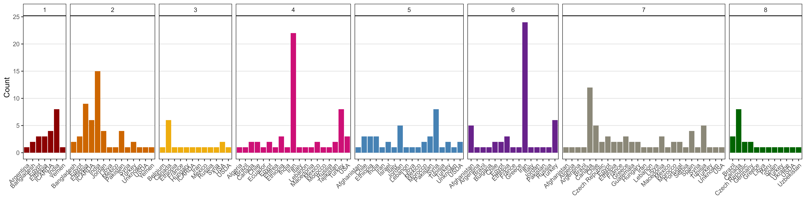

```{r}
# Prep data
xx <- read.csv("data/data_pca_results.csv") %>% 
  mutate(Cluster = factor(Cluster))
xx <- ldp %>% 
  left_join(select(xx, Entry, Cluster), by = "Entry")
x1 <- xx %>% filter(Origin != "ICARDA") %>% 
  group_by(Origin, Cluster) %>% 
  summarise(Count = n()) %>% 
  spread(Cluster, Count) %>%
  left_join(select(ct, Origin=Country, Lat, Lon), by = "Origin") %>% 
  ungroup() %>% 
  as.data.frame()
x1[is.na(x1)] <- 0 
# Plot
mp <- ggplot(xx, aes(x = Origin, fill = Cluster)) + 
  geom_bar(stat = "count") + 
  facet_grid(. ~ Cluster, scales = "free", space = "free") + 
  scale_fill_manual(values = colors) +
  theme_AGL +
  theme(legend.position = "none",
        panel.grid.major.x = element_blank(),
        axis.text.x = element_text(angle = 90, hjust = 1, vjust = 0.5)) +
  labs(x = NULL)
ggsave("Additional/Additional_Figure_08.png", width = 16, height = 4, dpi = 600)
```

---

## Additional Figure 9: LDP Origins By Cluster

https://derekmichaelwright.github.io/AGILE_LDP_Phenology/Additional/Additional_Figure_09.html


```{r}
# Prep data
xx <- read.csv("data/data_pca_results.csv") %>% 
  mutate(Cluster = factor(Cluster))
xx <- ldp %>% 
  select(Entry, Name, Lat, Lon, Origin) %>% 
  left_join(select(xx, Entry, Cluster), by = "Entry") %>%
  left_join(select(ct, Origin=Country, cLat=Lat, cLon=Lon), by = "Origin") %>%
  mutate(Lat = ifelse(is.na(Lat), cLat, Lat),
         Lon = ifelse(is.na(Lon), cLon, Lon),
         Lat = ifelse(duplicated(Lat), jitter(Lat, 1, 1), Lat),
         Lon = ifelse(duplicated(Lon), jitter(Lon, 1, 1), Lon), 
         Size = 1)
# Plot png
invisible(png("Additional/Additional_Figure_09.png", width = 7200, height = 4200, res = 600))
par(mai = c(0,0,0,0), xaxs = "i", yaxs = "i")
mapBubbles(dF = xx, nameX = "Lon", nameY = "Lat", nameZColour = "Cluster", pch = 20,
           nameZSize = "Size", symbolSize = 0.5, xlim = c(-140,110), ylim = c(0,20),
           colourPalette = colors[1:8], addColourLegend = F, addLegend = F,
           oceanCol = "grey90", landCol = "white", borderCol = "black")
legend(-139.5, 15.5, title = "Cluster", legend = 1:8, col = colors,
       pch = 16, cex = 1.75, pt.cex = 3, box.lwd = 2)
invisible(dev.off())
# Plot html
pal <- colorFactor(colors, domain = 1:8)
mp <- leaflet() %>% 
  addProviderTiles(providers$CartoDB.Positron) %>%
  addCircles(lng = xx$Lon, lat = xx$Lat, weight = 10,
                   color = pal(xx$Cluster), opacity = 1, fillOpacity = 1,
                   popup = paste(xx$Entry,"|",xx$Name)) %>%
  addLegend("bottomleft", pal = pal, values = xx$Cluster,
            title = "Cluster", opacity = 1)
saveWidget(mp, file="Additional/Additional_Figure_09.html")
mp
```

---

# Modeling DTF

## Additional Figures: Entry Regressions

https://github.com/derekmichaelwright/AGILE_LDP_Phenology/tree/master/Additional/Entry_TP

```{r echo = F}
downloadthis::download_link(
  link = "Additional/pdf_TP.pdf",
  button_label = "pdf_TP.pdf",
  button_type = "success",
  has_icon = TRUE,
  icon = "fa fa-file-pdf",
  self_contained = FALSE
)
```

```{r eval = F}
myfills <- alpha(c("darkgreen", "darkorange3", "darkblue"), 0.5)
mymin <- min(rr$RDTF, na.rm = T)
mymax <- max(rr$RDTF, na.rm = T)
mp <- list()
for(i in 1:324) {
  xx <- rr %>% 
    filter(Entry == i) %>%
    left_join(select(ff, Expt, MacroEnv, T_mean, P_mean), by = "Expt") %>%
    mutate(myfill = MacroEnv)
  x1 <- xx %>% filter(MacroEnv != "South Asia")
  x2 <- xx %>% filter(MacroEnv != "Temperate")
  x3 <- xx %>% filter(MacroEnv != "Mediterranean")
  figlab <- paste("Entry", str_pad(i, 3, "left", "0"), "|", unique(xx$Name))
  # Plot (a) 1/f = a + bT
  mp1 <- ggplot(xx, aes(x = T_mean, y = RDTF)) +
    geom_point(aes(shape = MacroEnv, color = MacroEnv)) +
    geom_smooth(data = x1, method = "lm", se = F, color = "black", lty = 3) +
    geom_smooth(data = x2, method = "lm", se = F, color = "black") +
    scale_y_continuous(sec.axis = dup_axis(~ 1/., name = NULL, breaks = c(35,50,100,150)),
                       trans = "reverse", breaks = c(0.01,0.02,0.03), limits = c(mymax, mymin)) +
    scale_x_continuous(breaks = c(11,13,15,17,19,21)) +
    scale_shape_manual(name = "Macro-environment", values = c(16,15,17)) +
    scale_color_manual(name = "Macro-environment", values = myfills) +
    theme_AGL + 
    labs(title = figlab, y = "1 / DTF", x = expression(paste("Temperature (",degree,"C)", sep="")))
  # Plot (b) 1/f = a + cP
  mp2 <- ggplot(xx, aes(x = P_mean, y = RDTF)) +
    geom_point(aes(shape = MacroEnv, color = MacroEnv)) +
    geom_smooth(data = x1, method = "lm", se = F, color = "black", lty = 3) +
    geom_smooth(data = x3, method = "lm", se = F, color = "black") +
    scale_y_continuous(sec.axis = dup_axis(~ 1/., name="DTF", breaks = c(35,50,100,150)),
                       trans = "reverse", breaks = c(0.01,0.02,0.03), limits = c(mymax, mymin)) +
    scale_x_continuous(breaks = c(11,12,13,14,15,16)) +
    scale_shape_manual(name = "Macro-environment", values = c(16,15,17)) +
    scale_color_manual(name = "Macro-environment", values = myfills) +
    theme_AGL +
    labs(title = "", y = NULL,x = "Photoperiod (hours)")
  #
  mp[[i]] <- ggarrange(mp1, mp2, ncol = 2, common.legend = T, legend = "bottom") 
  ggsave(paste0("Additional/Entry_TP/TP_Entry_", str_pad(i, 3, pad = "0"), ".png"), 
         mp[[i]], width = 8, height = 4, dpi = 600)
}
pdf("Additional/pdf_TP.pdf", width = 8, height = 4)
for(i in 1:324) { print(mp[[i]]) }
dev.off()
```

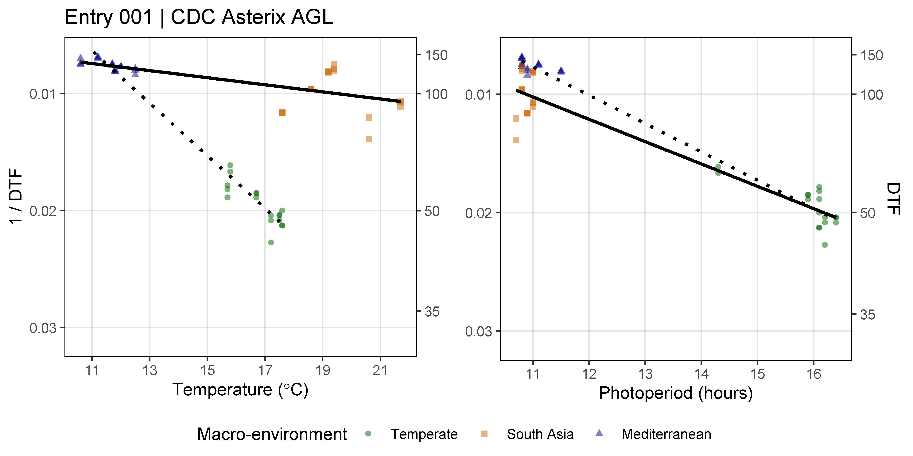

---

## Additional Figures: PhotoThermal Plane

https://github.com/derekmichaelwright/AGILE_LDP_Phenology/tree/master/Additional/Entry_3D

https://github.com/derekmichaelwright/AGILE_LDP_Phenology/blob/master/Additional/Animation_3D.gif

```{r echo = F}
downloadthis::download_link(
  link = "Additional/pdf_3D.pdf",
  button_label = "Additional/pdf_3D.pdf",
  button_type = "success",
  has_icon = TRUE,
  icon = "fa fa-file-pdf",
  self_contained = FALSE
)
```

```{r eval = F}
# Prep data
xx <- rr %>% 
  filter(!is.na(RDTF)) %>%
  left_join(select(ff, Expt, T_mean, P_mean, MacroEnv), by = "Expt")
# Create plotting function
ggPTplane <- function(x, i) {
  x1 <- x %>% filter(Entry == i)
  x <- x1$T_mean
  y <- x1$P_mean
  z <- x1$RDTF
  fit <- lm(z ~ x + y)
  # Create PhotoThermal plane
  fitp <- predict(fit)
  grid.lines <- 12
  x.p <- seq(min(x), max(x), length.out = grid.lines)
  y.p <- seq(min(y), max(y), length.out = grid.lines)
  xy <- expand.grid(x = x.p, y = y.p)
  z.p <- matrix(predict(fit, newdata = xy), nrow = grid.lines, ncol = grid.lines)
  pchs <- plyr::mapvalues(x1$Expt, names_Expt, c(rep(16,6),rep(15,6),rep(17,6))) %>%
    as.character() %>% as.numeric()
  # Plot with regression plane
  par(mar=c(1.5, 2.5, 1.5, 0.5))
  scatter3D(x, y, z, pch = pchs, cex = 2, main = unique(x1$Name),
    col = alpha(c("darkgreen", "darkorange3", "darkblue"),0.5),
    colvar = as.numeric(x1$MacroEnv), colkey = F, col.grid = "gray90", bty = "u",
    theta = 40, phi = 25, ticktype = "detailed", cex.lab = 1, cex.axis = 0.5,
    xlab = "Temperature", ylab = "Photoperiod", zlab = "1 / DTF", zlim = c(0.005,0.03),
    surf = list(x = x.p, y = y.p, z = z.p, col = "black", facets = NA, fit = fitp) )
}
# Plot each Entry
for (i in 1:324) {
  png(paste0("Additional/Entry_3D/3D_Entry_", str_pad(i, 3, pad = "0"), ".png"), 
      width = 1000, height = 1000, res = 300) 
  ggPTplane(xx, i)
  dev.off()
}
# Create PDF
pdf("Additional/pdf_3D.pdf")
par(mar=c(1.5, 2.5, 1.5, 0.5))
for (i in 1:324) {
  ggPTplane(xx, i)
}
dev.off()
#
# Plot ILL 5888 & ILL 4400 & Laird
xx <- xx %>% mutate(Name = gsub(" AGL", "", Name))
for (i in c(235, 94, 128)) {
  png(paste0("Additional/Temp/3D_Entry_", str_pad(i, 3, pad = "0"), ".png"), 
      width = 2000, height = 2000, res = 600) 
  ggPTplane(xx, i)
  dev.off()
}
# Create animation
xx <- read.csv("data/model_t+p_coefs.csv") %>% arrange(b, c)
lf <- list.files("Additional/Entry_3D")[xx$Entry]
mp <- image_read(paste0("Additional/Entry_3D/", lf))
animation <- image_animate(mp, fps = 10)
image_write(animation, "Additional/Animation_3D.gif")
```

---

## Supplemental Figure 4: Regressions


```{r}
# Prep data
myfills <- alpha(c("darkgreen", "darkorange3", "darkblue"), 0.5)
yy <- c("ILL 5888 AGL", "PI 420925 LSP AGL",  "Laird AGL")
xx <- rr %>% 
  filter(Name %in% yy, !is.na(DTF)) %>%
  left_join(select(ff, Expt, MacroEnv, T_mean, P_mean), by = "Expt") %>%
  mutate(Name = gsub(" AGL", "", Name), myfill = MacroEnv,
         Name = factor(Name, levels = gsub(" AGL", "", yy)))
x1 <- xx %>% filter(MacroEnv != "South Asia")
x2 <- xx %>% filter(MacroEnv != "Temperate")
x3 <- xx %>% filter(MacroEnv != "Mediterranean")
# Plot (a) 1/f = a + bT
mp1 <- ggplot(xx, aes(x = T_mean, y = RDTF)) +
  geom_point(aes(shape = MacroEnv, color = MacroEnv)) +
  geom_smooth(data = x1, method = "lm", se = F, color = "black", lty = 3) +
  geom_smooth(data = x2, method = "lm", se = F, color = "black") +
  scale_y_continuous(trans = "reverse", breaks = c(0.01,0.02,0.03),
                     sec.axis = dup_axis(~ 1/., name = "DTF", breaks = c(35,50,100,150))) +
  scale_x_continuous(breaks = c(11,13,15,17,19,21)) +
  scale_shape_manual(name = "Macro-environment", values = c(16,15,17)) +
  scale_color_manual(name = "Macro-environment", values = myfills) +
  theme_AGL + facet_grid(. ~ Name) + 
  theme(axis.title.y = element_text(size = 9),
        plot.margin = unit(c(0,0,0,0), "cm")) +
  guides(colour = guide_legend(override.aes = list(size = 3))) +
  labs(y = "1 / DTF", x = expression(paste("Temperature (", degree, "C)", sep = "")))
# Plot (b) 1/f = a + cP
mp2 <- ggplot(xx, aes(x = P_mean, y = RDTF)) +
  geom_point(aes(shape = MacroEnv, color = MacroEnv)) +
  geom_smooth(data = x1, method = "lm", se = F, color = "black", lty = 3) +
  geom_smooth(data = x3, method = "lm", se = F, color = "black") +
  scale_y_continuous(trans = "reverse", breaks = c(0.01,0.02,0.03),
                     sec.axis = dup_axis(~ 1/., name="DTF", breaks = c(35,50,100,150))) +
  scale_x_continuous(breaks = c(11,12,13,14,15,16)) +
  scale_shape_manual(name = "Macro-environment", values = c(16,15,17)) +
  scale_color_manual(name = "Macro-environment", values = myfills) +
  theme_AGL + facet_grid(. ~ Name) + 
  theme(axis.title.y = element_text(size = 9),
        plot.margin = unit(c(0,0,0,0), "cm")) +
  guides(colour = guide_legend(override.aes = list(size = 3))) +
  labs(y = "1 / DTF",x = "Photoperiod (h)")
# Append (a) and (b)
mp <- ggarrange(mp1, mp2, ncol = 1, common.legend = T, legend = "bottom") 
ggsave("Additional/Temp/Temp_SF04_1.png", mp, width = 6, height = 3.75, dpi = 600)
# Append (c)s
im1 <- image_read("Additional/Temp/3D_Entry_094.png")
im2 <- image_read("Additional/Temp/3D_Entry_235.png")
im3 <- image_read("Additional/Temp/3D_Entry_128.png")
im <- image_append(c(im1, im2, im3)) %>% image_scale("3600x")
image_write(im, "Additional/Temp/Temp_SF04_2.png")
# Prep data 
xx <- dd %>% 
  filter(Name %in% yy) %>% 
  mutate(Name = gsub(" AGL", "", Name),
         Name = factor(Name, levels = gsub(" AGL", "", yy)))
# Plot D)
mp3 <- ggplot(dd, aes(x = ExptShort, y = DTF2_scaled, group = Name)) + 
  geom_line(color = "black", alpha = 0.1) +
  geom_vline(xintercept = 6.5,  lty = 2) + 
  geom_vline(xintercept = 12.5, lty = 2) +
  geom_line(data = xx, aes(color = Name), size = 2) + 
  scale_color_manual(name = "Genotype", values = colors[c(1,5,8)]) +
  theme_AGL + labs(y = "DTF (scaled 1-5)", x = NULL) +
  theme(legend.position = "bottom", 
        legend.margin = unit(c(0,0,0,0), "cm"),
        plot.margin   = unit(c(0,0.2,0,0.5), "cm"),
        panel.grid   = element_blank(),
        axis.title.y = element_text(size = 9),
        axis.text.x  = element_text(angle = 90, vjust = 0.5))
ggsave("Additional/Temp/Temp_SF04_3.png", mp3, width = 6, height = 2.5, dpi = 600)
# Append (a), (b), C) and D)
im1 <- image_read("Additional/Temp/Temp_SF04_1.png") %>% 
  image_annotate("(a)", size = 100, location = "+0+0") %>% 
  image_annotate("(b)", size = 100, location = "+0+1000")
im2 <- image_read("Additional/Temp/Temp_SF04_2.png") %>% 
  image_annotate("(c)", size = 100)
im3 <- image_read("Additional/Temp/Temp_SF04_3.png") %>% 
  image_annotate("(d)", size = 100)
im <- image_append(c(im1, im2, im3), stack = T)
image_write(im, "Supplemental_Figure_04.png")
```

---

## Modeling DTF - Functions

```{r}
# Create functions
# Plot Observed vs Predicted
ggModel1 <- function(x, title = NULL, type = 1,
    mymin = min(c(x$DTF,x$Predicted_DTF)) - 2, 
    mymax = max(c(x$DTF,x$Predicted_DTF)) + 2 ) {
  x <- x %>% mutate(Flowered = ifelse(is.na(DTF), "Did not Flower", "Flowered"))
  # Prep data
  if(type == 1) {
    myx <- "DTF"; myy <- "Predicted_DTF"
    x <- x %>% filter(!is.na(DTF))
  }
  if(type == 2) {
    myx <- "RDTF"; myy <- "Predicted_RDTF"
    x <- x %>% filter(!is.na(RDTF))
  }
  myPal <- colors_Expt[names_Expt %in% unique(x$Expt)]
  r2 <- round(modelR2(x = x[,myx], y = x[,myy]), 3)
  # Plot
  mp <- ggplot(x) +
    geom_point(aes(x = get(myx), y = get(myy), color = Expt)) +
    geom_abline() +
    geom_label(x = mymin, y = mymax, hjust = 0, vjust = 1, parse = T,
               label = paste("italic(R)^2 == ", r2)) +
    scale_x_continuous(limits = c(mymin, mymax), expand = c(0, 0)) +
    scale_y_continuous(limits = c(mymin, mymax), expand = c(0, 0)) +
    scale_color_manual(name = NULL, values = myPal) +
    guides(colour = guide_legend(override.aes = list(size = 2))) +
    theme_AGL 
  if(type == 1) { 
    mp <- mp + labs(y = "Predicted DTF (days)", x = "Observed DTF (days)")
  }
  if(type == 2) { 
    mp <- mp + 
      scale_x_reverse(limits = c(mymax, mymin), expand = c(0, 0)) + 
      scale_y_reverse(limits = c(mymax, mymin), expand = c(0, 0)) +
      labs(y = "Predicted RDTF (1/days)", x = "Observed RDTF (1/days)")
  }
  if(!is.null(title)) { mp <- mp + labs(title = title) }
  mp
}
# Facets by Expt
ggModel2 <- function(x, myX = "DTF", myY = "Predicted_DTF", title = NULL,
                       x1 = 30, x2 = 30, y1 = 145, y2 = 120, legend.pos = "bottom") {
  # Prep data
  pca <- read.csv("data/data_pca_results.csv") %>% 
    select(Entry, Cluster) %>%
    mutate(Cluster = factor(Cluster))
  x <- x %>% 
    filter(!is.na(get(myX))) %>%
    left_join(pca, by = "Entry")
  xf <- x %>% 
    group_by(Expt) %>% 
    summarise(Mean = mean(DTF)) %>% 
    ungroup() %>%
    mutate(r2 = NULL, RMSE = NULL)
  for(i in 1:nrow(xf)) {
    xi <- x %>% filter(Expt == xf$Expt[i])
    xf[i,"r2"]   <- round(modelR2(x = xi[,myX],   y = xi[,myY]), 2)
    xf[i,"RMSE"] <- round(modelRMSE(x = xi[,myX], y = xi[,myY]), 1)
  }
  # Plot
  mp <- ggplot(x, aes(x = get(myX), y = get(myY))) +
    geom_point(aes(color = Cluster), size = 0.75, alpha = 0.7) + geom_abline() +
    geom_text(x = x1, y = y1, color = "black", hjust = 0, vjust = 0, size = 3,
              aes(label = paste("RMSE = ", RMSE, sep = "")), data = xf) +
    geom_text(x = x2, y = y2, color = "black", hjust = 0, vjust = 0, size = 3,
              aes(label = paste("italic(R)^2 == ", r2)), parse = T, data = xf) +
    facet_wrap(Expt ~ ., ncol = 6, labeller = label_wrap_gen(width = 17)) + 
    scale_x_continuous(limits = c(min(x[,myX]), max(x[,myX]))) +
    scale_y_continuous(limits = c(min(x[,myX]), max(x[,myX]))) +
    scale_color_manual(values = colors) +
    theme_AGL + 
    theme(legend.position = legend.pos, legend.margin = unit(c(0,0,0,0), "cm"),
          panel.grid = element_blank()) +
    guides(colour = guide_legend(nrow = 1, override.aes = list(size = 3))) +
    labs(y = "Predicted DTF (days)", x = "Observed DTF (days)")
  if(!is.null(title)) { mp <- mp + labs(title = title) }
  mp
}
# R^2 function
modelR2 <- function(x, y) {
  1 - ( sum((x - y)^2, na.rm = T) / sum((x - mean(x, na.rm = T))^2, na.rm = T))
}
# RMSE function
modelRMSE <- function(x, y) {
  sqrt(sum((x-y)^2, na.rm = T) / length(x))
}
```

$R^2=1-\frac{SS_{residuals}}{SS_{total}}=1-\frac{\sum (x-y)^2}{\sum (x-\bar{x})}$ 

$RMSE=\frac{\sum (y-x)^2}{n}$

---

## Modeling DTF (T + P) - All Site-years

https://github.com/derekmichaelwright/AGILE_LDP_Phenology/tree/master/Additional/Entry_Model

```{r echo = F}
downloadthis::download_link(
  link = "Additional/pdf_model.pdf",
  button_label = "Additional/pdf_model.pdf",
  button_type = "success",
  has_icon = TRUE,
  icon = "fa fa-file-pdf",
  self_contained = FALSE
)
downloadthis::download_link(
  link = "data/model_t+p_coefs.csv",
  button_label = "data/model_t+p_coefs.csv",
  button_type = "success",
  has_icon = TRUE,
  icon = "fa fa-save",
  self_contained = F
)
downloadthis::download_link(
  link = "data/model_t+p.csv",
  button_label = "data/model_t+p.csv",
  button_type = "success",
  has_icon = TRUE,
  icon = "fa fa-save",
  self_contained = F
)
downloadthis::download_link(
  link = "data/model_t+p_d.csv",
  button_label = "data/model_t+p_d.csv",
  button_type = "success",
  has_icon = TRUE,
  icon = "fa fa-save",
  self_contained = F
)
```

```{r echo = F, eval = T}
xx <- read.csv("data/model_t+p_coefs.csv")
DT::datatable(xx)
```

```{r eval = F}
###########################
# 1/f = a + bT + cP (All) #
###########################
# Prep data
xx <- rr %>% 
  filter(!is.na(RDTF)) %>%
  left_join(select(ff, Expt, T_mean, P_mean), by = "Expt") %>%
  select(Plot, Entry, Name, Rep, Expt, ExptShort, T_mean, P_mean, RDTF, DTF)
mr <- NULL
md <- NULL
mc <- ldp %>% select(Entry, Name) %>%
  mutate(a = NA, b = NA, c = NA, RR = NA, Environments = NA, aP = NA, bP = NA, cP = NA)
# Model
for(i in 1:324) {
  # Prep data
  xri <- xx %>% filter(Entry == i)
  xdi <- xri %>% 
    group_by(Entry, Name, Expt, ExptShort) %>% 
    summarise_at(vars(DTF, RDTF, T_mean, P_mean), funs(mean), na.rm = T) %>%
    ungroup()
  # Train Model
  mi <- lm(RDTF ~ T_mean + P_mean, data = xri)
  # Predict DTF
  xri <- xri %>% mutate(Predicted_RDTF = predict(mi),
                        Predicted_DTF = 1 / predict(mi))
  xdi <- xdi %>% mutate(Predicted_RDTF = predict(mi, newdata = xdi),
                        Predicted_DTF = 1 / predict(mi, newdata = xdi))
  # Save to table
  mr <- bind_rows(mr, xri) 
  md <- bind_rows(md, xdi)
  # Save coefficients
  mc[i,c("a","b","c")] <- mi$coefficients
  # Calculate rr and # of environments used
  mc[i,"RR"] <- 1 - sum((xri$DTF - xri$Predicted_DTF)^2, na.rm = T) / 
    sum((xri$Predicted_DTF - mean(xri$DTF, na.rm = T))^2, na.rm = T)
  mc[i,"Environments"] <- length(unique(xri$Expt[!is.na(xri$DTF)]))
  mc[i,"aP"] <- summary(mi)[[4]][1,4]
  mc[i,"bP"] <- summary(mi)[[4]][2,4]
  mc[i,"cP"] <- summary(mi)[[4]][3,4]
}
mr <- mr %>% mutate(Expt = factor(Expt, levels = names_Expt))
md <- md %>% mutate(Expt = factor(Expt, levels = names_Expt))
# Save Results
write.csv(mr, "data/model_t+p.csv",       row.names = F)
write.csv(md, "data/model_t+p_d.csv",     row.names = F)
write.csv(mc, "data/model_t+p_coefs.csv", row.names = F)
#
# Plot Each Entry
mp <- list()
for(i in 1:324) {
  mp1 <- ggModel1(mr %>% filter(Entry == i), paste("Entry", i, "| DTF"),
           mymin = min(c(mr$Predicted_DTF, mr$DTF), na.rm = T),
           mymax = max(c(mr$Predicted_DTF, mr$DTF), na.rm = T))
  mp2 <- ggModel1(mr %>% filter(Entry == i), paste("Entry", i, "| RDTF"), type = 2,
           mymin = min(c(mr$Predicted_RDTF, mr$RDTF)) - 0.001,
           mymax = max(c(mr$Predicted_RDTF, mr$RDTF)) + 0.001)
  mp[[i]] <- ggarrange(mp1, mp2, ncol = 2, common.legend = T, legend = "right")
  fname <- paste0("Additional/entry_model/model_entry_", str_pad(i, 3, pad = "0"), ".png")
  ggsave(fname, mp[[i]], width = 10, height = 4.5, dpi = 600)
}
pdf("Additional/pdf_model.pdf", width = 10, height = 4.5)
for (i in 1:324) { print(mp[[i]]) }
dev.off()
```

---


```{r}
# Prep data
xx <- read.csv("data/model_t+p_d.csv") %>% 
  mutate(Expt = factor(Expt, levels = names_Expt))
# Plot Observed vs Predicted
mp <- ggModel1(xx, title = "Model = T + P")
ggsave("Additional/Model/Model_1_1.png", mp, width = 7, height = 5, dpi = 600)
```

---


```{r}
# Plot Observed vs Predicted
mp <- ggModel2(xx, title = "Model = T + P")
ggsave("Additional/Model/Model_2_1.png", mp, width = 8, height = 5.5, dpi = 600)
```

---


```{r}
# Plot Observed vs Predicted for Temperate Locations
myexpts <- c("Ro16","Ro17","Su16","Su17","Su18","Us18")
mp <- ggModel2(xx %>% filter(ExptShort %in% myexpts))
ggsave("Additional/Model/Model_3_1.png", mp ,width = 8, height = 3, dpi = 600)
```

---

## Modeling DTF (T x P) - All Site-years

```{r echo = F}
downloadthis::download_link(
  link = "data/model_txp.csv",
  button_label = "model_txp.csv",
  button_type = "success",
  has_icon = TRUE,
  icon = "fa fa-save",
  self_contained = F
)
downloadthis::download_link(
  link = "data/model_txp_d.csv",
  button_label = "model_txp_d.csv",
  button_type = "success",
  has_icon = TRUE,
  icon = "fa fa-save",
  self_contained = F
)
downloadthis::download_link(
  link = "data/model_txp_coefs.csv",
  button_label = "model_txp_coefs.csv",
  button_type = "success",
  has_icon = TRUE,
  icon = "fa fa-save",
  self_contained = F
)
```

```{r echo = F, eval = T}
xx <- read.csv("data/model_txp_coefs.csv")
DT::datatable(xx)
```

```{r eval = F}
###########################
# 1/f = a + bT + cP (All) #
###########################
# Prep data
xx <- rr %>% 
  filter(!is.na(RDTF)) %>%
  left_join(select(ff, Expt, T_mean, P_mean), by = "Expt") %>%
  select(Plot, Entry, Name, Rep, Expt, ExptShort, T_mean, P_mean, RDTF, DTF)
mr <- NULL
md <- NULL
mc <- ldp %>% select(Entry, Name) %>%
  mutate(a = NA, b = NA, c = NA, d = NA, RR = NA, Environments = NA,
         aP = NA, bP = NA, cP= NA, dP = NA)
# Model
for(i in 1:324) {
  # Prep data
  xri <- xx %>% filter(Entry == i)
  xdi <- xri %>% 
    group_by(Entry, Name, Expt, ExptShort) %>% 
    summarise_at(vars(DTF, RDTF, T_mean, P_mean), funs(mean), na.rm = T) %>%
    ungroup()
  # Train Model
  mi <- lm(RDTF ~ T_mean * P_mean, data = xri)
  # Predict DTF
  xri <- xri %>% mutate(Predicted_RDTF = predict(mi),
                        Predicted_DTF = 1 / predict(mi))
  xdi <- xdi %>% mutate(Predicted_RDTF = predict(mi, newdata = xdi),
                        Predicted_DTF = 1 / predict(mi, newdata = xdi))
  # Save to table
  mr <- bind_rows(mr, xri) 
  md <- bind_rows(md, xdi)
  # Save coefficients
  mc[i,c("a","b","c","d")] <- mi$coefficients
  # Calculate rr and # of environments used
  mc[i,"RR"] <- 1 - sum((xri$DTF - xri$Predicted_DTF)^2, na.rm = T) / 
    sum((xri$Predicted_DTF - mean(xri$DTF, na.rm = T))^2, na.rm = T)
  mc[i,"Environments"] <- length(unique(xri$Expt[!is.na(xri$DTF)]))
  mc[i,"aP"] <- summary(mi)[[4]][1,4]
  mc[i,"bP"] <- summary(mi)[[4]][2,4]
  mc[i,"cP"] <- summary(mi)[[4]][3,4]
  mc[i,"dP"] <- summary(mi)[[4]][4,4]
}
mr <- mr %>% mutate(Expt = factor(Expt, levels = names_Expt))
md <- md %>% mutate(Expt = factor(Expt, levels = names_Expt))
# Save Results
write.csv(mr, "data/model_txp.csv",       row.names = F)
write.csv(md, "data/model_txp_d.csv",     row.names = F)
write.csv(mc, "data/model_txp_coefs.csv", row.names = F)
```

---


```{r}
# Prep data
xx <- read.csv("data/model_txp_d.csv") %>% 
  mutate(Expt = factor(Expt, levels = names_Expt))
# Plot Observed vs Predicted
mp <- ggModel1(xx, title = "Model = T x P")
ggsave("Additional/Model/Model_1_2.png", mp, width = 7, height = 5, dpi = 600)
```

---


```{r}
# Plot Observed vs Predicted
mp <- ggModel2(xx, title = "Model = T x P")
ggsave("Additional/Model/Model_2_2.png", mp, width = 8, height = 5.5, dpi = 600)
```

---

## Supplemental Table 3: Model Constants

```{r echo = F}
downloadthis::download_link(
  link = "Supplemental_Table_03.csv",
  button_label = "Supplemental_Table_03.csv",
  button_type = "success",
  has_icon = TRUE,
  icon = "fa fa-save",
  self_contained = F
)
```

```{r}
# Prep data
x1 <- read.csv("data/model_t+p_coefs.csv")
x2 <- read.csv("data/model_txp_coefs.csv")
xx <- bind_rows(x1, x2) %>% 
  arrange(Entry) %>% 
  select(Entry, Name, a, b, c, d, RR, Environments, 
         a_p.value=aP, b_p.value=bP, c_p.value=cP, d_p.value=dP)
# Save
write.csv(xx, "Supplemental_Table_03.csv", na = "", row.names = F)
DT::datatable(xx)
```

---

## Additional Figure 10: significant T x P interactions


```{r}
# Prep data
x1 <- read.csv("data/model_t+p_coefs.csv")
x2 <- read.csv("data/model_txp_coefs.csv")
xx <- bind_rows(x1, x2) %>% 
  arrange(Entry) %>% 
  select(Entry, Name, a, b, c, d, RR)
entries <- x2 %>% filter(dP < 0.05) %>% pull(Entry)
length(entries)
xx <- xx %>% filter(Entry %in% entries)
xx <- xx %>% 
  arrange(RR) %>% 
  mutate(Entry = factor(Entry, levels = unique(Entry)),
         Model = ifelse(is.na(d), "T + P", "T x P"))
# Plot
mp <- ggplot(xx, aes(x = Entry, y = RR, fill = Model)) + 
  geom_bar(stat = "identity", position = "dodge") +
  scale_y_continuous(breaks = seq(0,1,0.1), minor_breaks = seq(0,1,0.01)) +
  theme_AGL + 
  theme(legend.position = "top") 
ggsave("Additional/Additional_Figure_10.png", mp, width = 7, height = 5, dpi = 600)
```

---

## Supplemental Figure 5: Model T + P vs. T x P


```{r}
# Prep data
xx <- read.csv("data/model_t+p_d.csv") %>% 
  mutate(Expt = factor(Expt, levels = names_Expt))
# Plot Observed vs Predicted
mp1 <- ggModel1(xx, title = expression(paste("(a) ", italic(" 1 / f = a + bT + cP"))))
# Prep data
xx <- read.csv("data/model_txp_d.csv") %>% 
  mutate(Expt = factor(Expt, levels = names_Expt))
# Plot Observed vs Predicted
mp2 <- ggModel1(xx, title = expression(paste("(b) ", italic(" 1 / f = a + bT + cP + dTP"))))
# Append
mp <- ggarrange(mp1, mp2, ncol = 2, common.legend = T, legend = "right")
ggsave("Supplemental_Figure_05.png", mp, width = 12, height = 5, dpi = 600)
```

---

## Additional Figure 11: Constants


```{r}
# Prep data
pca <- read.csv("data/data_pca_results.csv") %>% mutate(Cluster = factor(Cluster))
x1 <- read.csv("data/model_t+p_coefs.csv") %>% mutate(Model = "T+P")
x2 <- read.csv("data/model_txp_coefs.csv") %>% mutate(Model = "TxP")
xx <- bind_rows(x1, x2) %>% 
  gather(Coef, Value, a, b, c, d) %>%
  left_join(pca, by = "Entry") %>% 
  mutate(Cluster = factor(Cluster))
# Plot
mp1 <- ggplot(xx %>% filter(Model=="T+P"), aes(x = Cluster, y = Value, color = Cluster)) + 
  geom_quasirandom() + 
  theme_AGL +
  facet_grid(Coef ~ Model, scales = "free_y") + 
  scale_color_manual(values = colors) + labs(y = NULL)
mp2 <- ggplot(xx %>% filter(Model=="TxP"), aes(x = Cluster, y = Value, color = Cluster)) + 
  geom_quasirandom() + 
  facet_grid(Coef ~ Model, scales = "free_y") + 
  theme_AGL +
  theme(panel.grid.major.x = element_blank()) +
  scale_color_manual(values = colors) + labs(y = NULL)
mp <- ggarrange(mp1, mp2, ncol = 2, legend = "none")
ggsave("Additional/Additional_Figure_11.png", mp, width = 8, height = 5, dpi = 600)
```

---

## Additional Figure 12: Coefficient p-values

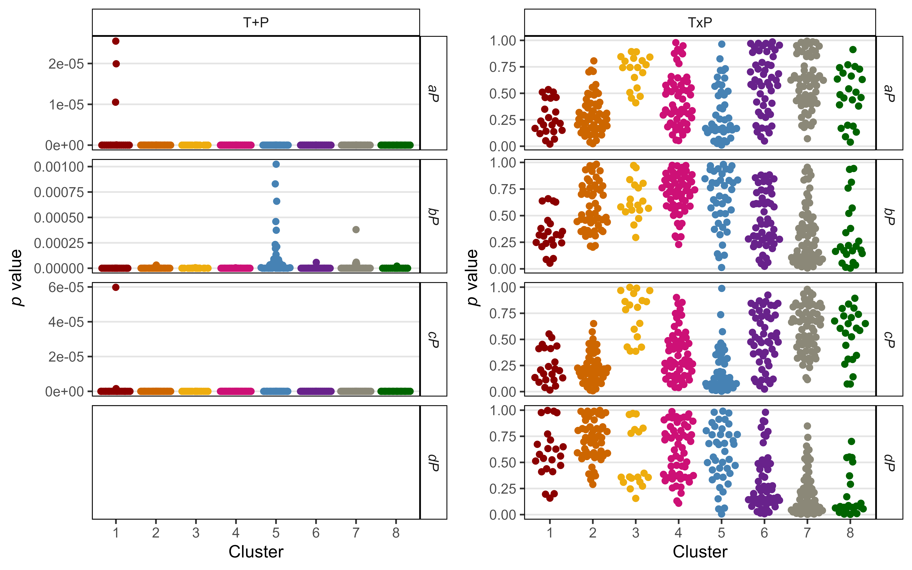

```{r}
# Prep data
pca <- read.csv("data/data_pca_results.csv") %>% mutate(Cluster = factor(Cluster))
x1 <- read.csv("data/model_t+p_coefs.csv") %>% mutate(Model = "T+P")
x2 <- read.csv("data/model_txp_coefs.csv") %>% mutate(Model = "TxP")
xx <- bind_rows(x1, x2) %>% 
  gather(Coef, Value, aP,bP,cP,dP) %>%
  left_join(pca, by = "Entry") %>%
  mutate(Cluster = factor(Cluster))
# Plot
mp1 <- ggplot(xx %>% filter(Model=="T+P"), aes(x = Cluster, y = Value, color = Cluster)) + 
  geom_quasirandom() + 
  facet_grid(Coef ~ Model, scales = "free_y") + 
  scale_color_manual(values = colors) +
  theme_AGL +
  theme(panel.grid.major.x = element_blank())  +
  labs(y = "p value")
mp2 <- ggplot(xx%>%filter(Model=="TxP"), aes(x = Cluster, y = Value, color = Cluster)) + 
  geom_quasirandom() + 
  facet_grid(Coef ~ Model, scales = "free_y") + 
  theme_AGL +
  theme(panel.grid.major.x = element_blank()) +
  scale_color_manual(values = colors) +
  labs(y = "p value")
mp <- ggarrange(mp1,mp2,ncol=2, legend = "none") 
ggsave("Additional/Additional_Figure_12.png", mp, width = 8, height = 5, dpi = 600)
```

---

## Additional Figure 13: p-values b c


```{r}
# Prep data
pca <- read.csv("data/data_pca_results.csv") %>% 
  mutate(Cluster = factor(Cluster))
xx <- read.csv("data/model_t+p_coefs.csv") %>% 
  mutate(Sig = factor(ifelse(bP > 0.0001, "Sig","Less Sig"))) %>%
  select(Entry, Sig, p.value=bP, b) %>% 
  gather(Trait, Value, p.value, b) %>%
  left_join(pca, by = "Entry")
x1 <- xx %>% filter(Sig == "Sig", Trait == "p.value")
# Plot (a)
mp1 <- ggplot(xx, aes(x = 1, y = Value)) +
  geom_quasirandom(aes(color = Cluster)) +
    geom_point(data = x1, size = 2.5, pch = 25, color = "black", fill = "darkblue") +
  geom_text_repel(data = x1, aes(label = Entry)) +
  facet_wrap(.~Trait, scales = "free_y") +
  scale_color_manual(values = colors) +
  guides(colour = guide_legend(nrow = 1, override.aes = list(size = 3))) +
  theme_AGL +
  theme(panel.grid.major.x = element_blank()) +
  labs(title = "(a)", x = NULL, y = NULL)
# Prep data
xx <- read.csv("data/model_t+p_coefs.csv") %>% 
  mutate(Sig = factor(ifelse(cP > 0.000001, "Sig","Less Sig"))) %>%
  select(Entry, Sig, p.value=cP, c) %>% 
  gather(Trait, Value, p.value, c) %>%
  left_join(pca, by = "Entry")
x1 <- xx %>% filter(Sig == "Sig")
# Plot B)
mp2 <- ggplot(xx, aes(x = 1, y = Value)) +
  geom_quasirandom(aes(color = Cluster)) +
  geom_point(data = x1, size = 2.5, pch = 25, color = "black", fill = "darkred") +
  geom_text_repel(data = x1 %>% filter(Trait =="p.value"), aes(label = Entry)) +
  facet_wrap(.~Trait, scales = "free_y") +
  scale_color_manual(values = colors) +
  guides(colour = guide_legend(nrow = 1, override.aes = list(size = 3))) +
  theme_AGL +
  theme(panel.grid.major.x = element_blank()) +
  labs(title = "(b)", x = NULL, y = NULL)
# Append (a) and (b)
mp <- ggarrange(mp1, mp2, ncol = 2, common.legend = T, legend = "bottom")
ggsave("Additional/Additional_Figure_13.png", mp, width = 8, height = 4, dpi = 600)
```

---

## Modeling DTF (T + P) - Location Out

Train the model without the location used for prediction

```{r echo = F}
downloadthis::download_link(
  link = "data/model_test.csv",
  button_label = "model_test.csv",
  button_type = "success",
  has_icon = TRUE,
  icon = "fa fa-save",
  self_contained = F
)
downloadthis::download_link(
  link = "data/model_test_d.csv",
  button_label = "model_test_d.csv",
  button_type = "success",
  has_icon = TRUE,
  icon = "fa fa-save",
  self_contained = F
)
```

```{r echo = F, eval = T}
xx <- read.csv("data/model_test_d.csv")
DT::datatable(xx)
```

```{r eval = F}
####################################
# 1/f = a + bT + cP (Location Out) #
####################################
# Prep data
xx <- rr %>% 
  filter(!is.na(RDTF)) %>%
  left_join(select(ff, Expt, T_mean, P_mean), by = "Expt")
mr <- NULL
md <- NULL
# Model - For each Location, the model is re-trained without that locations data
for(i in 1:324) {
  for(k in unique(xx$Location)) {
    # Prep data
    xi1 <- xx %>% filter(Entry == i, Location != k)
    xi2 <- xx %>% filter(Entry == i, Location == k) 
    xd2 <- xi2 %>% 
      group_by(Entry, Name, Expt, ExptShort) %>% 
      summarise_at(vars(DTF, RDTF, T_mean, P_mean), funs(mean), na.rm = T) %>%
      ungroup()
    # Train model
    mi <- lm(RDTF ~ T_mean * P_mean, data = xi1)
    # Predict DTF
    xi2 <- xi2 %>% mutate(Predicted_DTF = 1 / predict(mi, newdata = xi2))
    xd2 <- xd2 %>% mutate(Predicted_DTF = 1 / predict(mi, newdata = xd2))
    # Save to table
    mr <- bind_rows(mr, xi2)
    md <- bind_rows(md, xd2)
  }
}
# Save Results
write.csv(mr, "data/model_test.csv", row.names = F)
write.csv(md, "data/model_test_d.csv", row.names = F)
```

---

## Figure 4: Test Model


```{r}
# Prep data
xx <- read.csv("data/model_test_d.csv") %>% 
  mutate(Expt = factor(Expt, levels = names_Expt))
# Plot Observed vs Predicted
mp <- ggModel2(xx, title = expression(paste("Overall: ", italic("R")^2, " = 0.804 | RMSE = 15.0")))
ggsave("Figure_04.png", mp, width = 8, height = 5.5, dpi = 600)
```

```{r}
modelR2(xx$DTF, xx$Predicted_DTF)
modelRMSE(xx$DTF, xx$Predicted_DTF)
```

---

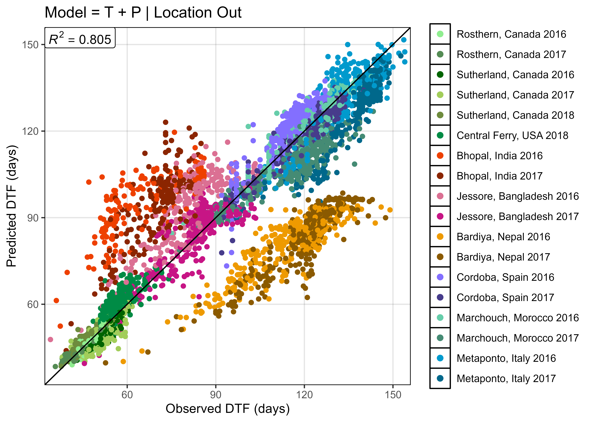

```{r}
# Plot Observed vs Predicted
mp <- ggModel1(xx, title = "Model = T + P | Location Out")
ggsave("Additional/Model/Model_1_3.png", mp, width = 7, height = 5, dpi = 600)
```

---


```{r}
# Plot Observed vs Predicted
mp <- ggModel2(xx, title = "Model = T + P | Location Out")
ggsave("Additional/Model/Model_2_3.png", mp, width = 8, height = 5.5, dpi = 600)
```

---

## Supplemental Table 4: Test Model

[Supplemental_Table_04.csv](https://github.com/derekmichaelwright/AGILE_LDP_Phenology/blob/master/Supplemental_Table_04.csv)

```{r eval = F}
####################################
# 1/f = a + bT + cP (3 Locations) #
####################################
# Prep data
xx <- rr %>% #filter(!is.na(DTF)) %>%
  left_join(select(ff, Expt, T_mean, P_mean), by = "Expt")
mt <- data.frame(Temperate_Location     = rep(names_ExptShort[1:6],  each = 36),
                 SouthAsian_Location    = rep(names_ExptShort[7:12], times = 36)) %>%
  arrange(SouthAsian_Location) %>%
  mutate(Mediterranean_Location = rep(names_ExptShort[13:18], 36),
                 RR = NA, Genotypes = NA)
# Run each combination
for(t in names_ExptShort[1:6]) { # Temperate site-years
  for(s in names_ExptShort[7:12]) { # South asian site-years
    for(m in names_ExptShort[13:18]) { # Mediterranean site-years
      mr <- NULL; md <- NULL
      for(i in 1:324) {
        # Prep data
        xi1 <- xx %>% filter(Entry == i, ExptShort %in% c(t, s, m))
        xi2 <- xx %>% filter(Entry == i)
        xd2 <- xi2 %>% 
          group_by(Entry, Name, Expt, ExptShort) %>% 
          summarise_at(vars(DTF, RDTF, T_mean, P_mean), funs(mean), na.rm = T) %>%
          ungroup()
        # Train model
        mi <- lm(RDTF ~ T_mean + P_mean, data = xi1)
        # Predict DTF
        xi2 <- xi2 %>% mutate(Predicted_DTF = 1 / predict(mi, newdata = xi2))
        xd2 <- xd2 %>% mutate(Predicted_DTF = 1 / predict(mi, newdata = xd2))
        # Save to table
        mr <- bind_rows(mr, xi2)
        md <- bind_rows(md, xd2)
      }
      remEntries <- unique(md$Entry[is.na(md$DTF) & md$ExptShort %in% c(t, s, m)])
      md2 <- md %>% filter(!Entry %in% remEntries, !md$ExptShort %in% c(t, s, m))
      myrow <- mt$Temperate_Location     == t & 
               mt$SouthAsian_Location    == s & 
               mt$Mediterranean_Location == m
      mt[myrow,"RR"] <- round(modelR2(md2$DTF, md2$Predicted_DTF), 6)
      mt[myrow,"Genotypes"] <- length(unique(md2$Entry))
    }
  }
}
# Save
write.csv(mt %>% arrange(RR), "Supplemental_Table_04.csv", row.names = F)
```

```{r echo = F}
xx <- read.csv("Supplemental_Table_04.csv")
DT::datatable(xx)
```

---

## Modeling DTF (T + P) - 3 Best

```{r eval = F}
####################################
# 1/f = a + bT + cP (3 Locations) #
####################################
# Prep data
xx <- rr %>% 
  filter(!is.na(RDTF)) %>%
  left_join(select(ff, Expt, T_mean, P_mean), by = "Expt")
mr <- NULL
md <- NULL
mc <- select(ldp, Entry, Name) %>%
  mutate(a = NA, b = NA, c = NA, RR = NA, Environments = NA )
k <- c("Sutherland, Canada 2016", "Jessore, Bangladesh 2017", "Cordoba, Spain 2017")
# Model - only the ^above^ three site-years are used to train the model
for(i in 1:324) {
  # Prep data
  xi1 <- xx %>% filter(Entry == i, Expt %in% k)
  xi2 <- xx %>% filter(Entry == i)
  xd2 <- xi2 %>% 
    group_by(Entry, Name, Expt, ExptShort) %>% 
    summarise_at(vars(DTF, RDTF, T_mean, P_mean), funs(mean), na.rm = T) %>%
    ungroup()
  # Train model
  mi <- lm(RDTF ~ T_mean * P_mean, data = xi1)
  # Predict DTF
  xi2 <- xi2 %>% mutate(Predicted_DTF = 1 / predict(mi, newdata = xi2))
  xd2 <- xd2 %>% mutate(Predicted_DTF = 1 / predict(mi, newdata = xd2))
  # Save to table
  mr <- bind_rows(mr, xi2)
  md <- bind_rows(md, xd2)
  # Save coefficients
  mc[i,c(3:5)] <- mi$coefficients
  # Calculate rr and # of environments used
  mc[i,6] <- 1 - sum((xi2$DTF - xi2$Predicted_DTF)^2) / sum((xi2$Predicted_DTF - mean(xi2$DTF))^2)
  mc[i,7] <- length(unique(xi2$Expt))
}
ents <- xx %>% filter(ExptShort %in% c("Su16", "Ba17", "Sp17"), is.na(DTF)) %>%
  pull(Entry) %>% unique()
mr <- mr %>% filter(!Entry %in% ents)
md <- md %>% filter(!Entry %in% ents)
mc <- mc %>% filter(!Entry %in% ents)
# Save Results
write.csv(mr, "data/model_3best.csv",        row.names = F)
write.csv(md, "data/model_3best_d.csv",      row.names = F)
write.csv(mc, "data/model_3best_coefs.csv",  row.names = F)
```

[data/model_3best.csv](https://github.com/derekmichaelwright/AGILE_LDP_Phenology/blob/master/data/model_3best.csv)

[data/model_3best_d.csv](https://github.com/derekmichaelwright/AGILE_LDP_Phenology/blob/master/data/model_3best_d.csv)

[data/model_3best_coefs.csv](https://github.com/derekmichaelwright/AGILE_LDP_Phenology/blob/master/data/model_3best_coefs.csv)

---

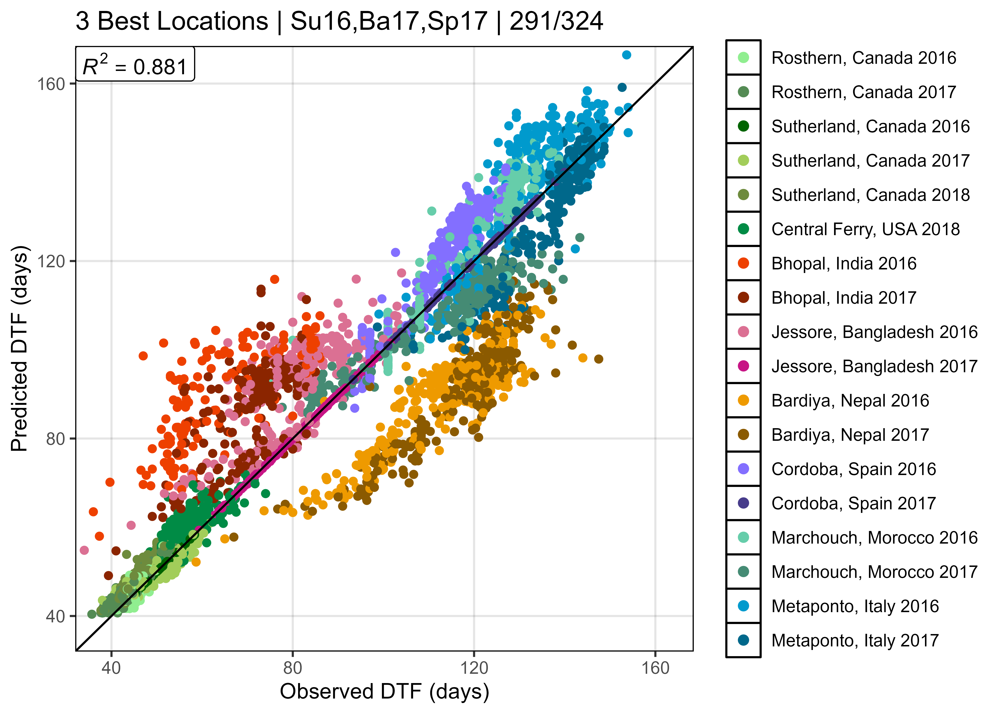

```{r}
# Prep data 
xx <- read.csv("data/model_3best_d.csv") %>% 
  mutate(Expt = factor(Expt, levels = names_Expt))
length(unique(xx$Entry))
# Plot Observed vs Predicted
mp <- ggModel1(xx, title = "3 Best Locations | Su16,Ba17,Sp17 | 291/324")
ggsave("Additional/Model/Model_1_4.png", mp, width = 7, height = 5, dpi = 600)
```

---


```{r}
# Plot B)
mp <- ggModel2(xx, title = "3 Best Locations | Su16,Ba17,Sp17 | 291/324")
ggsave("Additional/Model/Model_2_4.png", mp, width = 8, height = 5.5, dpi = 600)
```

---

## Modeling DTF (T + P) - 3 Worst

```{r eval = F}
####################################
# 1/f = a + bT + cP (3 Locations)  #
####################################
# Prep data
xx <- rr %>% 
  filter(!is.na(RDTF)) %>%
  left_join(select(ff, Expt, T_mean, P_mean), by = "Expt")
mr <- NULL
md <- NULL
mc <- select(ldp, Entry, Name) %>%
  mutate(a = NA, b = NA, c = NA, RR = NA, Environments = NA )
k <- c("Sutherland, Canada 2018", "Bhopal, India 2016", "Cordoba, Spain 2016")
# Model - only the ^above^ three site-years are used to train the model
for(i in 1:324) {
  # Prep data
  xi1 <- xx %>% filter(Entry == i, Expt %in% k)
  xi2 <- xx %>% filter(Entry == i)
  xd2 <- xi2 %>% 
    group_by(Entry, Name, Expt, ExptShort) %>% 
    summarise_at(vars(DTF, RDTF, T_mean, P_mean), funs(mean), na.rm = T) %>%
    ungroup()
  # Train model
  mi <- lm(RDTF ~ T_mean * P_mean, data = xi1)
  # Predict DTF
  xi2 <- xi2 %>% mutate(Predicted_DTF = 1 / predict(mi, newdata = xi2))
  xd2 <- xd2 %>% mutate(Predicted_DTF = 1 / predict(mi, newdata = xd2))
  # Save to table
  mr <- bind_rows(mr, xi2)
  md <- bind_rows(md, xd2)
  # Save coefficients
  mc[i,c(3:5)] <- mi$coefficients
  # Calculate rr and # of environments used
  mc[i,6] <- 1 - sum((xi2$DTF - xi2$Predicted_DTF)^2) / 
    sum((xi2$Predicted_DTF - mean(xi2$DTF))^2)
  mc[i,7] <- length(unique(xi2$Expt))
}
ents <- xx %>% 
  filter(ExptShort %in% c("Su18", "In16", "Sp16"), is.na(DTF)) %>%
  pull(Entry) %>% unique()
mr <- mr %>% filter(!Entry %in% ents)
md <- md %>% filter(!Entry %in% ents)
mc <- mc %>% filter(!Entry %in% ents)
# Save Results
write.csv(mr, "data/model_3worst.csv",        row.names = F)
write.csv(md, "data/model_3worst_d.csv",      row.names = F)
write.csv(mc, "data/model_3worst_coefs.csv",  row.names = F)
```

[data/model_3worst.csv](https://github.com/derekmichaelwright/AGILE_LDP_Phenology/blob/master/data/model_3worst.csv)

[data/model_3worst_d.csv](https://github.com/derekmichaelwright/AGILE_LDP_Phenology/blob/master/data/model_3worst_d.csv)

[data/model_3worst_coefs.csv](https://github.com/derekmichaelwright/AGILE_LDP_Phenology/blob/master/data/model_3worst_coefs.csv)

---

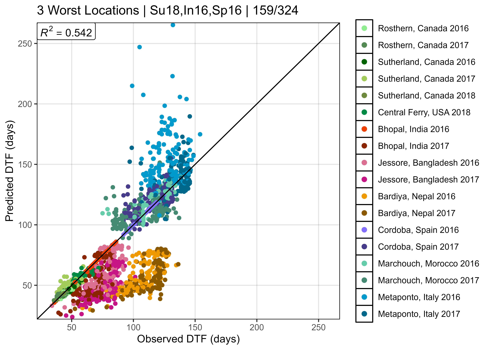

```{r}
# Prep data 
xx <- read.csv("data/model_3worst_d.csv") %>% 
  mutate(Expt = factor(Expt, levels = names_Expt))
length(unique(xx$Entry))
# Plot Observed vs Predicted
mp <- ggModel1(xx, title = "3 Worst Locations | Su18,In16,Sp16 | 159/324")
ggsave("Additional/Model/Model_1_5.png", mp, width = 7, height = 5, dpi = 600)
```

---

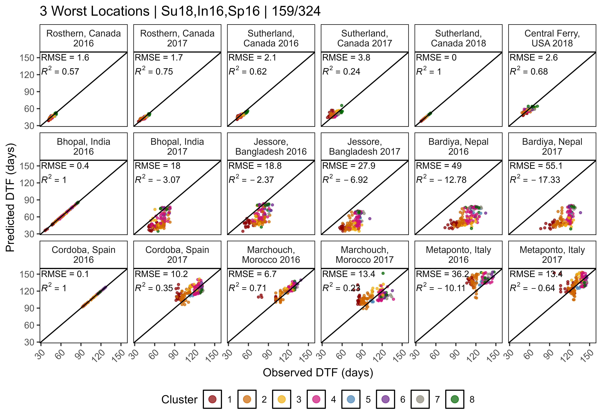

```{r}
# Plot B)
mp <- ggModel2(xx, title = "3 Worst Locations | Su18,In16,Sp16 | 159/324")
ggsave("Additional/Model/Model_2_5.png", mp, width = 8, height = 5.5, dpi = 600)
```

---

## DTF Model Correlation Coefficients

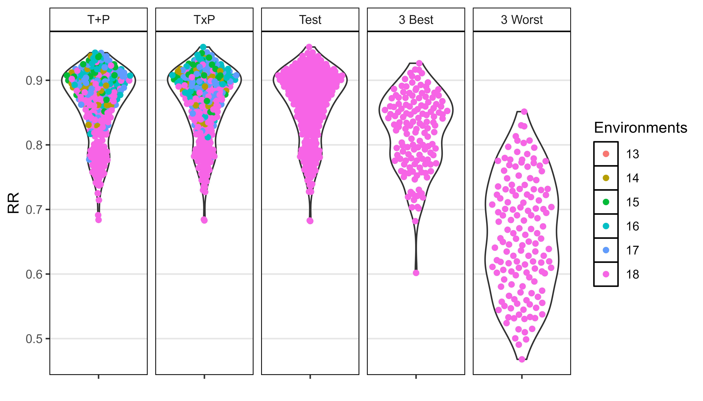

```{r}
# Prep data
x1 <- read.csv("data/model_t+p_coefs.csv") %>% mutate(Model = "T+P")
x2 <- read.csv("data/model_txp_coefs.csv") %>% mutate(Model = "TxP")
x3 <- read.csv("data/model_test_coefs.csv") %>% mutate(Model = "Test")
x4 <- read.csv("data/model_3best_coefs.csv")  %>% mutate(Model = "3 Best")
x5 <- read.csv("data/model_3worst_coefs.csv")  %>% mutate(Model = "3 Worst")
xx <- bind_rows(x1, x2, x3, x4, x5) %>% 
  mutate(Model = factor(Model, levels = unique(Model)),
         Environments = factor(Environments))
# Plot RR
mp <- ggplot(xx, aes(x = "", y = RR)) + 
  geom_violin() + 
  geom_quasirandom(aes(color = Environments)) +
  facet_grid(. ~ Model) +
  theme_AGL + 
  theme(panel.grid.major.x = element_blank()) +
  labs(x = NULL)
ggsave("Additional/Model/Model_pvalues.png", mp, width = 7, height = 4, dpi = 600)
```

---

## Supplemental Figure 6: Compare Constants Entry


- Entry 76 = ILL 4400 (Syrian Local Large)
- Entry 77 = ILL 4605 (Precoz)
- Entry 118 = ILL 9
- Entry 128 = Laird

```{r}
# Prep data
x1 <- read.csv("data/model_t+p_coefs.csv") %>% 
  filter(Entry %in% c(76, 77, 118, 128)) %>% 
  mutate(Expt = "All 18 Site-years")
x2.1 <- read.csv("data/model_3best_coefs.csv") %>% 
  filter(Entry %in% c(76, 77, 118, 128)) %>% 
  mutate(Expt = "Su16-Ba17-Sp17")
x2.2 <- read.csv("data/model_3worst_coefs.csv") %>% 
  filter(Entry %in% c(76, 77, 118, 128)) %>% 
  mutate(Expt = "Su18-In16-Sp16")
# Summerfield et al., 1985
x3 <- x1 %>% mutate(Expt = "Summerfield 1985 -V")
x3[x3$Entry == 76,  c("a","b","c")] <- c(-0.002918,  0,          0.0010093)
x3[x3$Entry == 77,  c("a","b","c")] <- c(-0.0052226, 0.00093643, 0.00075104)
x3[x3$Entry == 118, c("a","b","c")] <- c(-0.0057408, 0.00020113, 0.0012292)
x3[x3$Entry == 128, c("a","b","c")] <- c( 0.0014689, 0.00030622, 0.00044640)
x4 <- x1 %>% mutate(Expt = "Summerfield 1985 +V")
x4[x4$Entry == 76,  c("a","b","c")] <- c(-0.020910,   0.00045813,  0.0020210)
x4[x4$Entry == 77,  c("a","b","c")] <- c( 0.0101590, -0.00008401, -0.00044067)
x4[x4$Entry == 118, c("a","b","c")] <- c(-0.0196948,  0.00078441,  0.0019110)
x4[x4$Entry == 128, c("a","b","c")] <- c( 0.0015094,  0.00030622,  0.00085502)
# Roberts et al., 1988
x5 <- x1 %>% filter(Entry %in% c(77, 128)) %>% mutate(Expt = "Roberts 1988")
x5[x5$Entry == 77,  c("a","b","c")] <- c(-0.0112,   0.001427, 0.000871)
x5[x5$Entry == 128, c("a","b","c")] <- c(-0.008172, 0.000309, 0.001187)
# 
xx <- bind_rows(x1, x2.1, x2.2, x3, x4, x5) %>%
  gather(Constant, Value, a, b, c) %>%
  mutate(Entry = factor(Entry),
         Name = plyr::mapvalues(Entry, c(76,77,118,128), 
                  c("Precoz","ILL 4400","ILL 9","Laird")),
         Expt = factor(Expt, levels = c("All 18 Site-years", 
                  "Su16-Ba17-Sp17", "Su18-In16-Sp16",
                  "Summerfield 1985 -V", "Summerfield 1985 +V", "Roberts 1988")))
# Plot
mp <- ggplot(xx, aes(x = Expt, y = Value * 10000, shape = Expt)) + 
  geom_quasirandom(size = 2, width = 0.2) + 
  facet_grid(Constant ~ Name, scales = "free_y") +
  scale_shape_manual(name = NULL, values = c(8,3,4,1,16,11)) +
  guides(shape=guide_legend(nrow = 3, byrow = F)) +
  theme_AGL +
  theme(legend.position = "bottom", legend.margin = unit(c(0,0,0,0), "cm"),
        strip.text.y = element_text(face = "italic"),
        panel.grid.major.x = element_blank(),
        axis.text.x = element_blank()) +
  labs(x = NULL, y = "x 10000")
ggsave("Supplemental_Figure_06.png", mp, width = 4, height = 5, dpi = 600)
```

---

## Supplemental Figure 7: 3 best vs. 3 worst


```{r}
# Plot (a)
xx <- read.csv("data/model_3best_d.csv") %>% 
  mutate(Expt = factor(Expt, levels = names_Expt)) 
mp1 <- ggModel2(xx, title = "(a) 3 Best Locations | Su16-Ba17-Sp17 | 291/324")
# Plot (b)
xx <- read.csv("data/model_3worst_d.csv") %>% 
  mutate(Expt = factor(Expt, levels = names_Expt))
mp2 <- ggModel2(xx, title = "(b) 3 Worst Locations | Su18-In16-Sp16 | 159/324")
# Append (a) and (b)
mp <- ggarrange(mp1, mp2, ncol = 1, common.legend = T, legend = "bottom")
ggsave("Supplemental_Figure_07.png", mp, width = 8, height = 11, dpi = 600)
```

---

## Supplemental Figure 8: Compare Constants All


```{r}
# Prep data
levs <- c("All 18 Site-years", "Su16-Ba17-Sp17", "Su18-In16-Sp16")
pca <- read.csv("data/data_pca_results.csv") %>% 
  select(Entry, Cluster) %>%
  mutate(Cluster = factor(Cluster))
x1 <- read.csv("data/model_t+p_coefs.csv") %>%
  mutate(Expt = levs[1]) %>% select(-RR)
x2 <- read.csv("data/model_3best_coefs.csv") %>% 
  mutate(Expt = levs[2])
x3 <- read.csv("data/model_3worst_coefs.csv") %>% 
  mutate(Expt = levs[3])
xx <- bind_rows(x1, x2,x3) %>% 
  left_join(pca, by = "Entry") %>%
  gather(Trait, Value, a, b, c) %>%
  mutate(Expt = factor(Expt,levels = levs))
# Plot
mp <- ggplot(xx, aes(x = Expt, y = Value * 10000 )) +
  geom_violin(alpha = 0.3, color = NA, fill = "grey") + 
  geom_quasirandom(aes(color = Cluster), size = 0.3) + 
  facet_wrap(Trait ~ ., scales = "free") +
  scale_color_manual(values = colors, breaks = 8:1) +
  theme_AGL +
  theme(strip.text = element_text(face = "italic"),
        panel.grid.major.x = element_blank(),
        axis.text.x = element_text(angle = 90, vjust = 0.5, hjust = 1)) +
  guides(colour = guide_legend(override.aes = list(size = 2))) +
  labs(x = NULL, y = "x 10000")
ggsave("Supplemental_Figure_08.png", mp, width = 6, height = 3, dpi = 600)
```

---

## Base Temperature & Critical Photoperiod

```{r eval = F}
# Calculate Tf and Pf
xx <- read.csv("data/model_t+p_coefs.csv") %>% select(-Name) %>%
  mutate(predicted_Tf = 1/b, predicted_Pf = 1/c )
xx <- rr %>% left_join(xx, by = "Entry") %>%
  left_join(select(ff, Expt, T_mean, P_mean), by = "Expt") %>%
  mutate(Tb = -(a + c * P_mean) / b,
         Pc = -(a + b * T_mean) / c,
         Tf_0 = NA, Tf_5 = NA, Tf = NA, Pf = NA, PTT = NA)
for(i in 1:nrow(xx)) {
  e1 <- ee %>% filter(Expt == xx$Expt[i])
  for(k in 1:nrow(e1)) { 
    e1$Tfsum[k] <- sum(e1$Temp_mean[1:k] - xx$Tb[i])
    e1$Pfsum[k] <- sum(e1$DayLength[1:k] - xx$Pc[i])
  }
  ei <- e1 %>% 
    filter(Date <= xx$PlantingDate[i] + xx$DTF2[i], !is.na(Temp_mean)) 
  if(nrow(ei) > 0) {
    xx$Tf_0[i]  <- round(sum(ei$Temp_mean), 1)
    xx$Tf_5[i]  <- round(sum(ei$Temp_mean - 5), 1)
    xx$Tf[i]    <- round(sum(ei$Temp_mean - xx$Tb[i]), 1)
    xx$Pf_0[i]  <- round(sum(ei$DayLength), 1)
    xx$Pf_7[i]  <- round(sum(ei$DayLength - 7), 1)
    xx$Pf[i]    <- round(sum(ei$DayLength - xx$Pc[i]), 1)
    xx$PTT_0[i] <- round(sum(ei$Temp_mean * ei$DayLength), 1)
    xx$PTT[i]   <- round(sum((ei$Temp_mean - xx$Tb[i]) * (ei$DayLength - xx$Pc[i])), 1)
    eTf <- e1 %>% filter(Tfsum > xx$predicted_Tf[i])
    ePf <- e1 %>% filter(Pfsum > xx$predicted_Pf[i])
    xx$predicted_DTF_Tf[i] <- eTf$DaysAfterPlanting[1]
    xx$predicted_DTF_Pf[i] <- ePf$DaysAfterPlanting[1]
  }
}
xx <- xx %>% 
  left_join(select(ff, Expt, MacroEnv), by = "Expt") %>%
  group_by(Entry, Name, Expt, ExptShort, MacroEnv) %>% 
  summarise_at(vars(DTF, Tb, Pc, Tf_0, Tf_5, Tf, Pf_0, Pf_7, Pf, PTT, PTT_0,
                    predicted_DTF_Tf, predicted_DTF_Pf,
                    predicted_Pf, predicted_Tf), funs(mean), na.rm = T) %>%
  ungroup()
# Save
write.csv(xx,"data/data_tb_pc.csv", row.names = F)
```

[data/data_tb_pc.csv](https://github.com/derekmichaelwright/AGILE_LDP_Phenology/blob/master/data/data_tb_pc.csv)

```{r echo = F, eval = T}
xx <- read.csv("data/data_tb_pc.csv")
DT::datatable(xx)
```

---

## Figure 5: Tb and Pc


```{r}
# Prep data for (a) a, b and c
pca <- read.csv("data/data_pca_results.csv") %>% 
  select(Entry, Cluster) %>%
  mutate(Cluster = factor(Cluster))
xx <- read.csv("data/model_t+p_coefs.csv") %>%
  left_join(pca, by = "Entry") %>%
  select(Entry, Name, Cluster, a, b, c) %>%
  gather(Constant, Value, 4:ncol(.)) %>%
  mutate(Meaning = plyr::mapvalues(Constant, c("a","b","c"),
           c("", "temperature sensitivity", "photoperiod sensitivity")))
x1 <- xx %>% filter(Entry %in% c(94,105), Constant != "a") %>% 
  mutate(Name = gsub(" AGL", "", Name))
# Plot (a) a, b and c
mp1 <- ggplot(xx, aes(x = Cluster, y = Value * 10000) ) + 
  geom_violin(aes(fill = Cluster), color = NA, alpha = 0.7) + 
  geom_quasirandom(size = 0.3) + 
  geom_text_repel(data = x1, aes(label = Name), size = 3, nudge_x = 0.5) +
  facet_wrap(Constant + Meaning ~ ., nrow = 1, scales = "free") + 
  theme_AGL +
  theme(strip.text = element_text(face = "italic"),
        legend.position = "none", panel.grid.major.x = element_blank()) +
  scale_fill_manual(name = NULL, values = colors) +
  guides(fill = F) +
  labs(y = "x 10000")
# Prep data
xx <- read.csv("data/data_tb_pc.csv") %>% 
  left_join(pca, by = "Entry") %>%
  mutate(Expt = factor(Expt, levels = names_Expt)) %>%
  select(Entry, Name, Expt, ExptShort, Cluster, Tb, Pc, predicted_Tf, predicted_Pf)
x1 <- xx %>% 
  filter(ExptShort %in% c("Su17", "Ba17", "It17")) %>% 
  group_by(Entry, Name, Expt, ExptShort, Cluster) %>%
  summarise_at(vars(Tb, Pc), funs(mean), na.rm = T) 
# Plot (b) Tb
mp2.1 <- ggplot(x1, aes(x = 1, y = Tb)) + 
  geom_violin(fill = "grey", alpha = 0.3, color = NA) + 
  geom_quasirandom(aes(color = Cluster), size = 0.3) + 
  facet_grid(. ~ Expt, labeller = label_wrap_gen(width = 17)) +
  scale_y_continuous(breaks = seq(-80,0,20), minor_breaks = seq(-110,0,10)) +
  scale_color_manual(values = colors) +
  theme_AGL +
  theme(axis.text.x  = element_blank(), 
        axis.ticks.x = element_blank(),
        panel.grid.major.x = element_blank()) +
  guides(colour = guide_legend(nrow = 1, override.aes = list(size=2))) +
  labs(y = expression(paste(italic("T")[italic("b")], " = -(", italic("a"), " + ",
              italic("cP"), ") / ", italic("b"))), x = NULL)
# Plot (c) Pc
x2 <- x1 %>% 
  filter(Entry %in% c(94,105)) %>%
  ungroup() %>% 
  mutate(Name = gsub(" AGL", "", Name))
mp2.2 <- ggplot(x1, aes(x = 1, y = Pc)) + 
  geom_violin(fill = "grey", alpha = 0.3, color = NA) + 
  geom_quasirandom(aes(color = Cluster), size = 0.3) + 
  facet_grid(. ~ Expt, labeller = label_wrap_gen(width = 17)) +
  geom_text(data = x2, aes(label = Name), size = 3, nudge_y = 1.2) +
  scale_y_continuous(breaks = c(-20,-15,-10,-5,0,5)) +
  scale_color_manual(values = colors) +
  theme_AGL +
  theme(axis.text.x        = element_blank(),
        axis.ticks.x       = element_blank(),
        panel.grid.major.x = element_blank()) +
  guides(colour = guide_legend(nrow = 1, override.aes = list(size=2))) +
  labs(y = expression(paste(italic("P")[italic("c")], " = -(", italic("a"), " + ", 
             italic("bT"), ") / ", italic("c"))), x = NULL)
mp2 <- ggarrange(mp2.1, mp2.2, nrow = 1, ncol = 2, common.legend = T, legend = "bottom",
                 labels = c("(b)","(c)"), font.label = list(face = "plain"))
#
mp <- ggarrange(mp1, mp2, nrow = 2, ncol = 1, align = "hv", 
                labels = c("(a)",""), font.label = list(face = "plain")) #heights = 
ggsave("Figure_05.png", mp, width = 8, height = 6, dpi = 600)
```

---

## Figure 6: Origin Constants

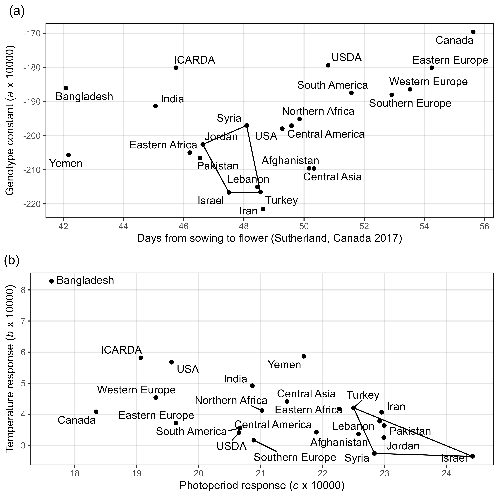

```{r}
# Prep data
mycts <- c("Canada", "USA", "Iran", "Yemen",
           "India", "Pakistan", "Bangladesh", "Afghanistan",
           "Syria", "Jordan", "Turkey", "Lebanon", "Israel")
xx <- read.csv("data/model_t+p_coefs.csv") %>% 
  left_join(select(ldp, Entry, Origin), by = "Entry") %>%
  left_join(select(ct, Origin=Country, SubRegion), by = "Origin") %>%
  filter(Origin != "Unknown") %>%
  mutate(SubRegion = as.character(SubRegion), Origin = as.character(Origin),
         SubRegion = ifelse(Origin %in% c("ICARDA", "USDA"), 
                            Origin, as.character(SubRegion)),
         Origin = ifelse(Origin %in% mycts, Origin, as.character(SubRegion)))
x1 <- xx %>% 
  left_join(dd %>% filter(ExptShort == "Su17") %>% select(Entry, DTF), by = "Entry") %>%
  group_by(Origin) %>% 
  summarise_at(vars(DTF, a, b, c), funs(mean, sd)) %>% 
  filter(Origin != "Unknown")
x2 <- x1 %>% mutate(CO = 1) %>%
  filter(Origin %in% c("Syria", "Jordan", "Turkey", "Lebanon", "Israel"))
# Plot (a) a vs DTF
find_hull <- function(df) df[chull(df[,"DTF_mean"], df[,"a_mean"]), ]
polys <- plyr::ddply(x2, "CO", find_hull)
mp1 <- ggplot(x1, aes(x = DTF_mean, y = a_mean * 10000)) + 
  geom_polygon(data = polys, fill = NA, color = "black") +
  geom_point() + 
  geom_text_repel(aes(label = Origin)) +
  scale_x_continuous(breaks = seq(42, 56, 2)) + 
  theme_AGL +
  theme(plot.title = element_text(hjust = -0.085) ) +
  labs(title = "(a)",
       y = expression(paste("Genotype constant (", italic(a)," x 10000)")), 
       x = "Days from sowing to flower (Sutherland, Canada 2017)")
# Plot (b) b vs c
find_hull <- function(df) df[chull(df[,"c_mean"], df[,"b_mean"]), ]
polys <- plyr::ddply(x2, "CO", find_hull)
mp2 <- ggplot(x1, aes(x = c_mean * 10000, y = b_mean * 10000)) + 
  geom_polygon(data = polys, fill = NA, color = "black") +
  geom_point() + 
  geom_text_repel(aes(label = Origin)) +
  scale_x_continuous(breaks = seq(18, 24, 1)) +
  scale_y_continuous(breaks = 3:8) +
  theme_AGL +
  theme(plot.title = element_text(hjust = -0.06) ) +
  labs(title = "(b)",
       y = expression(paste("Temperature response (", italic(b), " x 10000)")), 
       x = expression(paste("Photoperiod response (", italic(c), " x 10000)")))
# Append (a) and (b)
mp <- ggarrange(mp1, mp2, ncol = 1, nrow = 2)
ggsave("Figure_06.png", mp, width = 7, height = 7, dpi = 600)
ggsave("Additional/Temp/Temp_F06_1.png", mp1, width = 8, height = 4, dpi = 600)
ggsave("Additional/Temp/Temp_F06_2.png", mp2, width = 8, height = 4, dpi = 600)
```

---

## Supplemental Figure 9: Pc Tf PTT


```{r}
# Prep data for (a) Tf
pca <- read.csv("data/data_pca_results.csv") %>% 
  select(Entry, Cluster) %>%
  mutate(Cluster = factor(Cluster))
xx <- read.csv("data/data_tb_pc.csv") %>% 
  left_join(pca, by = "Entry") %>%
  mutate(MacroEnv = factor(MacroEnv, levels = names_MacroEnvs))
x1 <- xx %>% 
  select(Entry, Name, Expt, ExptShort, MacroEnv, Cluster, Tf_0, Tf_5, Tf) %>%
  gather(Trait, Value, Tf_0, Tf_5, Tf) %>%
  mutate(Trait = factor(Trait, levels = c("Tf_0", "Tf_5", "Tf")))
new.lab <- as_labeller(c(
  Tf_0 = "italic(T)[italic(b)]==0", Tf_5 = "italic(T)[italic(b)]==5",
  Tf = "italic(T)[italic(b)]==-(italic(a)+italic(Pc))/italic(b)", 
  Mediterranean = "Mediterranean", Temperate = "Temperate", 
  `South Asia` = "South~Asia"), label_parsed)
# Plot (a) Tf
mp1 <- ggplot(x1, aes(x = ExptShort, y = Value)) +
  geom_violin(fill = "grey", alpha = 0.3, color = NA) + 
  geom_quasirandom(aes(color = Cluster), size = 0.1, alpha = 0.7) + 
  facet_grid(Trait ~ MacroEnv, scales = "free", labeller = new.lab) +
  scale_color_manual(values = colors) +
  theme_AGL +
  theme(legend.position = "bottom", 
        legend.margin = unit(c(0,0,0,0), "cm"),
        panel.grid.major.x = element_blank(),
        axis.text.x = element_text(angle = 90, hjust = 1, vjust = 0.5)) +
  guides(colour = guide_legend(nrow = 1, override.aes = list(size = 3))) +
  labs(title = "(a) Thermal sum required for flowering", 
       y = expression(italic("T")[italic("f")]), x = NULL)
# Prep data for B) Pf
x1 <- xx %>% 
  select(Entry, Expt, ExptShort, MacroEnv, Cluster, Pf_0, Pf_7, Pf) %>%
  gather(Trait, Value, Pf_0, Pf_7, Pf) %>%
  mutate(Trait = factor(Trait, levels = c("Pf_0", "Pf_7", "Pf")))
new.lab <- as_labeller(c(
  Pf_0 = "italic(P)[italic(c)]==0", Pf_7 = "italic(P)[italic(c)]==5",
  Pf = "italic(P)[italic(c)]==-(italic(a)+italic(Tb))/italic(c)",
  Mediterranean = "Mediterranean", Temperate = "Temperate", 
  `South Asia` = "South~Asia"), label_parsed)
# Plot (b) Pf
mp2 <- ggplot(x1, aes(x = ExptShort, y = Value)) +
  geom_violin(fill = "grey", alpha = 0.3, color = NA) + 
  geom_quasirandom( aes(color = Cluster), size = 0.1, alpha = 0.7) + 
  facet_grid(Trait ~ MacroEnv, scales = "free", labeller = new.lab) +
  scale_color_manual(values = colors) +
  theme_AGL +
  theme(legend.position = "bottom",
        legend.margin = unit(c(0,0,0,0), "cm"),
        panel.grid.major.x = element_blank(),
        axis.text.x = element_text(angle = 90, hjust = 1, vjust = 0.5)) +
  guides(colour = guide_legend(nrow = 1, override.aes = list(size = 3))) +
  labs(title = "(b) Photoperiodic sum required for flowering", 
       y = expression(italic("P")[italic("f")]), x = NULL)

# Append (a), (b) and (c)
mp <- ggarrange(mp1, mp2, ncol = 1, common.legend = T, legend = "bottom")
# Save
ggsave("Additional/Temp/Temp_SF09_1.png", mp1, width = 8, height = 6, dpi = 600)
ggsave("Additional/Temp/Temp_SF09_2.png", mp2, width = 8, height = 6, dpi = 600)
ggsave("Supplemental_Figure_09.png", mp, width = 8, height = 10, dpi = 600)
```

---

## Additional Figure 14: PTT


```{r}
# Prep data
pca <- read.csv("data/data_pca_results.csv") %>% 
  select(Entry, Cluster) %>%
  mutate(Cluster = factor(Cluster))
xx <- read.csv("data/data_tb_pc.csv") %>% 
  left_join(pca, by = "Entry") %>%
  mutate(MacroEnv = factor(MacroEnv, levels = names_MacroEnvs)) %>% 
  select(Entry, Expt, ExptShort, MacroEnv, Cluster, PTT_0, PTT) %>%
  gather(Trait, Value, PTT_0, PTT) %>%
  mutate(Trait = factor(Trait, levels = c("PTT_0", "PTT")))
new.lab <- as_labeller(c(PTT_0 = "Sigma(italic(T))(italic(P))",
  PTT = "Sigma(italic(T)-italic(T)[italic(b)])(italic(P)-italic(P)[italic(c)])", 
  Mediterranean = "Mediterranean", Temperate = "Temperate", 
  `South Asia` = "South~Asia"), label_parsed)
# Plot PTT
mp <- ggplot(xx, aes(x = ExptShort, y = Value)) +
  geom_violin(fill = "grey", alpha = 0.3, color = NA) + 
  geom_quasirandom(aes(color = Cluster), size = 0.1, alpha = 0.7) + 
  facet_grid(Trait ~ MacroEnv, scales = "free", labeller = new.lab) +
  scale_color_manual(values = colors) +
  theme_AGL +
  theme(legend.position = "bottom",
        panel.grid.major.x = element_blank(),
        axis.text.x = element_text(angle = 90, hjust = 1, vjust = 0.5)) +
  guides(colour = guide_legend(nrow = 1, override.aes = list(size = 3))) +
  labs(title = "(b)", y = expression(italic("PTT")), x = NULL)
ggsave("Additional/Additional_Figure_14.png", mp, width = 8, height = 5, dpi = 600)
```

---

## Supplemental Figure 10: Thermal Sums


```{r}
# Prep data
xx <- read.csv("data/data_tb_pc.csv") %>% 
  mutate(Expt = factor(Expt, levels = names_Expt))
# Plot (a)
mp1 <- ggModel2(xx, "Tf", "predicted_Tf", "(a) Thermal sum required for flowering", 200, 200, 6600, 5500)
# Plot (b)
mp2 <- ggModel2(xx, "DTF", "predicted_DTF_Tf", "(b) Days from sowing to flower", 30, 30, 145, 125)
# Append (a) and (b)
mp <- ggarrange(mp1, mp2, nrow = 2, ncol = 1, common.legend = T, legend = "bottom")
ggsave("Supplemental_Figure_10.png", mp, width = 8, height = 10, dpi = 600)
```

---

## Supplemental Figure 11: Photoperiodic Sums


```{r}
# Prep data
xx <- read.csv("data/data_tb_pc.csv") %>% 
  mutate(Expt = factor(Expt, levels = names_Expt))
# Plot (a)
mp1 <- ggModel2(xx, "Pf", "predicted_Pf", "(a) Photoperiodic sum required for flowering", 190, 190, 1350, 1150)
# Plot (b)
mp2 <- ggModel2(xx, "DTF", "predicted_DTF_Pf", "(b) Days from sowing to flower", 30, 30, 145, 125)
# Append (a) and (b)
mp <- ggarrange(mp1, mp2, nrow = 2, ncol = 1, common.legend = T, legend = "bottom")
ggsave("Supplemental_Figure_11.png", mp, width = 8, height = 10, dpi = 600)
```

---

## Figure 7: Temperature Increase By MacroEnv


```{r}
# Prep data
yy <- c("Ro17", "Su17", "Us18", "In17", "Ba17", "Ne17", "Sp17", "Mo17", "It17")
coefs <- read.csv("data/model_t+p_coefs.csv")
pca <- read.csv("data/data_pca_results.csv") %>% 
  select(Entry, Cluster) %>%
  mutate(Cluster = factor(Cluster))
xx <- dd %>% 
  select(Entry, Expt, ExptShort, DTF) %>% 
  left_join(coefs, by = "Entry") %>%
  left_join(pca, by = "Entry") %>%
  left_join(select(ff, Expt, MacroEnv, T_mean, P_mean), by = "Expt")
# Temp +1
x1 <- xx %>%
  mutate(T_mean_1.5 = T_mean + 1.5,
         DTF_1 = 1 / (a + b * T_mean_1.5 + c * P_mean),
         DTF_0  = 1 / (a + b * T_mean + c * P_mean),
         Difference = DTF_0 - DTF_1) %>% 
  filter(ExptShort %in% yy)
x2 <- xx %>%
  mutate(P_mean_0.1 = P_mean + 0.1,
         DTF_1 = 1 / (a + b * T_mean + c * P_mean_0.1),
         DTF_0  = 1 / (a + b * T_mean + c * P_mean),
         Difference = DTF_0 - DTF_1) %>% 
  filter(ExptShort %in% yy)
x1 <- x1 %>% mutate(Treatment = "T + 1.5")
x2 <- x2 %>% mutate(Treatment = "P + 0.1")
knitr::kable(x1 %>% group_by(MacroEnv) %>% 
  summarise(Min = round(min(Difference), 2), Max = round(max(Difference), 2)) )
knitr::kable(x2 %>% group_by(MacroEnv) %>% 
  summarise(Min = round(min(Difference), 2), Max = round(max(Difference), 2)) )
xx <- bind_rows(x1, x2) %>%
  select(Expt, ExptShort, MacroEnv, Entry, Name, Cluster, 
         DTF_0, DTF_1, Difference, Treatment) %>%
  mutate(Treatment = factor(Treatment, levels = c("T + 1.5", "P + 0.1")))
write.csv(xx, "data/data_temp_photo_increase.csv", row.names = F)
new.lab <- as_labeller(c(`T + 1.5` = "italic(T)~+~1.5~degree*C", 
    `P + 0.1` = "italic(P)~+~0.1~h", Mediterranean = "Mediterranean", 
    Temperate = "Temperate", `South Asia` = "South~Asia"), label_parsed)
my_breaks <- function(x) { if (max(x) < 6) c(0,2.5,5) else seq(0,30,5) }
#my_minor_breaks <- function(x) { if (max(x) < 6) 1:5 else 1:30 }
# Plot 
mp <- ggplot(xx, aes(x = ExptShort, y = Difference)) + 
  geom_violin(fill = "grey", alpha = 0.3, color = NA) + 
  geom_quasirandom(aes(color = Cluster), size = 0.3) + 
  facet_grid(Treatment ~ MacroEnv, scales = "free", labeller = new.lab) + 
  scale_y_continuous(minor_breaks = 0:30, breaks = my_breaks) +
  scale_color_manual(values = colors) +
  theme_AGL +
  theme(legend.position = "bottom", 
        legend.margin = unit(c(0,0,0,0), "cm"),
        axis.text.x = element_text(angle = 90, hjust = 1, vjust = 0.5),
        panel.grid.major.x = element_blank()) + 
  guides(colour = guide_legend(nrow = 1, override.aes = list(size=2))) +
  labs(y = "Decrease in days to flower", x = NULL)
ggsave("Figure_07.png", mp, width = 7, height = 5, dpi = 600)
```

[data/data_temp_photo_increase.csv](https://github.com/derekmichaelwright/AGILE_LDP_Phenology/blob/master/data/data_temp_photo_increase.csv)

```{r echo = F, eval = T}
xx <- read.csv("data/data_temp_photo_increase.csv")
DT::datatable(xx)
```

---

&copy; Derek Michael Wright 2020