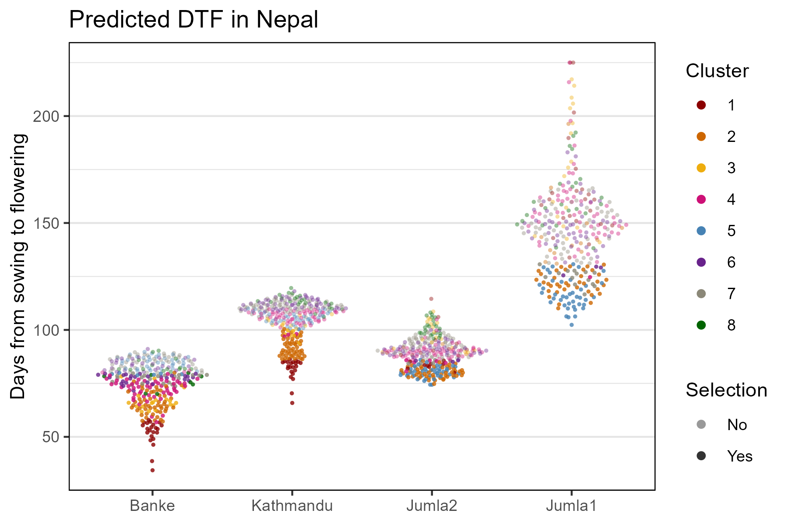
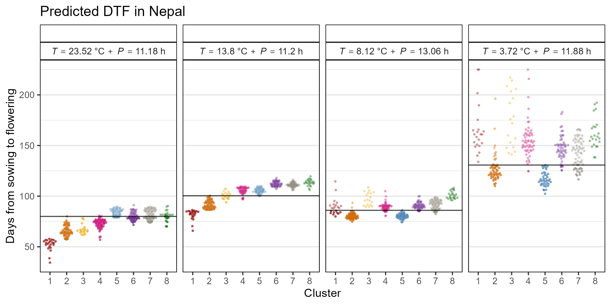
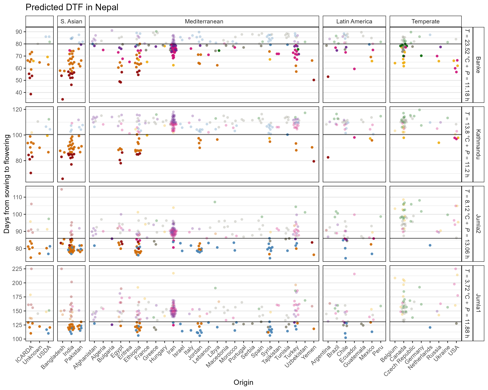
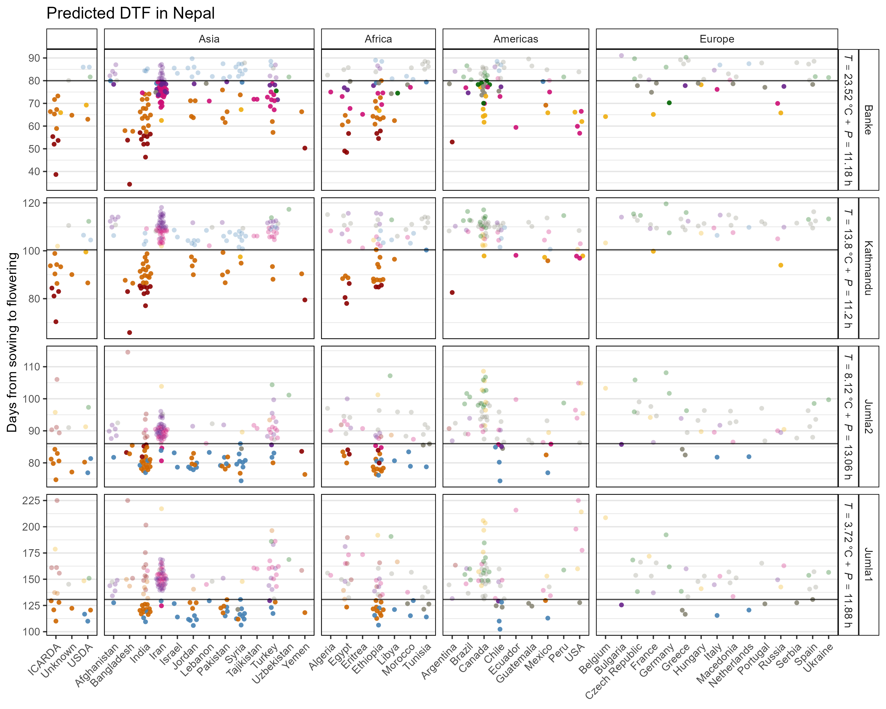

```{r setup, include=FALSE}
knitr::opts_chunk$set(echo = TRUE, message = F, warning = F, comment = NA, out.width = "100%")
```

---

# Introduction

This vignette contains some of the `r shiny::icon("r-project")` code and analysis to go along with the paper: 

`r shiny::icon("newspaper")` [Sandesh Neupane, Rajeev Dhakal, Derek Wright, Deny Shrestha, Bishnu Dhakal and Kirstin Bett. (2021) **Strategic Identification of New Genetic Diversity to Expand Lentil (*Lens culinaris* Medik.) Production (Using Nepal as an Example)**. *Agronomy*. 11(10): 1933.](https://www.mdpi.com/2073-4395/11/10/1933/htm)

which is a follow-up to:

`r shiny::icon("newspaper")` [Derek Wright, Sandesh Neupane, Taryn Heidecker, Teketel Haile, Clarice Coyne, Rebecca McGee, Sripada Udupa, Fatima Henkrar, Eleonora Barilli, Diego Rubiales, Tania Gioia, Giuseppina Logozzo, Stefania Marzario, Reena Mehra, Ashutosh Sarker, Rajeev Dhakal, Babul Anwar, Debashish Sarker, Albert Vandenberg, and Kirstin Bett. (2020) **Understanding photothermal interactions can help expand production range and increase genetic diversity of lentil (*Lens culinaris* Medik.)**. *Plants, People, Planet*. 00:1-11.](https://nph.onlinelibrary.wiley.com/doi/10.1002/ppp3.10158)

`r shiny::icon("github")` https://github.com/derekmichaelwright/AGILE_LDP_Phenology

This work done as part of the AGILE project at the University of Saskatchewan.


---

# Data Preparation

Load the nessesary R packages, Prepare the data for analysis.

```{r echo = F}
downloadthis::download_link(
  link = "data/data_countries.csv",
  button_label = "data_countries.csv",
  button_type = "success",
  has_icon = TRUE,
  icon = "fa fa-save",
  self_contained = F
)
downloadthis::download_link(
  link = "data/data_pca_results.csv",
  button_label = "data_pca_results.csv",
  button_type = "success",
  has_icon = TRUE,
  icon = "fa fa-save",
  self_contained = F
)
downloadthis::download_link(
  link = "data/model_t+p_coefs.csv",
  button_label = "model_t+p_coefs.csv",
  button_type = "success",
  has_icon = TRUE,
  icon = "fa fa-save",
  self_contained = F
)
downloadthis::download_link(
  link = "data/model_nepal.csv",
  button_label = "model_nepal.csv",
  button_type = "success",
  has_icon = TRUE,
  icon = "fa fa-save",
  self_contained = F
)
```

```{r}
#install.packages(c("tidyverse","ggbeeswarm","plotly","htmlwidgets"))
# Load libraries
library(tidyverse)   # data wrangling
library(ggbeeswarm)  # geom_quasirandom()
library(plotly)      # plot_ly()
library(htmlwidgets) # saveWidget()
# ggplot theme
theme_AGL <- theme_bw() + 
  theme(strip.background   = element_rect(colour = "black", fill = NA, size = 0.5),
        panel.background   = element_rect(colour = "black", fill = NA, size = 0.5),
        panel.border       = element_rect(colour = "black", size = 0.5),
        panel.grid         = element_line(color  = alpha("black", 0.1), size = 0.5),
        panel.grid.minor.x = element_blank(), 
        panel.grid.major.x = element_blank())
# General color palettes 
myColors_Cluster <- c("darkred",   "darkorange3", "darkgoldenrod2", "deeppink3", 
                 "steelblue", "darkorchid4", "cornsilk4",      "darkgreen")
myColors_Expt <- c("darkred", "purple4", "steelblue", "darkblue")
# Lentil Diversity Panel metadata
myPCA <- read.csv("https://raw.githubusercontent.com/derekmichaelwright/AGILE_LDP_Phenology/master/data/data_pca_results.csv") %>%
  select(Entry, Name, Origin, Cluster)
# Photothermal model coefficients
myCoefs <- read.csv("https://raw.githubusercontent.com/derekmichaelwright/AGILE_LDP_Phenology/master/data/model_t%2Bp_coefs.csv") %>%
  select(Entry, a, b, c)
# Country info
myCountries <- read.csv("https://raw.githubusercontent.com/derekmichaelwright/AGILE_LDP_Phenology/master/data/data_countries.csv") %>%
  select(Origin=Country, Region, Area)
#
myExpts <- c("Banke", "Kathmandu", "Jumla2", "Jumla1")
myLabels <- c("lab_Banke", "lab_Kathmandu", "lab_Jumla2", "lab_Jumla1")
myAreas <- c("", "S. Asian", "Mediterranean", "Latin America", "Temperate")
myRegions <- c("", "Asia", "Africa", "Americas", "Europe")
```

# Predict DTF

$$DTF = 1 / (a + b * T + c * P)$$

where:

- $T$: Mean temperature
- $P$: Mean photoperiod

<br>

- Jumla1: $T$ = 3.72 | $P$ = 11.88
- Jumla2: $T$ = 8.12 | $P$ = 13.06
- Banke: $T$ = 23.52 | $P$ = 11.18
- Kathmandu: $T$ = 13.8 | $P$ = 11.2

```{r}
# Predict DTF
dd <- myPCA %>%
  left_join(myCountries, by = "Origin") %>%
  left_join(myCoefs, by = "Entry") %>%
  mutate(Cluster = factor(Cluster),
         Jumla1 = 1 / (a + b * 3.72 + c * 11.88),
         Jumla2 = 1 / (a + b * 8.12 + c * 13.06),
         Banke = 1 / (a + b * 23.52 + c * 11.18),
         Kathmandu = 1 / (a + b * 13.8 + c * 11.2)) %>%
  gather(Expt, Value, Jumla1, Jumla2, Kathmandu, Banke) %>%
  mutate(Value = ifelse(Value > 225, 225, Value),
         Expt = factor(Expt, levels = myExpts),
         Area = factor(Area, levels = myAreas),
         Region = factor(Region, levels = myRegions))
```

# Selections

For prediction, the maximum DTF from cluster 2 of the South Asian genotypes was considered a cut-off for Banke and Kathmandu and the maximum from cluster 5 as the cut-off for Jumla.

```{r}
# Selection values
max_jumla1 <- dd %>% 
  filter(Expt == "Jumla1", Cluster == 5) %>%
  pull(Value) %>% max()
max_jumla2 <- dd %>% 
  filter(Expt == "Jumla2", Cluster == 5) %>%
  pull(Value) %>% max()
max_banke <- dd %>% 
  filter(Expt == "Banke", Cluster == 2) %>%
  pull(Value) %>% max()
max_kathmandu <- dd %>% 
  filter(Expt == "Kathmandu", Cluster == 2) %>%
  pull(Value) %>% max()
# Make selections
dd <- dd %>% 
  mutate(Selection = ifelse(Expt == "Jumla1" & Value <= max_jumla1, "Yes", "No"),
         Selection = ifelse(Expt == "Jumla2" & Value <= max_jumla2, "Yes", Selection),
         Selection = ifelse(Expt == "Banke" & Value <= max_banke, "Yes", Selection),
         Selection = ifelse(Expt == "Kathmandu" & Value <= max_kathmandu, "Yes", Selection))
write.csv(dd, "data/model_nepal.csv", row.names = F)
# Prep data
myThresholds <- data.frame(Expt = c("Jumla1", "Jumla2", "Banke", "Kathmandu"),
                           Cutoff = c(max_jumla1, max_jumla2, 
                                      max_banke, max_kathmandu)) %>%
  mutate(Expt = factor(Expt, levels = myExpts),
         Label = paste0("lab_", Expt),
         Label = factor(Label, levels = myLabels))
# Plot labeling prep
dd <- dd %>% 
  mutate(Label = paste0("lab_", Expt),
         Label = factor(Label, levels = myLabels))
new.lab <- as_labeller(c(lab_Jumla1 = "italic(T)==3.72~degree*C~+~italic(P)==11.88~h", 
                         lab_Jumla2 = "italic(T)==8.12~degree*C~+~italic(P)==13.06~h", 
                         lab_Banke = "italic(T)==23.52~degree*C~+~italic(P)==11.18~h", 
                         lab_Kathmandu = "italic(T)==13.8~degree*C~+~italic(P)==11.2~h"), 
                       label_parsed)
```

---

# Predicted DTF

## All Data



```{r}
# Plot
mp <- ggplot(dd, aes(x = Expt, y = Value, 
                     color = Cluster, alpha = Selection)) +
  geom_quasirandom(size = 0.75, pch = 16) +
  scale_color_manual(values = myColors_Cluster) +
  scale_alpha_manual(values = c(0.4, 0.8)) +
  guides(colour = guide_legend(override.aes = list(size = 2)),
         alpha = guide_legend(override.aes = list(size = 2))) +
  theme_AGL +
  labs(title = "Predicted DTF in Nepal",
       y = "Days from sowing to flowering", x = NULL)
ggsave("Nepal/Nepal_Figure_01.png", mp, width = 6, height = 4)
```

---

## By DTF Cluster Group



```{r}
# Plot
mp <- ggplot(dd, aes(x = Cluster, y = Value, 
                     color = Cluster, alpha = Selection)) +
  geom_quasirandom(size = 0.75, pch = 16) +
  geom_hline(data = myThresholds, aes(yintercept = Cutoff), alpha = 0.7) +
  scale_color_manual(name = NULL, values = myColors_Cluster) +
  scale_alpha_manual(values = c(0.4, 0.7)) +
  facet_grid(. ~ Expt + Label, labeller = new.lab) +
  theme_AGL +
  theme(legend.position = "none") +
  labs(title = "Predicted DTF in Nepal",
       y = "Days from sowing to flowering")
ggsave("Nepal/Nepal_Figure_02.png", mp, width = 8, height = 4)
```

---

# By Origin

## Area

```{r echo = F}
downloadthis::download_link(
  link = "https://derekmichaelwright.github.io/AGILE_LDP_Phenology/Nepal/Nepal_Figure_03.html",
  button_label = "Nepal/Nepal_Figure_03.html",
  button_type = "success",
  has_icon = TRUE,
  icon = "fas fa-chart-line",
  self_contained = FALSE
)
```

<iframe
  src="Nepal/Nepal_Figure_03.html"
  style="width:100%; height:600px;"
  data-external="1"
></iframe>



```{r}
# Plot
mp <- ggplot(dd, aes(x = Origin, y = Value, alpha = Selection,
                     color = Cluster, key1 = Entry, key2 = Name)) +
  geom_quasirandom(pch = 16) +
  geom_hline(data = myThresholds, aes(yintercept = Cutoff), alpha = 0.7) +
  facet_grid(Expt + Label ~ Area, scales = "free", space = "free_x", 
             labeller = labeller(Area = label_value, Expt = label_value,
                                 Label = new.lab)) +
  scale_color_manual(name = NULL, values = myColors_Cluster) +
  scale_alpha_manual(values = c(0.3, 0.9)) +
  theme_AGL +
  theme(legend.position = "none",
        axis.text.x = element_text(angle = 45, hjust = 1)) +
  labs(title = "Predicted DTF in Nepal",
       y = "Days from sowing to flowering")
ggsave("Nepal/Nepal_Figure_03.png", mp, width = 10, height = 8)
# Interactive
mp <- ggplotly(mp)
saveWidget(mp, file="Nepal/Nepal_Figure_03.html")
```

---

## Region



```{r}
# Plot
mp <- ggplot(dd, aes(x = Origin, y = Value, 
                     color = Cluster, alpha = Selection)) +
  geom_quasirandom(pch = 16) +
  geom_hline(data = myThresholds, aes(yintercept = Cutoff), alpha = 0.7) +
  facet_grid(Expt + Label ~ Region, scales = "free", space = "free_x",
             labeller = labeller(Area = label_value, Expt = label_value,
                                 Label = new.lab)) +
  scale_color_manual(name = NULL, values = myColors_Cluster) +
  scale_alpha_manual(values = c(0.3, 0.9)) +
  theme_AGL +
  theme(legend.position = "none",
        axis.text.x = element_text(angle = 45, hjust = 1)) +
  labs(title = "Predicted DTF in Nepal",
       y = "Days from sowing to flowering", x = NULL)
ggsave("Nepal/Nepal_Figure_04.png", mp, width = 10, height = 8)
```

---

&copy; Derek Michael Wright