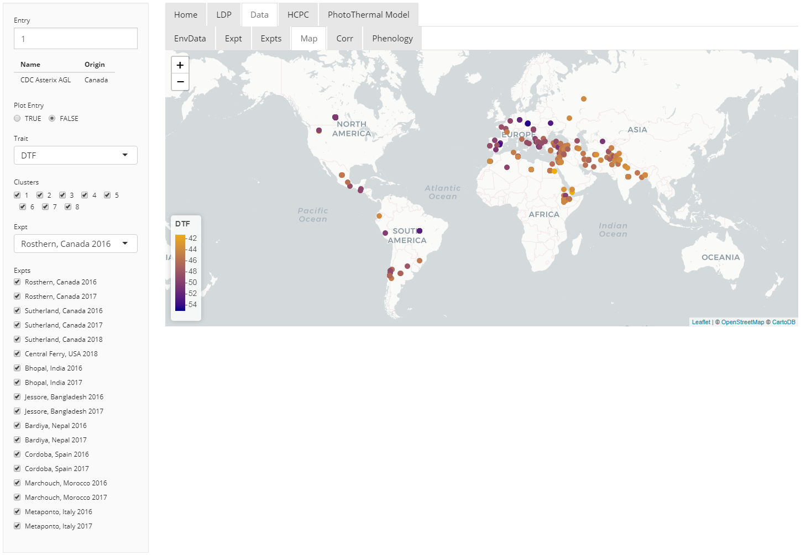

```{r setup, include=FALSE}
knitr::opts_chunk$set(echo = TRUE)
```

Contact: derek.wright@usask.ca

Derek Wright, Sandesh Neupane, Taryn Heidecker, Teketel Haile, Clarice Coyne, Sripada Udupa, Eleonora Barilli, Diego Rubiales, Tania Gioia, Reena Mehra, Ashutosh Sarker, Rajeev Dhakal, Babul Anwar, Debashish Sarker, Albert Vandenberg, and Kirstin E. Bett


**Project Collaborators**:

- Department of Plant Sciences and Crop Development Centre, University of Saskatchewan, Saskatoon, Saskatchewan, Canada
- United States Department of Agriculture Western Region Plant Introduction Station, Pullman, Washington, USA
- International Center for Agriculture Research in the Dry Areas, Rabat, Morocco
- Institute for Sustainable Agriculture, Spanish National Research Council, Cordoba, Spain
- School of Agriculture, Forestry, Food and Environmental Sciences, University of Basilicata, Potenza, Italy
- International Center for Agriculture Research in the Dry Areas, New Delhi, India
- Local Initiatives for Biodiversity, Research and Development, Pokhara, Nepal
- Bangladesh Agricultural Research Institute, Jessore, Bangladesh

**Project Sponsors**:

- Saskatchewan Pulse Growers Association
- Western Grains Research Foundation
- GenomePrairie
- GenomeCanada
- Saskatchewan Ministry of Agriculture

## Supplemental Folder

- Raw Data
- Supplemental Tables
- Supplemental Figures
- Additional Figures
- R Code Vignette
- Shiny App

## R Code Vignette


## Shiny App

Download this folder and run `app.R` in `R`
