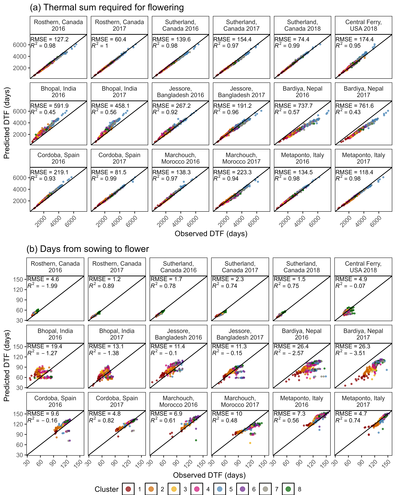

```{r setup, include=FALSE}
knitr::opts_chunk$set(echo = TRUE)
```

\pagebreak

---

[Derek Wright, Sandesh Neupane, Taryn Heidecker, Teketel Haile, Clarice Coyne, Sripada Udupa, Eleonora Barilli, Diego Rubiales, Tania Gioia, Reena Mehra, Ashutosh Sarker, Rajeev Dhakal, Babul Anwar, Debashish Sarker, Albert Vandenberg, and Kirstin E. Bett. (2020) Understanding photothermal interactions can help expand production range and increase genetic diversity of lentil (*Lens culinaris* Medik.). *Plants, People, Planet*.](https://www.biorxiv.org/content/10.1101/2020.07.18.207761v1.abstract)

---

[View as pdf](https://github.com/derekmichaelwright/AGILE_LDP_Phenology/raw/master/README.pdf)

[Source Code Vignette (Phenology_Vignette.html)](https://derekmichaelwright.github.io/AGILE_LDP_Phenology/Phenology_Vignette.html)

[Data](https://github.com/derekmichaelwright/AGILE_LDP_Phenology/tree/master/data)

# Contents

- [Shiny App](#shiny-app)
- [Figures](#figures)
- [Supplemental Figures](#supplemental-figures)
- [Supplemental Tables](#supplemental-tables)
- [Data Results Files](#data-results-files)
- [Additional Figures](#additional-figures)
- [PDFs](#pdfs)

# AGILE Project


## Collaborators

- Department of Plant Sciences and Crop Development Centre, University of Saskatchewan, Saskatoon, Saskatchewan, Canada
- United States Department of Agriculture Western Region Plant Introduction Station, Pullman, Washington, USA
- International Center for Agriculture Research in the Dry Areas, Rabat, Morocco
- Institute for Sustainable Agriculture, Spanish National Research Council, Cordoba, Spain
- School of Agriculture, Forestry, Food and Environmental Sciences, University of Basilicata, Potenza, Italy
- International Center for Agriculture Research in the Dry Areas, New Delhi, India
- Local Initiatives for Biodiversity, Research and Development, Pokhara, Nepal
- Bangladesh Agricultural Research Institute, Jessore, Bangladesh

## Sponsors

- Saskatchewan Pulse Growers Association
- Western Grains Research Foundation
- GenomePrairie
- GenomeCanada
- Saskatchewan Ministry of Agriculture

---

# Shiny App

Download this repository and run `app.R` in `R`

or visit https://derek-wright-usask.shinyapps.io/AGILE_LDP_Phenology/


---

# Figures

## Figure 1


*Figure 1: Growing Environments. (a) Locations of field trials conducted in the summer and winter of 2016, 2017 and 2018, along with (b) mean temperature and photoperiod of each field trial: Rosthern, Canada 2016 and 2017 (Ro16, Ro17), Sutherland, Canada 2016, 2017 and 2018 (Su16, Su17, Su18), Central Ferry, USA 2018 (Us18), Metaponto, Italy 2016 and 2017 (It16, It17), Marchouch, Morocco 2016 and 2017 (Mo16, Mo17), Cordoba, Spain 2016 and 2017 (Sp16, Sp17), Bhopal, India 2016 and 2017 (In16, In17), Jessore, Bangladesh 2016 and 2017 (Ba16, Ba17), Bardiya, Nepal 2016 and 2017 (Ne16, Ne17).*

---

## Figure 2


*Figure 2: Variations in temperature, day length and phenological traits across contrasting environment for a lentil (Lens culinaris Medik.) diversity panel. (a) Daily mean temperature (red line) and day length (blue line) from seeding to full maturity of all genotypes. The shaded ribbon represents the daily minimum and maximum temperature. The shaded area between the vertical bars corresponds to the windows of flowering. (b) Distribution of mean days from sowing to: flowering (DTF), swollen pods (DTS) and maturity (DTM), and (c) vegetative (VEG) and reproductive periods (REP) of 324 genotypes across 18 site-years. Rosthern, Canada 2016 and 2017 (Ro16, Ro17), Sutherland, Canada 2016, 2017 and 2018 (Su16, Su17, Su18), Central Ferry, USA 2018 (Us18), Metaponto, Italy 2016 and 2017 (It16, It17), Marchouch, Morocco 2016 and 2017 (Mo16, Mo17), Cordoba, Spain 2016 and 2017 (Sp16, Sp17), Bhopal, India 2016 and 2017 (In16, In17), Jessore, Bangladesh 2016 and 2017 (Ba16, Ba17), Bardiya, Nepal 2016 and 2017 (Ne16, Ne17).*

---

## Figure 3


\pagebreak

*Figure 3: Clustering of a lentil (Lens culinaris Medik.) diversity panel based days from sowing to flower (DTF). (a) Principal Component Analysis on DTF, scaled from 1-5, and hierarchical k-means clustering into eight groups. (b) Mean scaled DTF (1-5) for each cluster group across all field trials: Rosthern, Canada 2016 and 2017 (Ro16, Ro17), Sutherland, Canada 2016, 2017 and 2018 (Su16, Su17, Su18), Central Ferry, USA 2018 (Us18), Metaponto, Italy 2016 and 2017 (It16, It17), Marchouch, Morocco 2016 and 2017 (Mo16, Mo17), Cordoba, Spain 2016 and 2017 (Sp16, Sp17), Bhopal, India 2016 and 2017 (In16, In17), Jessore, Bangladesh 2016 and 2017 (Ba16, Ba17), Bardiya, Nepal 2016 and 2017 (Ne16, Ne17). Shaded areas represent one standard deviation from the mean. Dashed, vertical bars separate temperate, South Asian and Mediterranean macro-environments. (c) Composition of cluster groups in genotypes by country of origin. Pie size is relative to the number of genotypes originating from that country.*

---

## Figure 4


*Figure 4: Comparison of observed and predicted values for days from sowing to flowering (DTF) for a lentil (Lens culinaris Medik.) diversity panel calculated using equation 1. For each site-year, the model was retrained after removing all observations from that location, regardless of year before predicting results from that location. R2 = coefficient of determination, RMSE = root-mean-square error.*

---

## Figure 5


*Figure 5: Photothermal constants along with nominal base temperatures and photoperiods for a lentil (Lens culinaris Medik.) diversity panel. (a) Distribution of a, b and c constants calculated from equation 1 among cluster groups. Estimates of: (b) nominal base temperature (Tb), and (c) nominal base photoperiod (Pc) based on equations 2 and 3, respectively, using the mean temperature (T) and photoperiod (P) from Sutherland, Canada 2017, Jessore, Bangladesh 2017 and Metaponto, Italy 2017.*

---

## Figure 6


*Figure 6: Photothermal responses of lentil (Lens culinaris Medik.) adapted to regions outside the center of origin. (a) Comparison of days from sowing to flowering in Sutherland, Canada 2017 and the genotype constant a (x 104) derived from equation 1. (b) Comparison of temperature response (b x 104) and photoperiod response (c x 104) derived from equation 1. Polygons represent the variation inherent in the region where the crop was domesticated.*

---

## Figure 7


*Figure 7: Predicted decrease in days from sowing to flowering for a lentil (Lens culinaris Medik.) diversity panel based on a mean temperature (T) or photoperiod (P) increases of 1.5oC or 0.1h using equation 1 in the selected locations: Rosthern, Canada 2017 (Ro17), Sutherland, Canada 2017 (Su17), Central Ferry, USA 2018 (Us18), Bhopal, India 2017 (In17), Jessore, Bangladesh 2017 (Ba17), Bardiya, Nepal 2017 (Ne17), Marchouch, Morocco 2017 (Mo17), Cordoba, Spain 2017 (Sp17) and Metaponto, Italy 2017 (It17).*

---

# Supplemental Figures

## Supplemental Figure 1


*Figure S1: Distribution of days from sowing to flowering for raw data (top) and scaled data (1-5) (bottom) for all 18 field trials: Rosthern, Canada 2016 and 2017 (Ro16, Ro17), Sutherland, Canada 2016, 2017 and 2018 (Su16, Su17, Su18), Central Ferry, USA 2018 (Us18), Metaponto, Italy 2016 and 2017 (It16, It17), Marchouch, Morocco 2016 and 2017 (Mo16, Mo17), Cordoba, Spain 2016 and 2017 (Sp16, Sp17), Bhopal, India 2016 and 2017 (In16, In17), Jessore, Bangladesh 2016 and 2017 (Ba16, Ba17), Bardiya, Nepal 2016 and 2017 (Ne16, Ne17). Genotypes which did not flower were given a scaled value of 5.*

---

## Supplemental Figure 2


*Figure S2: Percentage of lentil genotypes reaching key phenological time points in South Asian locations. Days from sowing to: flowering (DTF), swollen pods (DTS) and maturity (DTM).*

---

## Supplemental Figure 3


*Figure S3: Correlations along with the corresponding correlation coefficients (R2) between days from sowing to: flowering (DTF), swollen pod (DTS) and maturity (DTM), in temperate (top), South Asian (middle) and Mediterranean (bottom) locations.*

---

## Supplemental Figure 4


\pagebreak

*Figure S4: Effects of mean temperature and photoperiod on the rate of progress towards flowering (1 / DTF) in three contrasting selected genotypes. (a) Effect of temperature on 1 / DTF, (b) effect of photoperiod on 1 / DTF, and (c) effect of temperature and photoperiod on 1 / DTF modelled using equation 1. For (a) and (b), solid lines represent regressions among locations of relatively constant photoperiod or temperature, respectively, while dotted lines indicate a break in the assumption of constant photoperiod or temperature, respectively, across environments (see Figure 1). (d) Scaled DTF (1-5) of each genotype (grey lines) across all site-years with ILL5888, PI 420925 LSP and Laird highlighted according to their corresponding cluster group, 1, 5 and 8 respectively. ILL 5888 is an early maturing, genotype from Bangladesh. PI 420925 LSP is a landrace from Jordan with medium maturity. Laird is a late maturing, Canadian cultivar.*

---

## Supplemental Figure 5


*Figure S5: Comparison of observed and predicted values for days from sowing to flowering using (a) equation 1 and (b) equation 2.*

---

## Supplemental Figure 6


*Figure S6: Comparison of a, b, and c constants calculated using equation 1, in the current study using all site-years, the three best site-years for predicting DTF, Sutherland, Canada 2016 (Su16), Jessore, Bangladesh 2017 (Ba17) and Cordoba, Spain 2017 (Sp17), the three worst site-years for predicting DTF, Sutherland, Canada 2018 (Su18), Bhopal, India 2016 (In16) and Cordoba, Spain 2016 (Sp16), from Roberts et al., (1988) and from Summerfield et al., (1985) with (+V) and without (-V) a seed vernalization treatment.*

---

## Supplemental Figure 7


\pagebreak

*Figure S7: Comparison of observed and predicted values, along with the coefficient of determination (R2) and root-mean-square error (RMSE), for days from sowing to flowering, calculated using equation 1, with (a) the 3 best site-years for training the model and (b) the 3 worst years for training the model (see Table S4). Sutherland, Canada 2016 and 2018 (Su16, Su18), Cordoba, Spain 2016 and 2017 (Sp16, Sp17), Bhopal, India 2016 (In16) and Jessore, Bangladesh 2017 (Ba17). Predictions of DTF can only be made with genotypes that flowered in all three locations, therefore, predictions in (a) are based on 291 and in (b) based on 159 of 324 genotypes used in this study.*

---

## Supplemental Figure 8


*Figure S8: Comparison of a, b, and c constants calculated using equation 1 using all site-years, the three best site-years for predicting DTF, Sutherland, Canada 2016 (Su16), Jessore, Bangladesh 2017 (Ba17) and Cordoba, Spain 2017 (Sp17), and the three worst site-years for predicting DTF, Sutherland, Canada 2018 (Su18), Bhopal, India 2016 (In16) and Cordoba, Spain 2016 (Sp16).*

---

## Supplemental Figure 9


\pagebreak

*Figure S9: (a) Thermal sum required for flowering (Tf), using a base temperature (Tb) of 0°C, 5°C and calculated using equation 3, across all site-years. (b) Photoperiodic sum required for flowering (Pf), using a critical photoperiod (Pc) of 0h, 5h and calculated using equation 4, across all site-years. Rosthern, Canada 2016 and 2017 (Ro16, Ro17), Sutherland, Canada 2016, 2017 and 2018 (Su16, Su17, Su18), Central Ferry, USA 2018 (Us18), Metaponto, Italy 2016 and 2017 (It16, It17), Marchouch, Morocco 2016 and 2017 (Mo16, Mo17), Cordoba, Spain 2016 and 2017 (Sp16, Sp17), Bhopal, India 2016 and 2017 (In16, In17), Jessore, Bangladesh 2016 and 2017 (Ba16, Ba17), Bardiya, Nepal 2016 and 2017 (Ne16, Ne17).*

---

\pagebreak

## Supplemental Figure 10



\pagebreak

*Figure S10: Comparison of observed vs predicted values, along with the coefficient of determination (R2) and root-mean-square error (RMSE), for (a) thermal sum required for flowering and (b) days from sowing to flowering, calculated using equation 5.*

---

\pagebreak

## Supplemental Figure 11


\pagebreak

*Figure S11: Comparison of observed vs predicted values, along with the coefficient of determination (R2) and root-mean-square error (RMSE) for (a) photoperiodic sum required for flowering and (b) days from sowing to flowering, calculated using equation 6.*

---

# Supplemental Tables

## Supplemental Table 1

[Supplemental_Table_01.csv](https://github.com/derekmichaelwright/AGILE_LDP_Phenology/blob/master/Supplemental_Table_01.csv)

```{r echo = F, eval = T}
xx <- read.csv("Supplemental_Table_01.csv")
DT::datatable(xx)
```

*Table S1: Genotype entry number, name, common synonyms, origin and source of lentil genotypes used in this study. These genotypes are gathered from the University of Saskatchewan (USASK), Plant Gene Resources of Canada (PGRC), United States Department of Agriculture (USDA), International Center for Agricultural Research in the Dry Areas (ICARDA).*

---

## Supplemental Table 2

https://github.com/derekmichaelwright/AGILE_LDP_Phenology/blob/master/Supplemental_Table_02.csv

```{r echo = F, eval = T}
xx <- read.csv("Supplemental_Table_02.csv")
DT::datatable(xx)
```

*Table S2: Details of the field trials used in this study, including location information, planting dates, mean temperature and photoperiods and details on plot type and number of seeds sown.*

---

## Supplemental Table 3

https://github.com/derekmichaelwright/AGILE_LDP_Phenology/blob/master/Supplemental_Table_03.csv

```{r echo = F, eval = T}
xx <- read.csv("Supplemental_Table_03.csv")
DT::datatable(xx)
```

*Table S3: Values of the constants derived from equations 1 and 2 using data from all site-years, for each of the genotypes used in this study.*

---

## Supplemental Table 4

https://github.com/derekmichaelwright/AGILE_LDP_Phenology/blob/master/Supplemental_Table_04.csv

```{r echo = F, eval = T}
xx <- read.csv("Supplemental_Table_04.csv")
DT::datatable(xx)
```

*Table S4: All possible combinations of a single temperate, South Asian, and Mediterranean site-year, used to train the model, with equation 1, along with the corresponding coefficient of determination (RR = R2), and number of genotypes which flowered in all three site-years.*

---

# Data Results Files

- [PCA Results (data/data_pca_results.csv)](https://github.com/derekmichaelwright/AGILE_LDP_Phenology/blob/master/data/data_pca_results.csv)
- [Photothermal Model Results (data/data_model_t+p.csv)](https://github.com/derekmichaelwright/AGILE_LDP_Phenology/blob/master/data/model_t%2Bp.csv)
- [Nominal Base Temperature and Photoperiod (data/data_tb_pc.csv)](https://github.com/derekmichaelwright/AGILE_LDP_Phenology/blob/master/data/data_tb_pc.csv)
- [Response to Temperature or Photoperiod increases (data/data_temp_phtoto_increase.csv)](https://github.com/derekmichaelwright/AGILE_LDP_Phenology/blob/master/data/data_temp_phtoto_increase.csv)

---

# Additional Figures

## Additional Figure 1


---

## Additional Figure 2


---

## Additional Figure 3


---

## Additional Figure 4


---

\pagebreak

## Additional Figure 5

[Additional/Additional_Figure_05.html](https://derekmichaelwright.github.io/AGILE_LDP_Phenology/Additional/Additional_Figure_05.html)

```{r echo = F, eval = T}
load("Additional/Additional_Figure_05.RData")
```


---

\pagebreak

## Additional Figure 6

[Additional/Additional_Figure_06.html](https://derekmichaelwright.github.io/AGILE_LDP_Phenology/Additional/Additional_Figure_06.html)

```{r echo = F, eval = T}
load("Additional/Additional_Figure_06.RData")
```


---

## Additional Figure 7


---

## Additional Figure 8


---

## Additional Figure 9

[Additional/Additional_Figure_09.html](https://derekmichaelwright.github.io/AGILE_LDP_Phenology/Additional/Additional_Figure_09.html)

```{r echo = F, eval = T}
load("Additional/Additional_Figure_09.RData")
```


---

## Additional Figure 10


---

## Additional Figure 11


---

## Additional Figure 12


---

## Additional Figure 13


---

## Additional Figure 14


---

## Phothermal Animation

[Additional/Animation_3D.gif](https://github.com/derekmichaelwright/AGILE_LDP_Phenology/blob/master/Additional/Animation_3D.gif)

```{r echo = F, eval = T}
magick::image_read("Additional/Animation_3D.gif")
```

---

\pagebreak

# PDFs

## Entry Phenology

[pdf_Phenology.pdf](https://github.com/derekmichaelwright/AGILE_LDP_Phenology/raw/master/Additional/pdf_Phenology.pdf)

---

## Temperature and Photoperiod Regressions

[pdf_TP.pdf](https://github.com/derekmichaelwright/AGILE_LDP_Phenology/raw/master/Additional/pdf_TP.pdf)

---

## Model Predictions

[pdf_Model.pdf](https://github.com/derekmichaelwright/AGILE_LDP_Phenology/raw/master/Additional/pdf_Model.pdf)

---

## Photothermal Planes 

[pdf_3D.pdf](https://github.com/derekmichaelwright/AGILE_LDP_Phenology/raw/master/Additional/pdf_3D.pdf)

---

&copy; Derek Michael Wright 2020
