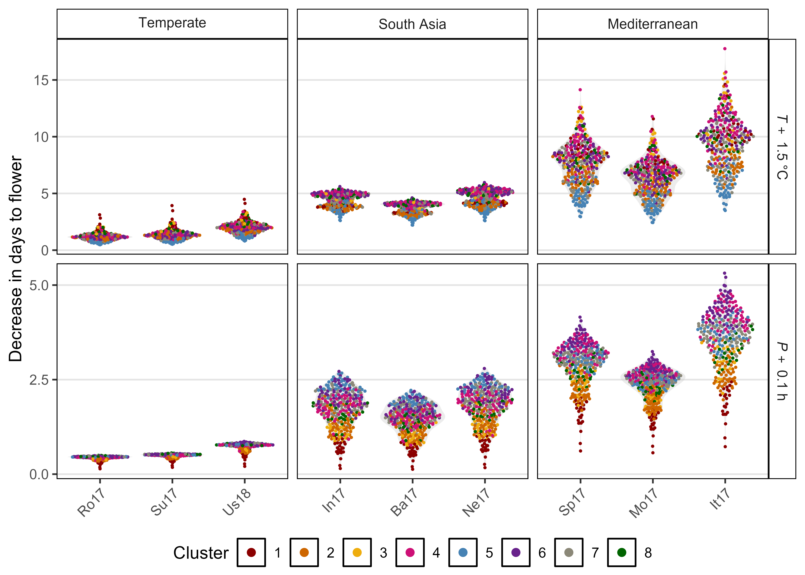
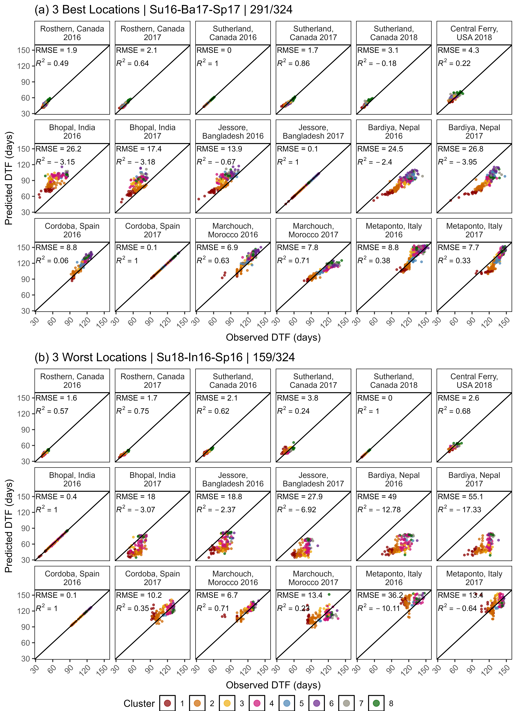
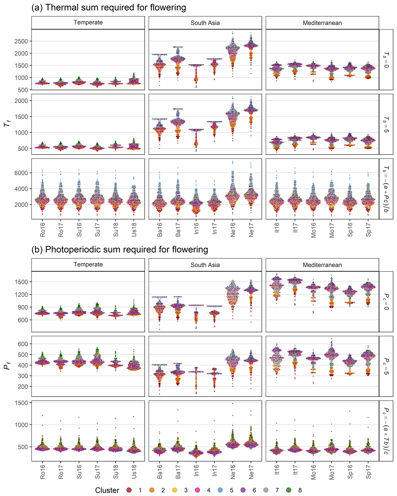
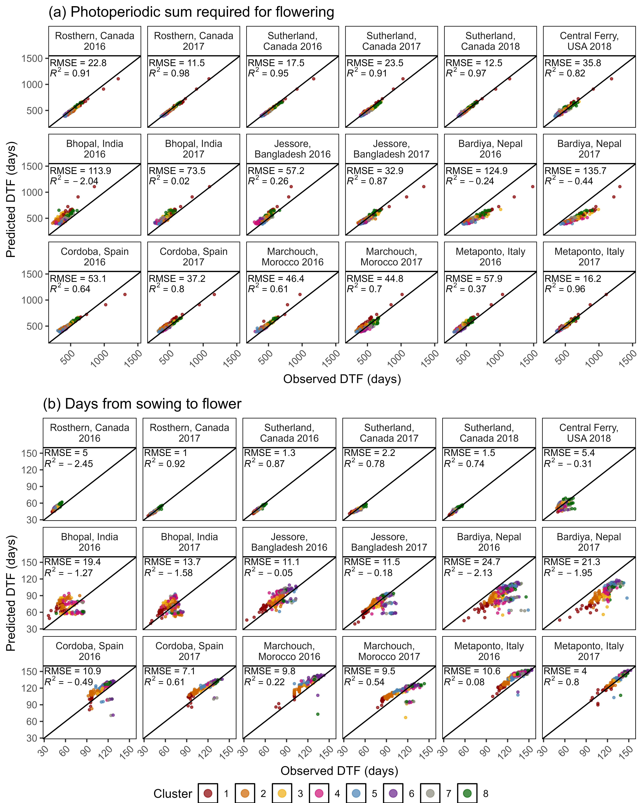
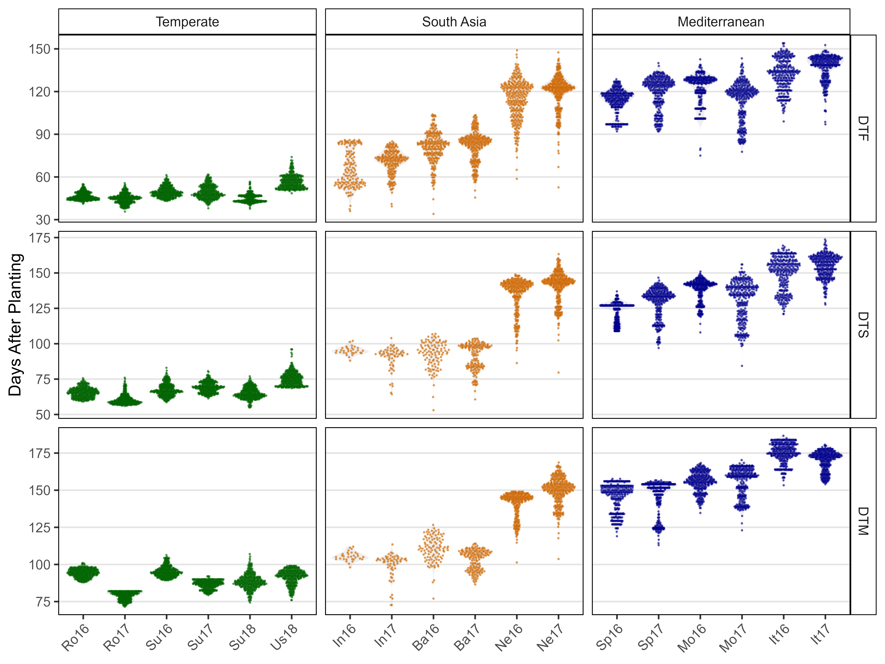
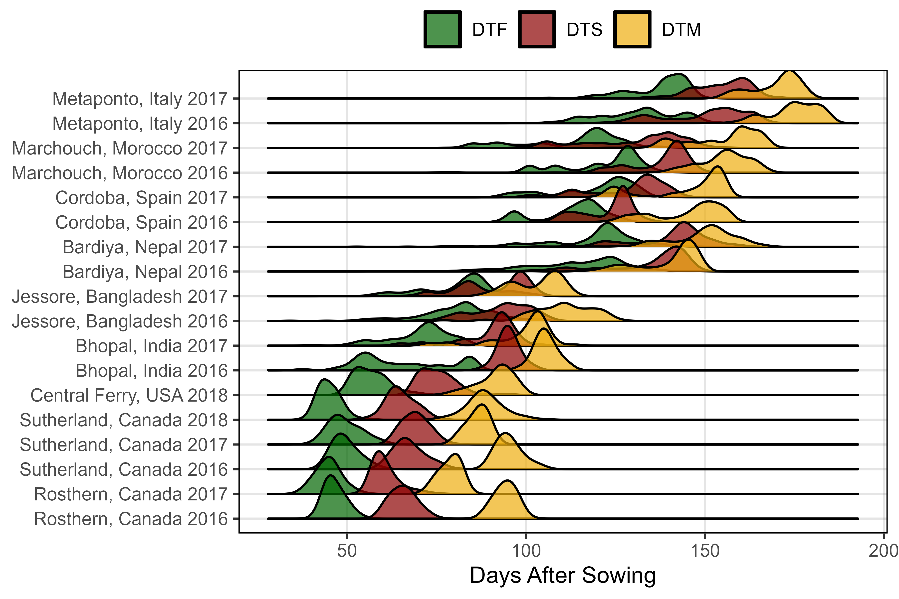
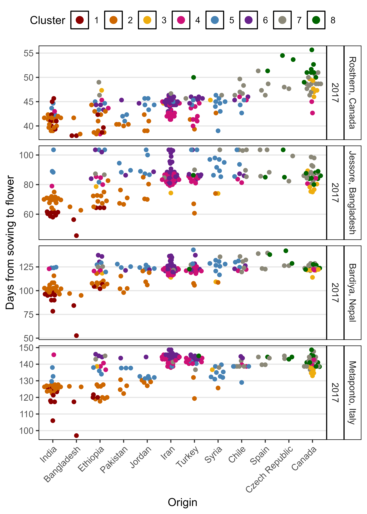

```{r setup, include=FALSE}
knitr::opts_chunk$set(echo = TRUE)
```

[View as HTML](https://derekmichaelwright.github.io/AGILE_LDP_Phenology/README.html)

Contact: derek.wright@usask.ca

Derek Wright, Sandesh Neupane, Taryn Heidecker, Teketel Haile, Clarice Coyne, Sripada Udupa, Eleonora Barilli, Diego Rubiales, Tania Gioia, Reena Mehra, Ashutosh Sarker, Rajeev Dhakal, Babul Anwar, Debashish Sarker, Albert Vandenberg, and Kirstin E. Bett

# Contents

- [Shiny App](#shiny_app)
- [Figures](#figures)
- [Supplemental Figures](#supplemental_figures)
- [Additional Figures](#additional_figures)
- [Animations](#animations)

# AGILE Project


## Collaborators

- Department of Plant Sciences and Crop Development Centre, University of Saskatchewan, Saskatoon, Saskatchewan, Canada
- United States Department of Agriculture Western Region Plant Introduction Station, Pullman, Washington, USA
- International Center for Agriculture Research in the Dry Areas, Rabat, Morocco
- Institute for Sustainable Agriculture, Spanish National Research Council, Cordoba, Spain
- School of Agriculture, Forestry, Food and Environmental Sciences, University of Basilicata, Potenza, Italy
- International Center for Agriculture Research in the Dry Areas, New Delhi, India
- Local Initiatives for Biodiversity, Research and Development, Pokhara, Nepal
- Bangladesh Agricultural Research Institute, Jessore, Bangladesh

## Sponsors

- Saskatchewan Pulse Growers Association
- Western Grains Research Foundation
- GenomePrairie
- GenomeCanada
- Saskatchewan Ministry of Agriculture

# R Code Vignette

[Phenology_Vignette.html](https://derekmichaelwright.github.io/AGILE_LDP_Phenology/Phenology_Vignette.html)

[Phenology_Vignette.pdf](https://github.com/derekmichaelwright/AGILE_LDP_Phenology/blob/master/Phenology_Vignette.pdf)

# Shiny App

Download this folder and run `app.R` in `R`


# Figures

## Figure 1


## Figure 2


## Figure 3


## Figure 4


## Figure 5


## Figure 6


## Figure 7



# Supplemental Figures

## Supplemental Figure 1


## Supplemental Figure 2


## Supplemental Figure 3


## Supplemental Figure 4


## Supplemental Figure 5


## Supplemental Figure 6


## Supplemental Figure 7



## Supplemental Figure 8


## Supplemental Figure 9



## Supplemental Figure 10


## Supplemental Figure 11



# Supplemental Tables

## Supplemental Table 1

```{r}
xx <- read.csv("Supplemental_Table_01.csv")
knitr::kable(xx[c(1:5,31:35,101:105,320:324),])
```

## Supplemental Table 2

```{r}
xx <- read.csv("Supplemental_Table_02.csv")
knitr::kable(xx)
```

## Supplemental Table 3

```{r}
xx <- read.csv("Supplemental_Table_03.csv")
knitr::kable(xx[c(1:2,61:62,201:202,647:648),])
```

## Supplemental Table 4

```{r}
xx <- read.csv("Supplemental_Table_04.csv")
knitr::kable(rbind(head(xx), tail(xx)))
```

# Additional Figures

## Additional Figure 1


## Additional Figure 2



## Additional Figure 3



## Additional Figure 4


## Additional Figure 5

[Additional/Additional_Figure_05_PCA_3D.html](https://derekmichaelwright.github.io/AGILE_LDP_Phenology/Additional/Additional_Figure_05_PCA_3D.html)

## Additional Figure 6


## Additional Figure 7



## Additional Figure 8


## Additional Figure 9


## Additional Figure 10


## Additional Figure 11


## Additional Figure 12


## Additional Figure 13


## Additional Figure 14


# Animations

## Temperature and Photoperiod Regressions

```{r echo = F, eval = F}
library(magick)
image_read("Additional/Animation_TP.gif")
```

[pdf of Temperature and Photoperiod Regressions](Additional/pdf_TP.pdf)

## Model Predictions

```{r echo = F, eval = F}
image_read("Additional/Animation_TP.gif")
```

[pdf of Model Predictions](Additional/pdf_Model.pdf)

## Photothermal Planes 

```{r echo = F, eval = F}
image_read("Additional/Animation_TP.gif")
```

[pdf of Photothermal Planes](Additional/pdf_3D.pdf)
