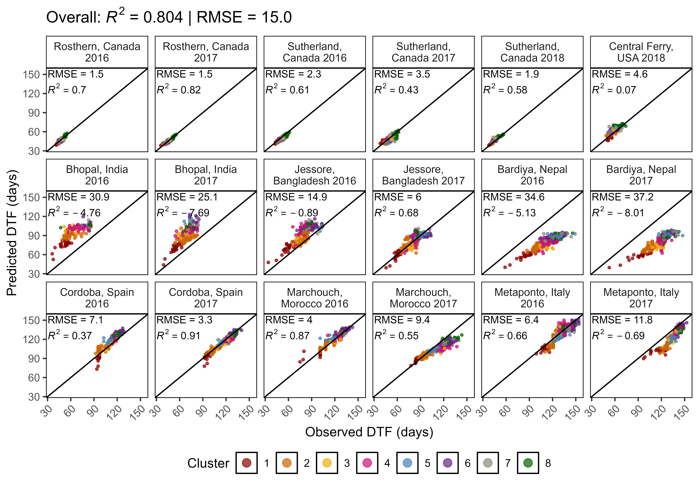
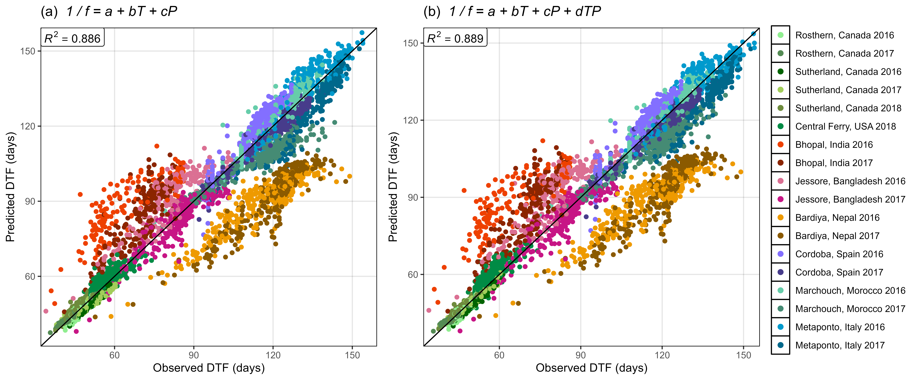
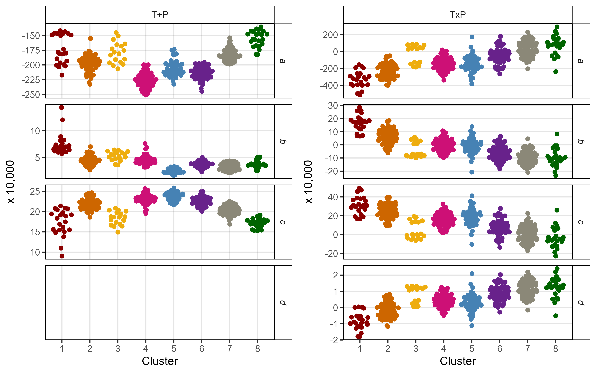

Variable responses of lentil (*Lens culinaris* Medik.) germplasm to
changes in photoperiod and temperature
================
Derek Michael Wright <derek.wright@usask.ca>
2020-03-02

[View as
HTML](https://derekmichaelwright.github.io/AGILE_LDP_Phenology/README.html)

Derek Wright, Sandesh Neupane, Taryn Heidecker, Teketel Haile, Clarice
Coyne, Sripada Udupa, Eleonora Barilli, Diego Rubiales, Tania Gioia,
Reena Mehra, Ashutosh Sarker, Rajeev Dhakal, Babul Anwar, Debashish
Sarker, Albert Vandenberg, and Kirstin E. Bett

# Contents

  - [Source Code Vignette](#source-code-vignette)
  - [Shiny App](#shiny-app)
  - [Raw Data Files](#raw-data)
  - [Figures](#figures)
  - [Supplemental Figures](#supplemental-figures)
  - [Supplemental Tables](#supplemental-tables)
  - [Data Results Files](#data-results-files)
  - [Additional Figures](#additional-figures)
  - [PDFs](#pdfs)

# AGILE Project


## Collaborators

  - Department of Plant Sciences and Crop Development Centre, University
    of Saskatchewan, Saskatoon, Saskatchewan, Canada
  - United States Department of Agriculture Western Region Plant
    Introduction Station, Pullman, Washington, USA
  - International Center for Agriculture Research in the Dry Areas,
    Rabat, Morocco
  - Institute for Sustainable Agriculture, Spanish National Research
    Council, Cordoba, Spain
  - School of Agriculture, Forestry, Food and Environmental Sciences,
    University of Basilicata, Potenza, Italy
  - International Center for Agriculture Research in the Dry Areas, New
    Delhi, India
  - Local Initiatives for Biodiversity, Research and Development,
    Pokhara, Nepal
  - Bangladesh Agricultural Research Institute, Jessore, Bangladesh

## Sponsors

  - Saskatchewan Pulse Growers Association
  - Western Grains Research Foundation
  - GenomePrairie
  - GenomeCanada
  - Saskatchewan Ministry of Agriculture

# Source Code Vignette

[Phenology\_Vignette.html](https://derekmichaelwright.github.io/AGILE_LDP_Phenology/Phenology_Vignette.html)

[Phenology\_Vignette.pdf](https://github.com/derekmichaelwright/AGILE_LDP_Phenology/blob/master/Phenology_Vignette.pdf)

# Shiny App

Download this folder and run `app.R` in `R`

or visit <https://derek-wright-usask.shinyapps.io/AGILE_LDP_Phenology/>


# Raw Data Files

  - [Raw Phenotype Data
    (data/data\_raw.csv)](https://github.com/derekmichaelwright/AGILE_LDP_Phenology/blob/master/data/data_raw.csv)
  - [Raw Environmental Data
    (data/data\_env.csv)](https://github.com/derekmichaelwright/AGILE_LDP_Phenology/blob/master/data/data_env.csv)

# Figures

## Figure 1


*Fig 1: (a) Locations of field trials conducted in the summer and winter
of 2016, 2017 and 2018, along with (b) mean temperature and photoperiod
of each field trial: Rosthern, Canada 2016 and 2017 (Ro16, Ro17),
Sutherland, Canada 2016, 2017 and 2018 (Su16, Su17, Su18), Central
Ferry, USA 2018 (Us18), Metaponto, Italy 2016 and 2017 (It16, It17),
Marchouch, Morocco 2016 and 2017 (Mo16, Mo17), Cordoba, Spain 2016 and
2017 (Sp16, Sp17), Bhopal, India 2016 and 2017 (In16, In17), Jessore,
Bangladesh 2016 and 2017 (Ba16, Ba17), Bardiya, Nepal 2016 and 2017
(Ne16, Ne17).*

## Figure 2


*Fig. 2: (a) Daily mean temperature (red line) and day length (blue
line) from seeding to full maturity of all genotypes. The shaded ribbon
represents the daily minimum and maximum temperature. The shaded area
between the vertical bars corresponds to the windows of flowering. (b)
Distribution of mean days from sowing to: flowering (DTF), swollen pods
(DTS) and maturity (DTM), and (c) vegetative (VEG) and reproductive
periods (REP) of 324 genotypes across 18 site-years. Rosthern, Canada
2016 and 2017 (Ro16, Ro17), Sutherland, Canada 2016, 2017 and 2018
(Su16, Su17, Su18), Central Ferry, USA 2018 (Us18), Metaponto, Italy
2016 and 2017 (It16, It17), Marchouch, Morocco 2016 and 2017 (Mo16,
Mo17), Cordoba, Spain 2016 and 2017 (Sp16, Sp17), Bhopal, India 2016 and
2017 (In16, In17), Jessore, Bangladesh 2016 and 2017 (Ba16, Ba17),
Bardiya, Nepal 2016 and 2017 (Ne16, Ne17).*

## Figure 3


*Fig. 3: (a) Principal Component Analysis on days from sowing to flower
(DTF), scaled from 1-5, and hierarchical k-means clustering into eight
groups. (b) Mean scaled DTF (1-5) for each cluster group across all
field trials: Rosthern, Canada 2016 and 2017 (Ro16, Ro17), Sutherland,
Canada 2016, 2017 and 2018 (Su16, Su17, Su18), Central Ferry, USA 2018
(Us18), Metaponto, Italy 2016 and 2017 (It16, It17), Marchouch, Morocco
2016 and 2017 (Mo16, Mo17), Cordoba, Spain 2016 and 2017 (Sp16, Sp17),
Bhopal, India 2016 and 2017 (In16, In17), Jessore, Bangladesh 2016 and
2017 (Ba16, Ba17), Bardiya, Nepal 2016 and 2017 (Ne16, Ne17). Shaded
areas represent one standard deviation from the mean. Dashed, vertical
bars separate temperate, South Asian and Mediterranean
macro-environments. (c) Composition of cluster groups in genotypes by
country of origin. Pie size is relative to the number of genotypes
originating from that country.*

## Figure 4



*Fig. 4: Comparison of observed and predicted values, along with the
coefficient of determination (R2) and root-mean-square error (RMSE), for
days from sowing to flowering, calculated using equation 1. For each
site year, the model was retrained after removing all observations from
that location, regardless of year before predicting results from that
location.*

## Figure 5


*Fig. 5: (a) Distribution of a, b and c constants derived from equation
1 among cluster groups. Estimates of: (b) nominal base temperature (Tb),
and (c) nominal base photoperiod (Pc) based on equations 2 and 3,
respectively, using the mean temperature (T) and photoperiod (P) from
Sutherland, Canada 2017, Jessore, Bangladesh 2017 and Metaponto, Italy
2017.*

## Figure 6


*Fig. 6: Mean values for genotypes of different origins. (a) Comparison
of days from sowing to flowering in Sutherland, Canada 2017 and the
genotype constant a (x 104) derived from equation 1. (b) Comparison of
temperature response (b x 104) and photoperiod response (c x 104)
derived from equation 1. Polygons represent the variation inherent in
the region where the crop was domesticated.*

## Figure 7


*Fig. 7: Predicted decrease in days from sowing to flowering based on a
mean temperature (T) or photoperiod (P) increases of 0.1h or and 1.5oC
using equation 1 in the selected locations: Rosthern, Canada 2017
(Ro17), Sutherland, Canada 2017 (Su17), Central Ferry, USA 2018 (Us18),
Bhopal, India 2017 (In17), Jessore, Bangladesh 2017 (Ba17), Bardiya,
Nepal 2017 (Ne17), Marchouch, Morocco 2017 (Mo17), Cordoba, Spain 2017
(Sp17) and Metaponto, Italy 2017 (It17).*

# Supplemental Figures

## Supplemental Figure 1


*Fig. S1: Distribution of days from sowing to flowering for raw data
(top) and scaled data (1-5) (bottom) for all 18 field trials: Rosthern,
Canada 2016 and 2017 (Ro16, Ro17), Sutherland, Canada 2016, 2017 and
2018 (Su16, Su17, Su18), Central Ferry, USA 2018 (Us18), Metaponto,
Italy 2016 and 2017 (It16, It17), Marchouch, Morocco 2016 and 2017
(Mo16, Mo17), Cordoba, Spain 2016 and 2017 (Sp16, Sp17), Bhopal, India
2016 and 2017 (In16, In17), Jessore, Bangladesh 2016 and 2017 (Ba16,
Ba17), Bardiya, Nepal 2016 and 2017 (Ne16, Ne17). Genotypes which did
not flower were given a scaled value of 5.*

## Supplemental Figure 2


*Fig. S2: Percentage of lentil genotypes reaching key phenological time
points in South Asian locations. Days from sowing to: flowering (DTF),
swollen pods (DTS) and maturity (DTM).*

## Supplemental Figure 3


*Fig. S3: Correlations along with the corresponding correlation
coefficients (R2) between days from sowing to: flowering (DTF), swollen
pod (DTS) and maturity (DTM), in temperate (top), South Asian (middle)
and Mediterranean (bottom) locations.*

## Supplemental Figure 4


*Fig. S4: Effects of mean temperature and photoperiod on the rate of
progress towards flowering (1 / DTF) in three contrasting selected
genotypes. (a) Effect of temperature on 1 / DTF, (b) effect of
photoperiod on 1 / DTF, and (c) effect of temperature and photoperiod on
1 / DTF modelled using equation 1. For (a) and (b), solid lines
represent regressions among locations of relatively constant photoperiod
or temperature, respectively, while dotted lines indicate a break in the
assumption of constant photoperiod or temperature, respectively, across
environments (see Figure 1). (d) Scaled DTF (1-5) of each genotype (grey
lines) across all site-years with ILL5888, PI 420925 LSP and Laird
highlighted according to their corresponding cluster group, 1, 5 and 8
respectively. ILL 5888 is an early maturing, genotype from Bangladesh.
PI 420925 LSP is a landrace from Jordan with medium maturity. Laird is a
late maturing, Canadian cultivar.*

## Supplemental Figure 5



*Fig. S5: Comparison of observed and predicted values for days from
sowing to flowering using (a) equation 1 and (b) equation 2.*

## Supplemental Figure 6


*Fig. S6: Comparison of a, b, and c constants calculated using equation
1, in the current study using all site-years, the three best site-years
for predicting DTF, Sutherland, Canada 2016 (Su16), Jessore, Bangladesh
2017 (Ba17) and Cordoba, Spain 2017 (Sp17), the three worst site-years
for predicting DTF, Sutherland, Canada 2018 (Su18), Bhopal, India 2016
(In16) and Cordoba, Spain 2016 (Sp16), from Roberts et al., (1988) and
from Summerfield et al., (1985) with (+V) and without (-V) a seed
vernalization treatment.*

## Supplemental Figure 7


*Fig. S7: Comparison of observed and predicted values, along with the
coefficient of determination (R2) and root-mean-square error (RMSE), for
days from sowing to flowering, calculated using equation 1, with (a) the
3 best site-years for training the model and (b) the 3 worst years for
training the model (see Table S4). Sutherland, Canada 2016 and 2018
(Su16, Su18), Cordoba, Spain 2016 and 2017 (Sp16, Sp17), Bhopal, India
2016 (In16) and Jessore, Bangladesh 2017 (Ba17). Predictions of DTF can
only be made with genotypes that flowered in all three locations,
therefore, predictions in (a) are based on 291 and in (b) based on 159
of 324 genotypes used in this study.*

## Supplemental Figure 8


*Fig. S8: Comparison of a, b, and c constants calculated using equation
1 using all site-years, the three best site-years for predicting DTF,
Sutherland, Canada 2016 (Su16), Jessore, Bangladesh 2017 (Ba17) and
Cordoba, Spain 2017 (Sp17), and the three worst site-years for
predicting DTF, Sutherland, Canada 2018 (Su18), Bhopal, India 2016
(In16) and Cordoba, Spain 2016 (Sp16).*

## Supplemental Figure 9


*Fig. S9: (a) Thermal sum required for flowering (Tf), using a base
temperature (Tb) of 0°C, 5°C and calculated using equation 3, across all
site-years. (b) Photoperiodic sum required for flowering (Pf), using a
critical photoperiod (Pc) of 0h, 5h and calculated using equation 4,
across all site-years. Rosthern, Canada 2016 and 2017 (Ro16, Ro17),
Sutherland, Canada 2016, 2017 and 2018 (Su16, Su17, Su18), Central
Ferry, USA 2018 (Us18), Metaponto, Italy 2016 and 2017 (It16, It17),
Marchouch, Morocco 2016 and 2017 (Mo16, Mo17), Cordoba, Spain 2016 and
2017 (Sp16, Sp17), Bhopal, India 2016 and 2017 (In16, In17), Jessore,
Bangladesh 2016 and 2017 (Ba16, Ba17), Bardiya, Nepal 2016 and 2017
(Ne16, Ne17).*

## Supplemental Figure 10


*Fig. S10: Comparison of observed vs predicted values, along with the
coefficient of determination (R2) and root-mean-square error (RMSE), for
(a) thermal sum required for flowering and (b) days from sowing to
flowering, calculated using equation 5.*

## Supplemental Figure 11


*Fig. S11: Comparison of observed vs predicted values, along with the
coefficient of determination (R2) and root-mean-square error (RMSE) for
(a) photoperiodic sum required for flowering and (b) days from sowing to
flowering, calculated using equation 6.*

# Supplemental Tables

## Supplemental Table 1

``` r
xx <- read.csv("Supplemental_Table_01.csv")
knitr::kable(xx[c(1:5,31:35,101:105,320:324),])
```

|     | Entry | Name              | Origin   | Source | Synonyms                     |
| --- | ----: | :---------------- | :------- | :----- | :--------------------------- |
| 1   |     1 | CDC Asterix AGL   | Canada   | USASK  |                              |
| 2   |     2 | CDC Rosie AGL     | Canada   | USASK  |                              |
| 3   |     3 | 3156-11 AGL       | Canada   | USASK  |                              |
| 4   |     4 | CDC Greenstar AGL | Canada   | USASK  |                              |
| 5   |     5 | CDC Cherie AGL    | Canada   | USASK  |                              |
| 31  |    31 | CN 105777 AGL     | Egypt    | PGRC   | LENS 170;B 47                |
| 32  |    32 | CN 105789 AGL     | Ethiopia | PGRC   | LENS 184;B 136               |
| 33  |    33 | CN 105791 AGL     | Egypt    | PGRC   | LENS 190;B 32                |
| 34  |    34 | CN 105862 AGL     | Tunisia  | PGRC   | LENS 559                     |
| 35  |    35 | CN 105863 AGL     | Tunisia  | PGRC   | LENS 561                     |
| 101 |   101 | ILL 6821 AGL      | Ethiopia | ICARDA | IG 73685;FLIP 89-63L;ALEMAYA |
| 102 |   102 | ILL 6853 AGL      | Syria    | ICARDA | IG 73717                     |
| 103 |   103 | ILL 7089 AGL      | Russia   | ICARDA | IG 73953                     |
| 104 |   104 | ILL 7558 AGL      | India    | ICARDA | IG 76277                     |
| 105 |   105 | ILL 7663 AGL      | ICARDA   | ICARDA | IG 114665;FLIP 95-7L         |
| 320 |   320 | W6 27754 LSP AGL  | USDA     | USDA   |                              |
| 321 |   321 | W6 27760 LSP AGL  | USDA     | USDA   |                              |
| 322 |   322 | W6 27763 LSP AGL  | USDA     | USDA   |                              |
| 323 |   323 | W6 27766 LSP AGL  | USDA     | USDA   |                              |
| 324 |   324 | W6 27767 LSP AGL  | USDA     | USDA   | *Not Barimasur-4*            |

*Table S1: Genotype entry number, name, common synonyms, origin and
source of lentil genotypes used in this study. These genotypes are
gathered from the University of Saskatchewan (USASK), Plant Gene
Resources of Canada (PGRC), United States Department of Agriculture
(USDA), International Center for Agricultural Research in the Dry Areas
(ICARDA).*

<https://github.com/derekmichaelwright/AGILE_LDP_Phenology/blob/master/Supplemental_Table_01.csv>

## Supplemental Table 2

``` r
xx <- read.csv("Supplemental_Table_02.csv")
knitr::kable(xx)
```

| Location            | Year | Short.Name | Latitude |  Longitude | Planting.Date | Temperature..mean. | Photoperiod..mean. | Number.of.Seeds.Sown | Plot.Type           |
| :------------------ | ---: | :--------- | -------: | ---------: | :------------ | -----------------: | -----------------: | -------------------: | :------------------ |
| Sutherland, Canada  | 2016 | Su16       | 52.16770 | \-106.5054 | 2016-04-27    |               16.7 |               15.9 |                   60 | three, 1 meter rows |
| Rosthern, Canada    | 2016 | Ro16       | 52.68920 | \-106.2945 | 2016-05-06    |               17.2 |               16.2 |                   60 | three, 1 meter rows |
| Marchouch, Morocco  | 2016 | Mo16       | 33.62000 |   \-6.7200 | 2016-11-21    |               12.0 |               10.8 |                   25 | one, 1 meter row    |
| Cordoba, Spain      | 2016 | Sp16       | 37.90000 |   \-4.8000 | 2016-12-13    |               12.5 |               10.9 |                   25 | one, 1 meter row    |
| Metaponto, Italy    | 2016 | It16       | 40.39000 |    16.7800 | 2016-11-29    |               10.6 |               10.8 |                   25 | one, 1 meter row    |
| Bhopal, India       | 2016 | In16       | 23.11000 |    76.8800 | 2016-12-04    |               17.6 |               10.9 |                   25 | one, 1 meter row    |
| Bardiya, Nepal      | 2016 | Ne16       | 28.25000 |    81.5000 | 2016-11-14    |               19.2 |               11.0 |                   25 | one, 1 meter row    |
| Jessore, Bangladesh | 2016 | Ba16       | 23.19000 |    89.1900 | 2016-11-15    |               18.6 |               10.8 |                   25 | one, 1 meter row    |
| Sutherland, Canada  | 2017 | Su17       | 52.16832 | \-106.5108 | 2017-05-04    |               15.7 |               16.1 |                   70 | three, 1 meter rows |
| Rosthern, Canada    | 2017 | Ro17       | 52.69150 | \-106.2897 | 2017-05-19    |               17.5 |               16.4 |                   70 | three, 1 meter rows |
| Marchouch, Morocco  | 2017 | Mo17       | 33.62000 |   \-6.7200 | 2017-12-21    |               11.8 |               11.5 |                   50 | two, 1 meter rows   |
| Cordoba, Spain      | 2017 | Sp17       | 37.90000 |   \-4.8000 | 2017-12-14    |               11.7 |               11.1 |                   50 | two, 1 meter rows   |
| Metaponto, Italy    | 2017 | It17       | 40.39000 |    16.7800 | 2017-11-28    |               11.2 |               10.8 |                   50 | two, 1 meter rows   |
| Bhopal, India       | 2017 | In17       | 23.11500 |    76.8850 | 2017-11-09    |               20.6 |               10.7 |                   50 | two, 1 meter rows   |
| Jessore, Bangladesh | 2017 | Ba17       | 23.19500 |    89.1950 | 2017-12-03    |               21.7 |               11.0 |                   50 | two, 1 meter rows   |
| Central Ferry, USA  | 2018 | Us18       | 46.65000 | \-117.7600 | 2018-03-29    |               15.8 |               14.3 |                   50 | two, 1 meter rows   |
| Sutherland, Canada  | 2018 | Su18       | 52.16890 | \-106.5149 | 2018-05-09    |               17.6 |               16.1 |                   70 | three, 1 meter rows |
| Bardiya, Nepal      | 2017 | Ne17       | 28.42000 |    81.8600 | 2017-11-03    |               19.4 |               10.8 |                   50 | two, 1 meter rows   |

*Table S2: Details of the field trials used in this study, including
location information, planting dates, mean temperature and photoperiods
and details on plot type and number of seeds sown.*

<https://github.com/derekmichaelwright/AGILE_LDP_Phenology/blob/master/Supplemental_Table_02.csv>

## Supplemental Table 3

``` r
xx <- read.csv("Supplemental_Table_03.csv")
knitr::kable(xx[c(1:2,61:62,201:202,647:648),])
```

|     | Entry | Name             |           a |           b |           c |           d |        RR | Environments | a\_p.value | b\_p.value | c\_p.value | d\_p.value |
| --- | ----: | :--------------- | ----------: | ----------: | ----------: | ----------: | --------: | -----------: | ---------: | ---------: | ---------: | ---------: |
| 1   |     1 | CDC Asterix AGL  | \-0.0187717 |   0.0003372 |   0.0020456 |          NA | 0.8978347 |           16 |  0.0000000 |  0.0000001 |  0.0000000 |         NA |
| 2   |     1 | CDC Asterix AGL  |   0.0072693 | \-0.0012017 | \-0.0003174 |   0.0001397 | 0.8992827 |           16 |  0.6202032 |  0.1688352 |  0.8110850 |  0.0793975 |
| 61  |    31 | CN 105777 AGL    | \-0.0203402 |   0.0006260 |   0.0020791 |          NA | 0.8417776 |           18 |  0.0000000 |  0.0000000 |  0.0000000 |         NA |
| 62  |    31 | CN 105777 AGL    | \-0.0299805 |   0.0011958 |   0.0029539 | \-0.0000518 | 0.8473458 |           18 |  0.1417083 |  0.3178702 |  0.1107758 |  0.6321050 |
| 201 |   101 | ILL 6821 AGL     | \-0.0207765 |   0.0001801 |   0.0024844 |          NA | 0.9055885 |           14 |  0.0000000 |  0.0006591 |  0.0000000 |         NA |
| 202 |   101 | ILL 6821 AGL     | \-0.0149886 | \-0.0001621 |   0.0019592 |   0.0000311 | 0.9051060 |           14 |  0.2937562 |  0.8467141 |  0.1321410 |  0.6828037 |
| 647 |   324 | W6 27767 LSP AGL | \-0.0194010 |   0.0002353 |   0.0022805 |          NA | 0.8697454 |           15 |  0.0000000 |  0.0000289 |  0.0000000 |         NA |
| 648 |   324 | W6 27767 LSP AGL | \-0.0080395 | \-0.0004354 |   0.0012494 |   0.0000609 | 0.8679062 |           15 |  0.5871621 |  0.6178443 |  0.3531932 |  0.4421900 |

*Table S3: Values of the constants derived from equations 1 and 2 using
data from all site-years, for each of the genotypes used in this study.*

<https://github.com/derekmichaelwright/AGILE_LDP_Phenology/blob/master/Supplemental_Table_03.csv>

## Supplemental Table 4

``` r
xx <- read.csv("Supplemental_Table_04.csv")
knitr::kable(rbind(head(xx), tail(xx)))
```

|     | Temperate\_Location | SouthAsian\_Location | Mediterranean\_Location |       RR | Genotypes |
| --- | :------------------ | :------------------- | :---------------------- | -------: | --------: |
| 1   | Ro17                | In16                 | Sp16                    | 0.461770 |       159 |
| 2   | Su18                | In16                 | Sp16                    | 0.462242 |       159 |
| 3   | Ro16                | In16                 | Sp16                    | 0.466809 |       159 |
| 4   | Su17                | In16                 | Sp16                    | 0.469932 |       159 |
| 5   | Su16                | In16                 | Sp16                    | 0.473691 |       159 |
| 6   | Ro17                | In16                 | It17                    | 0.475920 |       159 |
| 211 | Ro17                | Ba17                 | Sp17                    | 0.858843 |       291 |
| 212 | Su16                | Ba17                 | Mo16                    | 0.858923 |       291 |
| 213 | Ro16                | Ba17                 | Sp17                    | 0.859936 |       291 |
| 214 | Us18                | Ba17                 | Sp17                    | 0.861168 |       289 |
| 215 | Su17                | Ba17                 | Sp17                    | 0.862977 |       291 |
| 216 | Su16                | Ba17                 | Sp17                    | 0.863054 |       291 |

*Table S4: All possible combinations of a single temperate, South Asian,
and Mediterranean site-year, used to train the model, with equation 1,
along with the corresponding coefficient of determination (RR = R2), and
number of genotypes which flowered in all three site-years.*

<https://github.com/derekmichaelwright/AGILE_LDP_Phenology/blob/master/Supplemental_Table_04.csv>

# Data Results Files

  - [PCA Results
    (data/data\_pca\_results.csv)](https://github.com/derekmichaelwright/AGILE_LDP_Phenology/blob/master/data/data_pca_results.csv)
  - [Photothermal Model Results
    (data/data\_model\_t+p.csv)](https://github.com/derekmichaelwright/AGILE_LDP_Phenology/blob/master/data/model_t%2Bp.csv)
  - [Nominal Base Temperature and Photoperiod
    (data/data\_tb\_pc.csv)](https://github.com/derekmichaelwright/AGILE_LDP_Phenology/blob/master/data/data_tb_pc.csv)
  - [Response to Temperature or Photoperiod increases
    (data/data\_temp\_phtoto\_increase.csv)](https://github.com/derekmichaelwright/AGILE_LDP_Phenology/blob/master/data/data_temp_phtoto_increase.csv)

# Additional Figures

## Additional Figure 1


## Additional Figure 2


## Additional Figure 3


## Additional Figure 4


## Additional Figure 5

[Additional/Additional\_Figure\_05\_PCA\_3D.html](https://derekmichaelwright.github.io/AGILE_LDP_Phenology/Additional/Additional_Figure_05.html)

## Additional Figure 6


## Additional Figure 7


## Additional Figure 8


## Additional Figure 9


## Additional Figure 10


## Additional Figure 11



## Additional Figure 12


## Additional Figure 13


## Additional Figure 14


## Phothermal Animation


# PDFs

## Temperature and Photoperiod Regressions

[pdf of Temperature and Photoperiod Regressions](Additional/pdf_TP.pdf)

## Model Predictions

[pdf of Model Predictions](Additional/pdf_Model.pdf)

## Photothermal Planes

[pdf of Photothermal Planes](Additional/pdf_3D.pdf)
